# SHARC-Orbit — Tool architecture

Technical architecture document for the SHARC-Orbit tool (Streamlit UI) for
EPFD↓ simulation per ITU-R S.1503-4 and multi-system aggregation studies under
Resolution 76.

This document details modules, components, functionalities and the associated
Python libraries — supporting continuous technical evaluation of the solution.

---

## 1. Design principles

| Principle | Implementation |
|---|---|
| **Python-only** | No code in other languages. No JS/TS in the project. |
| **No client-server with auth** | Streamlit runs on loopback. No login. |
| **No mandatory external APIs** | All input data comes from local SRS `.mdb` files. ITU exceptions discussed case by case. |
| **Open source** | Distributable via `pip install` or `git clone`. |
| **Reproducibility** | Every run writes `params.json` + deterministic artifacts to disk. |
| **Engine reuse** | The numerical engine in `src/` is imported unchanged. |
| **Local state** | SQLite (stdlib) + files. No Postgres, no MinIO. |

---

## 2. Overview

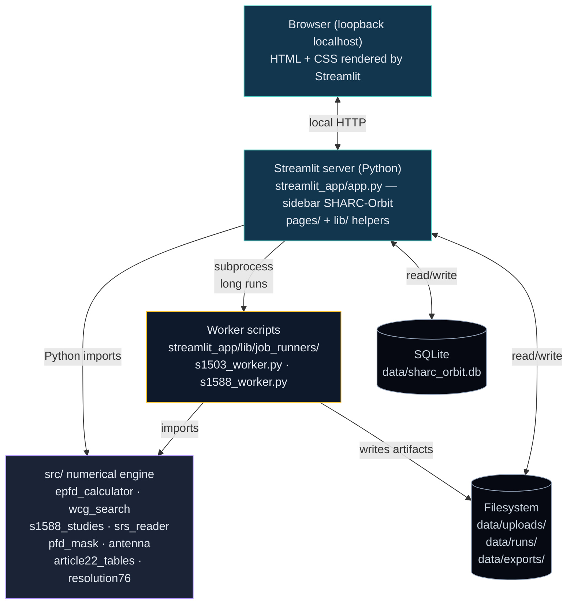

The Streamlit UI is the **only presentation layer**. The engine is the **only
compute layer**. Each long simulation is launched via `subprocess` to isolate
memory/faults and enable progress streaming through the log.

---

## 3. Module organization

### 3.1 SHARC-Orbit repository root

```
SHARC-Orbit/
├── README.md
├── ARCHITECTURE.md           # this document — tool architecture
├── pyproject.toml
├── requirements.txt
├── .gitignore
├── src/                      # numerical engine (ITU-R S.1503-4 / Resolution 76)
├── streamlit_app/            # Python UI (Streamlit) — entrypoint
├── tests/                    # pytest (engine + UI)
└── docs/                     # architecture, manuals, contributions
```

### 3.2 Numerical engine — `src/`

Reused integrally from the parent project. Public interface is immutable.

| Module | Responsibility |
|---|---|
| `src/epfd_calculator.py` | Temporal EPFD↓ simulation (S.1503-4 §D.5/D.7), streaming histogram |
| `src/wcg_search.py` | WCGA — Worst Case Geometry Algorithm (§D.3.1) |
| `src/s1588_studies/` | Aggregation studies (convolution, joint, grid) |
| `src/s1588_studies/convolution.py` | PMF convolution (CCDF↔PMF round-trip) |
| `src/s1588_studies/multi_system.py` | Joint simulation (Method 2B) |
| `src/s1588_studies/geometry.py` | Grid `(es_lat, es_lon, gso_lon)` (§D.6) |
| `src/s1588_studies/percentiles.py` | Extraction of 10/1/0.1/0.01 % percentiles |
| `src/srs_reader.py` | SRS `.mdb` reader (notices, masks, `mask_lnk1`) |
| `src/pfd_mask.py` | `PFDMask`, `PFDMaskXML`, `PFDMaskMulti` (multi-mask per satellite) |
| `src/antenna.py` | `ITURS1428Antenna`, `ITUBO1443Antenna`, factory `create_gso_es_antenna` |
| `src/orbit_propagator.py` | Keplerian propagation (optional J2) |
| `src/article22_tables.py` | RR Article 22 tables (single-entry limits) |
| `src/resolution76_tables.py` | Resolution 76 tables (aggregate limits) |
| `src/main.py` | Orchestrator `run_wcg_downlink(config)` — main entrypoint; config loaders `load_from_srs` (filings) / `load_from_manual` (parametric NGSO, R3/R4); raises `NoValidGeometry` when the WCG search finds no store-criteria geometry (never returns an all-`None` tuple) |
| `src/coordinates.py` | LLA/ECEF/ECI conversions |
| `src/time_step.py` | Normative resolution §D.4.2/§D.4.7 (dual time step) |
| `src/exceptions.py` | Domain exceptions — `NoValidGeometry` (WCG search completed but no geometry met the store criteria; carries actionable `diagnostics`) and `InvalidManualGeometry` (out-of-range manual ES/GSO coordinates) |
| `src/mask_generator.py` | Parametric PFD-mask generator (Part C) — `BeamSpec`/`MaskGenParams`, `generate_pfd_mask_azel` (Option 2), `generate_pfd_mask_alpha_dlon` (native Option 1), `write_pfd_mask_xml` (§C4.2 Table 5) |
| `src/mask_converter.py` | Az/el ↔ α/ΔLong mask geometry (§D6.4.4) — batch helpers reused by the generator; carries the signed-α southern-hemisphere fix (§D6.4.4.3) |
| `src/constellation_templates.py` | Constellation-pattern generators (Walker delta/star, equatorial ring, train, Molniya, tundra, IGSO, multi-shell) + sun-synchronous / repeat-ground-track helpers for manual entry |
| `src/mdb_writer.py` | Cross-platform JET4 MDB writer — a manual system → real `<base>_SRS.mdb` + `<base>_Mask.mdb` pair via a Java/Jackcess shell-out (`tools/jackcess/`); `availability()`/`is_available()` gate on a JRE with the `jdk.compiler` module |

### 3.3 Streamlit UI — `streamlit_app/`

```
streamlit_app/
├── app.py                    # entrypoint (sidebar label "SHARC-Orbit")
├── pages/
│   ├── 0_Cluster.py          # Ray runtime config + node control
│   ├── 1_Upload.py
│   ├── 2_Uploads.py
│   ├── 3_Single_entry.py
│   ├── 4_Aggregate.py
│   ├── 5_Launcher.py
│   ├── 6_Runs.py
│   ├── 7_Status.py
│   ├── 8_Results.py
│   ├── 9_Campaign.py
│   ├── A_Help.py             # in-app manual (workflow + glossary + troubleshooting)
│   ├── B_Mask_Viewer.py      # Interactive PFD mask visualiser (port of mask_viewer.html)
│   ├── C_Constellation.py    # 3D constellation globe (t=0 snapshot, per Article 22 scenario)
│   ├── E_Manual_System.py    # Manual/parametric NGSO entry — constellation-template wizard + 3D preview + register-as-filing
│   └── F_Mask_Generator.py   # Parametric PFD-mask generator (Part C) — beam params → PFD mask + C4.2 XML export
├── lib/
│   ├── __init__.py           # global paths (DATA_ROOT, RUNS_DIR, ...)
│   ├── engine.py             # lazy wrappers over src/
│   ├── storage.py            # SQLite + filesystem
│   ├── state.py              # session_state + disk persistence
│   ├── plots.py              # Plotly factories (CCDF, EPFD, percentiles, 3D, globe)
│   ├── theme.py              # CSS overrides + pills
│   ├── filings.py            # SRS preview
│   ├── srs_inspect.py        # notice/mask listing (lru_cache)
│   ├── exports.py            # XLSX — campaign report + per-run ITU-style workbook (run_to_xlsx)
│   ├── workers.py            # subprocess + log streaming
│   ├── launcher.py           # bridge worker ↔ DB ↔ filesystem
│   ├── cluster.py            # Ray runtime + LPT dispatch + SPREAD + ray.put broadcast + node control
│   ├── wcga_cluster.py       # Ray executor injected into the WCGA latitude sweep
│   ├── epfd_cluster.py       # Ray executor injected into the EPFD↓ time-chunk sweep
│   ├── plan.py               # per-filing cost estimate for LPT scheduling
│   ├── hwinfo.py             # per-run hardware capture (CPU/mem, per cluster node)
│   ├── mdb_results.py        # parse external results .mdb → CCDF curves (overlay)
│   ├── tour.py               # stateful guided tour across the workflow pages
│   ├── widgets.py            # select_described + confirm_delete_button (modal)
│   ├── manual.py             # per-page contextual help snippets
│   ├── estimator.py          # runtime + workload estimator (auto-calibrated)
│   ├── result_artifacts.py   # per-run CSV/PNG artifacts (CCDF, histogram, timeseries, geometries, table17, maps)
│   ├── report.py             # S.1503-4 §D7.3 summary.html (statement + Table 17 + CDF)
│   └── job_runners/
│       ├── s1503_worker.py   # single-system worker
│       └── s1588_worker.py   # multi-system worker (method_1..5)
├── tests/                    # smoke tests
├── data/                     # SQLite + uploads + runs + cluster.json (gitignored)
├── README.md
└── .streamlit/config.toml    # theme, server settings
```

### 3.4 Pages (UI components)

| Page | Functionality |
|---|---|
| Home | Landing, engine status pill |
| Cluster | Ray runtime config (4-state machine) + head/worker control + bind-IP picker (VPN / LAN / auto) |
| Upload | Register SRS `.mdb` + notice/mask detection (mdb-only) |
| Uploads | List filings + systems; **per-system orbital parameters** (planes, alt, e, i, RAAN, period) + **operating frequency bands** (masks + groups); *View mask* buttons → Mask Viewer; bulk delete / re-scan |
| Mask Viewer | Interactive PFD mask visualiser — metadata header, real-degree A/B sliders, 2D heatmap (uniform vs proportional), slice line plot, point-wise PFD calculator |
| Single-entry | S.1503-4 form (WCGA + EPFD↓); retractable WCG search / Manual WCG / Time step / **Orbital dynamics** (station keeping `Wdelta`, artificial precession, precession-from-MDB) sections |
| Aggregate | Multi-system form (5 methods) + per-method panel; same WCG / Time step / **Orbital dynamics** sections (per filing) |
| Launcher | Multi-method campaign — mirrors all Aggregate options; persisted form |
| Runs | Row-per-run table; per-row Results/Status; **delete actions behind a confirmation modal**; `finished_at (BRT)` + `duration` |
| Status | Progress + log streaming + cancel; **live host CPU%/mem% + per-worker utilisation** (while running) |
| Results | CCDF + percentiles + Art.22 / Res.76 limits + 3D globe; **upload external results `.mdb` to overlay reference CCDF curves** |
| Campaign | Aggregated dashboard + XLSX export |
| Help | In-app manual + **guided tour launcher** (`lib/tour.py`) |
| Constellation | 3D globe of the non-GSO constellation — `t=0` ECEF snapshot rendered inline via Plotly; filter by Article 22 scenario (**emitters-in-band** vs all) with per-satellite emission flags from `grp ⋈ mask_lnk1`; colour by **emitter status** or **orbital plane**; per-scenario metrics (N_total, emitters, planes, altitude, inclination, e). Built live from the SRS `.mdb` — **no run required** |
| Manual system | Define an NGSO system with no SRS filing — pick a constellation template (Walker, ring, train, Molniya, tundra, IGSO, multi-shell), edit the generated plane list (RAAN/ω/per-sat phases), preview on the 3D globe, attach a standalone PFD-mask XML, and either launch an EPFD↓ run directly or **register it as a filing** (real JET4 `_SRS.mdb`/`_Mask.mdb` pair via Jackcess, or a YAML+XML fallback) |
| Mask generator | Build a PFD mask from beam parameters (`pfd_i = P_i + G_i(θ) − 10log10(4πd²)` per cell, §C2.3.1, summed over the N_co strongest beams) in Option 1 (α×ΔLong) or Option 2 (az×el), with GSO-arc mitigation (beam-off / α-cutoff) and an operating-latitude band; preview + export round-trippable §C4.2 XML usable directly as a Manual-System mask |

Each workflow page also gets a collapsed `Help on this page` expander
fed by `lib/manual.py` snippets — keeps quick context one click away
from the title.

---

## 4. Simulation methods

The tool exposes two top-level simulation modes:

- **Single-entry** (one system) — ITU-R S.1503-4 reference flow
- **Aggregate** (≥ 2 systems) — five alternative aggregation methods (methods
  under study, **not necessarily tied to a single ITU-R recommendation**)

### 4.1 Single-entry — ITU-R S.1503-4

**Goal:** characterize the EPFD↓ from one NGSO system as seen by the geostationary
ES at the worst-case geometry (WCG), and check compliance with RR Article 22
single-entry limits.

**Inputs:** one *system* (filing × notice) with its constellation, PFD mask(s)
distributed across satellites via `mask_lnk1` (transparently handled by the
engine), GSO ES antenna parameters, simulation parameters (`num_time_steps`,
`time_step_s`, `min_elevation_deg`, dual time-step settings).

**Engine flow** (`src/main.py:run_wcg_downlink`):

1. Load SRS via `load_from_srs(...)` → Python `cfg` dict.
2. Build constellation via `create_constellation_with_masks(ngso_cfg,
   mask_assignment_per_sat=mask_lnk1)` → `(constellation, mask_id_per_sat)`.
3. Multi-mask detection: if `len(unique_mask_ids) > 1` → wrap in
   `PFDMaskMulti(masks_by_id, mask_id_per_sat)`; otherwise load a single PFD
   mask.
4. **WCGA** (S.1503-4 §D.3.1) via `search_wcg_s1503(...)` — the worst-case
   geometry (ES lat/lon, GSO lon, φ, θ) is found by latitude sweep + (θ, φ)
   sub-grid with binary searches on the boundaries α = α₀ and ε = ε₀.
5. **EPFD↓ simulation at WCG** (`run_epfd_simulation`) over `num_time_steps`
   with the dual time step (S.1503-4 §D.4.7) when enabled.
6. CCDF built by the streaming accumulator (0.1 dB bins weighted by real
   duration of each interval). Memory cost: < 1 MB regardless of N.
7. **Compliance** against RR Article 22 Table 22-1A/.../22-1E (auto-selected
   by frequency, service and antenna).

**WCG-empty outcome (contract):** if the WCGA store criteria (minimum
elevation ε₀, GSO-arc elevation εGSO, exclusion angle α₀, PFD mask) are never
satisfied, `run_wcg_downlink` **raises `NoValidGeometry`** (carrying a
`diagnostics` dict of the gating knobs) rather than returning an all-`None`
tuple — a legitimate result, not a crash. The worker catches it and writes a
completed `compliance: "no_geometry"` artifact (§6.2). Out-of-range manual
ES/GSO coordinates raise `InvalidManualGeometry` instead.

**Output (artifact `sim_data.json`):**

```
{
  "kind": "single" (or legacy "s1503"),
  "compliance": "pass" | "fail" | "unknown",
  "wcg": {es_lat_deg, es_lon_deg, gso_lon_deg, theta_deg, phi_deg, alpha_deg,
          offaxis_deg, epfd_dBW, elevation_deg},
  "ccdf_bins_db":   [...],     // descending EPFD↓ (dBW/m²/40 kHz)
  "ccdf_pct":       [...],     // ascending % of time exceeded
  "max_epfd_dbw_m2_40khz": -161.5,
  "percentiles": {"10.0%": ..., "1.0%": ..., "0.1%": ..., "0.01%": ...},
  "n_satellites": N,
  "compliance_detail": {worst_margin_dB, worst_limit_dBW, worst_percentage},
  "article22":   {limits[[epfd_db, pct], ...], rr_reference, ...},
  "resolution76":{limits[[epfd_db, pct], ...], rr_reference, ...},
  "hardware": {captured_by:{hostname, cpu_model, cpu_count_logical,
               mem_total_bytes, ...}, cluster_mode, distributed,
               nodes:[{hostname, cpu, mem_total_bytes}], n_nodes}
}
```

The Single-entry method **does not** spawn additional simulations: the
`PHASE 3B — Static ES (Brasília)` legacy stage is **disabled** by default
(`simulation.run_static_es = False` set by the worker).

### 4.2 Aggregate — Methods 1 to 5 (under study)

The Aggregate page accepts ≥ 2 systems (each a `(upload_id, ntc_id)` tuple)
and exposes five aggregation alternatives. All five run through the
`s1588_worker.py` subprocess; their output artifacts share the same envelope
JSON schema (`ccdf_bins_db`, `ccdf_pct`, `max_epfd_dbw_m2_40khz`, `percentiles`)
plus method-specific keys.

The five methods are **not all normative** — they exist to support comparison
of aggregation policies during the Resolution 76 studies.

---

#### Method 1 — convolution at each system's WCG

**Concept (Study 1, conservative):**

1. For each filing `i`, run the full single-entry pipeline → CCDFᵢ at its
   own WCGᵢ (each system at its individual worst-case geometry).
2. Convolve the N CCDFs via PMF transform:
   `PMF_total = PMF₁ ⊛ PMF₂ ⊛ ... ⊛ PMF_N` (linear power scale).
3. Convert back to CCDF → top-level aggregate CCDF.

**Assumption:** statistical independence between systems. Ignores temporal
correlation (peaks may coincide in reality).

**Conservatism:** each CCDFᵢ uses its own worst geometry; aggregating combines
worst-case statistics from N different geometries → typically larger than the
common-geometry methods.

**Artifact extra keys:** `per_system[i]` (each filing's CCDF + WCG).

---

#### Method 2 — convolution on common ES × GSO grid (Study 2)

**Concept:**

1. Build a grid of (`es_lat`, `es_lon`, `gso_lon`) triplets via
   `iter_geometry_grid(grid_step_deg, gso_pointing_step_deg,
   min_elevation_deg)` (S.1503-4 §D.6). Typical step: 10°.
2. For each grid point `p`:
   - Run `run_epfd_at_geometry(constellation_i, p)` for each filing `i`
     (single PFD mask handled transparently by engine multi-mask path).
   - Convolve the N per-system CCDFs at `p` → `CCDF_agg(p)`.
3. **Envelope** across all grid points (linear power scale):
   `EPFD_envelope(pct) = 10·log₁₀(max_p [10^(EPFD_agg(p, pct)/10)])`.
4. Top-level CCDF = envelope. `per_point[]` carries each grid point's
   aggregate CCDF.

**Notes:**

- Same geometry for all systems before convolution.
- Still assumes statistical independence between systems (convolution).
- Top-level curve is the **upper envelope** — pointwise-max across
  the grid in linear power.
- Computational cost: N_geom × N S.1503 simulations + N_geom convolutions.

**Artifact extra keys:** `grid_step_deg`, `gso_pointing_step_deg`,
`n_grid_points`, `per_point[]`.

---

#### Method 3 — joint simulation (Study 3 — coherent megaconstellation)

**Concept:**

1. Build a *megaconstellation* by fusing the N filings: their satellites are
   concatenated, each with its own `mask_id` (`PFDMaskMulti(masks_by_id,
   mask_id_per_sat)`). Same `t₀`, same `Δt`, same simulation window.
2. **Joint WCGA** on the megaconstellation: iterate the unique
   `(a, e, i, mask_id)` orbit keys → `search_wcg_s1503(oe_ref, mask_for_ref,
   ...)` for each → pick the maximum aggregate `epfd_dBW`.
   Optional override: user can pass a manual `(es_lat, es_lon, gso_lon)`.
3. **Joint EPFD↓ simulation** at the joint WCG/manual geometry:
   `run_epfd_simulation(constellation=combined, pfd_mask=pfd_multi, ...)`.
   The aggregate EPFD is computed instant-by-instant: per timestep, all
   contributors (across all N systems) sum in linear power scale.
4. CCDF from the streaming accumulator → top-level aggregate CCDF.

**Why joint and not convolution:** preserves temporal correlation between
constellations. If peaks across systems align in time, the joint sum reflects
the real combined EPFD (the convolution methods cannot, because they assume
independence).

**post_sum complement:** in parallel, the worker also runs the per-system
single-entry pipeline and convolves the N CCDFs (same as Method 1) into a
`post_sum` payload. Comparing `joint` vs `post_sum` quantifies the contribution
of temporal correlation that convolution discards.

**Artifact extra keys:** `geometry` (joint WCG), `post_sum`
{`ccdf_bins_db`, `ccdf_pct`, `max_epfd_dbw`, `percentiles`}, `per_system[]`.

---

#### Method 4 — per-WCG convolution sweep (didactic / inhomogeneity audit)

**Concept:**

1. For each filing `i`, compute its WCG `gᵢ` via the standard single-entry
   pipeline (N WCGs in total).
2. For each WCG `gᵢ`, simulate **all** N filings at that geometry:
   `run_epfd_at_geometry(constellation_j, gᵢ)` for j = 1..N. Convolve the N
   per-system CCDFs → 1 aggregate CCDF `CCDF_agg(gᵢ)`.
3. Output: N aggregate CCDFs, one per WCG (`per_wcg[]`).
4. Top-level CCDF: by convention, the worst per-WCG (max `max_epfd_dbw`).
   The UI plots **all N** per-WCG curves equally so the analyst decides
   visually which is worst.

**Use case:** measure how aggregate EPFD varies across the "natural" worst
geometries of each filing — exposes inhomogeneity between systems.

**Cost:** N WCGAs + N × N EPFD simulations + N convolutions.

**Artifact extra keys:** `per_wcg[]` (each entry: `wcg_index`, `es_lat_deg`,
`es_lon_deg`, `gso_lon_deg`, `ccdf_bins_db`, `ccdf_pct`, `percentiles`,
`max_epfd_dbw`).

---

#### Method 5 — Step-1 per geometry (no envelope)

**Concept:**

1. Build a grid via `iter_geometry_grid(...)` (same as Method 2).
2. For each grid point, simulate **each system independently** at that
   geometry → keep individual per-system CCDFs at each point.
3. **No convolution, no envelope.** Stores `per_point[].per_system[j]` raw.
4. Top-level CCDF is empty; the headline `max_epfd_dbw_m2_40khz` reports the
   maximum across all (point, system) combinations.

**Use case:** preparatory Stage 1 study — the analyst can post-process the raw
matrix (per_point × per_system) however they want without committing to a
particular aggregation policy.

**Cost:** N_geom × N EPFD simulations. No convolution overhead.

**Artifact extra keys:** `grid_step_deg`, `gso_pointing_step_deg`,
`n_grid_points`, `per_point[].per_system[]`.

---

### 4.3 Visual summary — aggregate method matrix

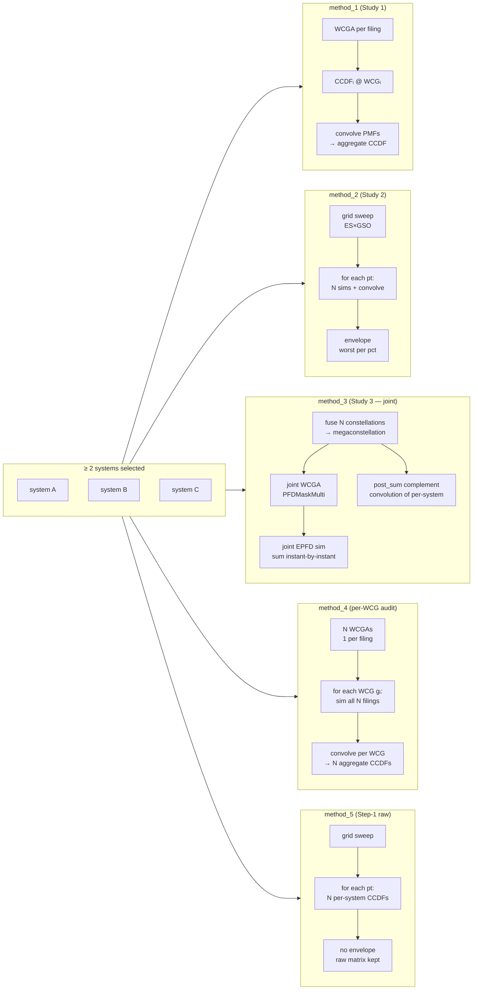

### 4.4 Common technical notes (all aggregate methods)

- **PMF convolution**: implemented in `src/s1588_studies/convolution.py`. The
  function `convolve_ccdfs_db(ccdfs)` converts dB-CCDF → linear PMF →
  `np.convolve` chained → linear PMF total → CCDF in dB. The convolution
  operator is mathematically correct because EPFD across independent systems
  sums in linear power.
- **Limits attachment**: every aggregate artifact is augmented with Article 22
  + Resolution 76 limit curves from the first filing's config (Resolution 76
  assumes common ES diameter + reference BW across systems).
- **Compliance**: the Results page renders the limit curves on the CCDF chart
  but does **not** automatically grade aggregate compliance — the analyst
  reads it from the plot.
- **3D Globe visualization**: every method emits the geometry points used
  (ES + GSO + grid when applicable), rendered on an orthographic globe
  (`lib/plots.globe_chart`). Clicking a geometry **selects the matching
  item in the *Geometry* picker below** (match by rounded `(es_lat,
  es_lon)`); pressing **Show CCDF** opens a `@st.dialog` modal with that
  point's CCDF overlaid with Article 22 / Resolution 76 limit curves.
  The selected point is highlighted in amber; the click model is
  single-select (`clickmode="event+select"` + `dragmode=False`).

---

### 4.5 Distributed processing (Ray)

Two granularities of fan-out, both through `lib/cluster.py`:

1. **Across sub-simulations (aggregate)** — methods 1–5 dispatch
   per-filing / per-geometry tasks (section 4.5.5).
2. **Inside a single simulation (single-entry & per-filing)** — the
   WCGA latitude sweep and the EPFD↓ time-chunk sweep are themselves
   distributable via **injected executors** (section 4.5.7), so even one
   heavy filing (e.g. a 24 h run) fans out across the cluster.

Standalone (no Ray) is **not** a degenerate path: the engine already
saturates local cores — WCGA via `multiprocessing.Pool` (one latitude
per core, `_resolve_wcga_parallel_jobs` prefers processes over Numba
threads) and the EPFD sim via its own time-chunk Pool. Ray adds
**cross-machine** scale on top.

The page `pages/0_Cluster.py` is a **state machine** that exposes only the
action relevant for the current state:

| State | Trigger | UI actions |
|---|---|---|
| `STANDALONE` | `cluster.json` mode = `standalone` (default) | Form → *Start Ray head on this host* |
| `RAY CLUSTER ACTIVE` | head reachable + ≥ 1 node alive | Node table, head endpoint, *Stop cluster*, *Refresh status* |
| `RAY CLUSTER UNREACHABLE` | mode = cluster_client but `ray.init` times out (8 s) | *Re-check*, *Restart head*, *Return to standalone* |
| `RAY NOT INSTALLED` | `ray` import fails | *Reset to standalone* |

#### 4.5.1 Modes

| Mode | Use | Effect |
|---|---|---|
| `standalone` | one machine (default) | `parallel_starmap_progress` collapses to a plain Python loop — engine already saturates local cores |
| `cluster_client` | two or more machines | driver attaches to the head. **When the head runs on this host, `ensure_init` connects as a native driver via the GCS address (`<ip>:6379`) — not the fragile `ray://:10001` client channel** (which drops under heavy data load); it falls back to `ray://` only if the driver connect fails |

Mode `local` (in-process Ray) is implemented in the library but **hidden
from the UI** because on a single host it just adds oversubscription
without benefit.

**Why the native-driver preference:** the Ray Client channel (`ray://`)
tunnels every object/task through one gRPC stream that saturates and
drops (`Put failed`, "Failed to reconnect the data channel") on large
payloads — and on failure the run silently falls back to local-only. A
native driver talks to the local raylet directly. See section 4.5.8.

#### 4.5.2 `runtime_env` shipping

`cluster.uploads_runtime_env()` builds the runtime_env passed to
`ray.init`:

```python
{
    "py_modules": [REPO_ROOT/"src", REPO_ROOT/"streamlit_app"],
    "working_dir": REPO_ROOT/"streamlit_app/data/uploads",
    "excludes": ["**/__pycache__/**", "data/uploads/**",
                 "data/runs/**", "data/exports/**", ...],
    "env_vars": {
        "NUMBA_NUM_THREADS": "1",
        "OMP_NUM_THREADS": "1",
        "MKL_NUM_THREADS": "1",
        "OPENBLAS_NUM_THREADS": "1",
        "NUMEXPR_NUM_THREADS": "1",
    },
}
```

- `py_modules` — `src/` (engine) + `streamlit_app/` (helpers + workers)
  are zipped, content-hashed and shipped to every Ray worker. No need
  for a SHARC-Orbit checkout on the worker host.
- `working_dir` — `streamlit_app/data/uploads/` is uploaded as a
  separate package, extracted to the Ray worker's CWD. SRS/mask MDBs
  available at `Path(<relpath>)` inside each task.
- Default working_dir cap raised from 100 MiB to 2 GiB via
  `RAY_RUNTIME_ENV_WORKING_DIR_UPLOAD_SIZE_LIMIT_BYTES`.
- `env_vars` — pins **every thread library** inside each Ray task to
  1 thread, so Ray's `num_cpus` cap = total active CPU threads (no
  Numba/OMP oversubscription).

#### 4.5.3 Path resolver (3-level fallback)

Filing payloads carry **both** absolute and relative paths. The
function `_resolve_filing_path` in `s1588_worker.py` tries, in order:

1. `filing[abs_key]` (absolute) — works on single-machine runs.
2. `Path(filing[rel_key])` resolved against the task's **CWD** — Ray
   extracts `working_dir` there.
3. `UPLOADS_DIR / filing[rel_key]` — local uploads dir (manual rsync
   deployment).

So worker hosts may use a different username/home path than the
driver — paths never need to match.

#### 4.5.4 Dispatch helper

```python
cluster.parallel_starmap_progress(
    fn=..., items=[(...)],         # tuples of args
    num_cpus=1.0, runtime_env=...,
    costs=[...],                   # optional LPT weights (per item)
    on_done=lambda i, n: _emit_progress(...),
)
```

- Calls `ensure_init(runtime_env=...)` (idempotent; bounded by an 8 s
  timeout so a dead head never hangs the UI).
- If Ray is active: wraps `fn` in `ray.remote`, submits with
  `.options(num_cpus=..., scheduling_strategy="SPREAD")`, drains via
  `ray.wait` (stream completion).
- If Ray is inactive: plain `for it in items: fn(*it)`.
- Results preserve input ordering. `on_done(i_done, n_total)` fires
  after each task so the worker can emit `PROGRESS:%` lines.

Three scheduling refinements (all transparent to callers):

- **LPT (`costs=`)** — when costs are supplied (`lib/plan.filing_costs`
  estimates per-filing cost ∝ `N_sat × N_steps`), tasks are *submitted*
  heaviest-first to minimise makespan under heterogeneous weights. A
  wrong estimate only changes order, never correctness.
- **`SPREAD`** — forces tasks across nodes. Without it, `ray.put`-broadcast
  args (below) live on the driver's node and Ray's data-locality
  preference would pin every task there, starving remote workers.
- **`ray.put` broadcast** — `broadcast_shared_in_tuples` detects objects
  repeated across the item tuples (constellation, PFD mask, antenna, WCG)
  and `ray.put`s each **once**, replacing occurrences with an
  `ObjectRef`; the remote wrapper restores them via
  `resolve_refs_in_tuple`. Cuts channel traffic from once-per-task to
  once-per-shared-object — the fix for `Put failed` at scale.

#### 4.5.5 Task fan-out per method

| Method | Tasks dispatched |
|---|---|
| method_1 | `N` filings (per-filing single-entry sim) |
| method_2 | `n_grid_points × N` (geometry × filing) |
| method_3 | joint sim sequential; post_sum `N` tasks parallel |
| method_4 | `N` WCGAs + `N × N` (WCG × filing) sims |
| method_5 | `n_grid_points × N` (no envelope) |

#### 4.5.6 Multi-machine flow

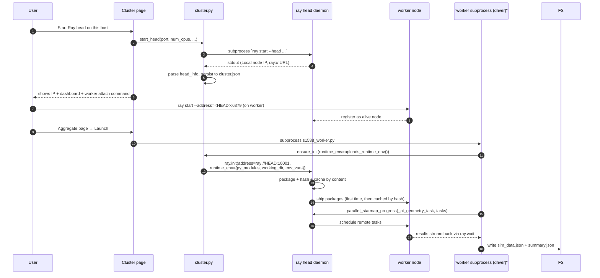

#### 4.5.7 Executor injection — distributing inside one simulation

A single heavy filing's WCGA and EPFD↓ phases are distributable without
the engine importing the app (dependency inversion):

- The engine exposes `wcg_search.set_wcga_executor(fn)` and
  `epfd_calculator.set_epfd_executor(fn)`. When set, the per-latitude /
  per-time-chunk dispatch uses `fn` instead of the built-in
  `multiprocessing.Pool`; same work units (`_wcga_pool_worker`,
  `_simulate_chunk`) and same merge (`_WCGState.merge`,
  `EPFDStreamAccumulator.merge`) → **parity-preserving**.
- `lib/wcga_cluster.py` / `lib/epfd_cluster.py` build Ray-backed
  executors (via `parallel_starmap_progress`, so they inherit LPT /
  SPREAD / broadcast) and inject them. `s1503_worker.py` arms them
  around `run_wcg_downlink` when Ray is active; fresh Ray workers
  re-apply the run's global state (GMST0 / GSO mode / α-method /
  Numba=1) that the local Pool would otherwise inherit via `fork`.
- No nesting: only the standalone single-entry driver arms the
  executors; aggregate filing-tasks (already distributed) never set
  the global, so their inner WCGA/EPFD use the local Pool.

Parity validated: in-process executor is bit-identical (incl. reversed
order); cross-node EPFD CCDF is bit-identical; cross-node WCGA matches
to ~1e-5° on the continuous GSO longitude (FP noise across
heterogeneous CPUs — well within engineering tolerance).

#### 4.5.8 Per-run hardware capture (`lib/hwinfo.py`)

Every run records the hardware it executed on into `sim_data.json` /
`summary.json` under a `hardware` block: `captured_by` (driver host
CPU model / cores / memory via psutil), `cluster_mode`, and — when
distributed — `nodes[]` (per **alive** worker: CPU count + memory;
**dead/disconnected nodes are filtered out**). The Status page also
shows **live** host CPU%/mem% (every 2 s) and per-node utilisation
(throttled ~10 s probe; an inline psutil probe shipped by value so it
runs on any node without `runtime_env`).

### 4.6 Article 22 normative scenario selection

EPFD↓ compliance is judged against an **Article 22** limit curve whose
shape depends on **service** (FSS/BSS), **frequency**, **ES antenna
diameter** and **reference bandwidth**. A filing's PFD band may intersect
several normative tables (22-1A…22-1E), so the applicable scenario is not
unique. The UI exposes the choice as a tree, built from
`list_article22_downlink_possibilities_for_masks`.

- **Shared helper** — `lib/art22_ui.py`:
  - `system_bands(srs, ntc)` — a filing's **downlink (PFD) bands**, grouping
    masks that share a `(freq_min, freq_max)`;
  - `merge_intervals` / `intersect_sets` — interval algebra over bands;
  - `art22_tree_for_bands(intervals)` — calls the engine
    `list_article22_downlink_possibilities_for_masks` to expand the tree
    **EPFD↓ → service → frequency run → option** (ES antenna · ref BW ·
    pattern · limit curve), one leaf per normative combination.
- **Where it appears**:
  - **Single-entry** — tree over the system's own PFD bands; the chosen
    leaf also **pins the PFD `mask_id`** (the band to simulate).
  - **Aggregate / Launcher** — tree over the **common** downlink band
    (intersection across selected systems); the leaf is one shared limit
    config for the whole aggregate / every campaign method, and does **not**
    pin a mask (each filing keeps its own).
- **What a leaf overrides**: `service`, `es_antenna_diameter_m`,
  `reference_bandwidth_khz`, `simulation_frequency_ghz` (and `mask_id` for
  single-entry). These flow to the worker, which sets them on the cfg before
  `apply_article22_limits_to_config` resolves the exact table row. The
  Service / ES-antenna form widgets mirror the leaf so the run is visible
  before launch. Other simulation parameters (time steps, elevation, WCGA,
  geometry, orbital dynamics) are untouched. Left on **Auto**, the engine
  auto-resolves per filing as before.
- **PFD mask resolution precedence** (engine, `load_from_srs`): when no
  `mask_id` is explicitly chosen, the single-mask case resolves it from
  **`mask_lnk1` precedence** (`emi_rcp=E` → lowest `grp_id` → lowest
  `seq_no`; wildcard `orb -1` first), falling back to the first declared PFD
  only when the filing has no `mask_lnk1` assignment. An explicit choice
  (Article 22 leaf, or a system registered with a specific mask) always
  wins. Multi-mask filings (distinct masks per orbit/satellite via
  `mask_lnk1`) use `PFDMaskMulti` — each satellite contributes with its own
  mask in both WCGA and the EPFD↓ accumulation.
- **Persistence + reload**: the resolved normative config (`service`,
  `frequency_run_*`, `rr_reference`, ref BW, ES diameter, pattern, limit
  curve) is written into `sim_data.json` / `summary.json` under
  `article22`, and shown textually on the Results page next to the curve.
  The Runs **reload** restores the scenario (`reference_bandwidth_khz`,
  `simulation_frequency_ghz`, `mask_id`) so a run reproduces exactly.

This section visualises the **architecture of each component** and the
**end-to-end flow** of Single-entry and Aggregate runs.

### 5.1 Module dependency graph

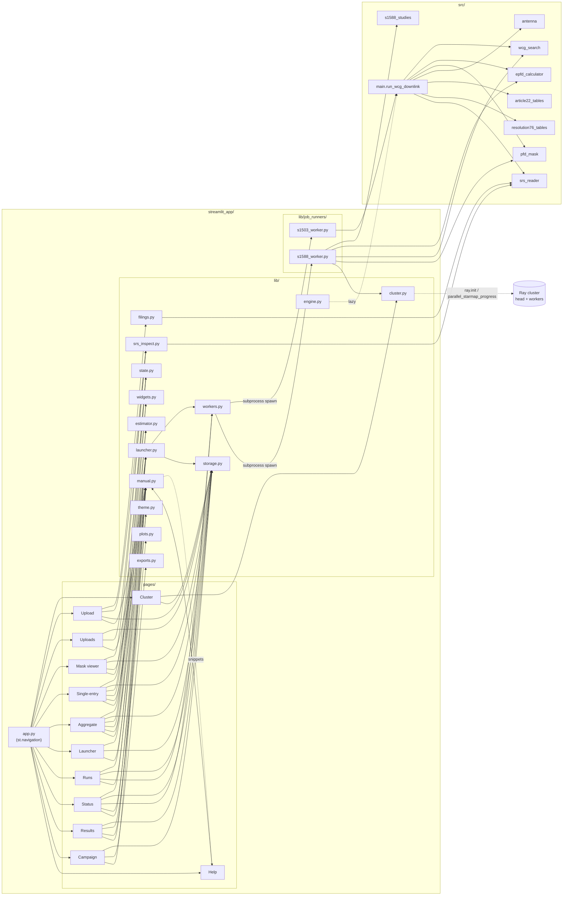

### 5.2 Persistence layer (`lib/storage.py`)

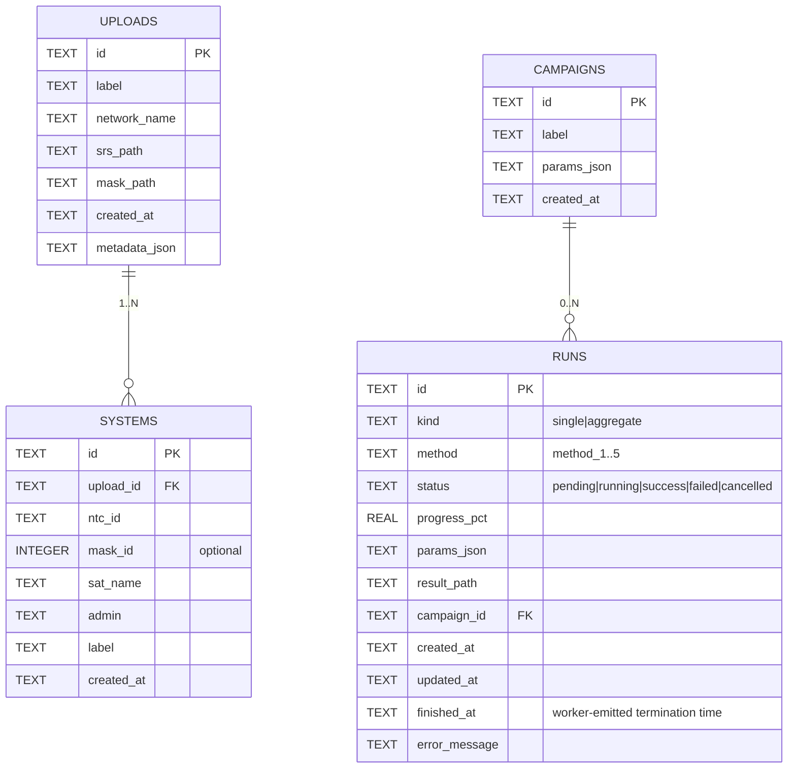

Artifacts on disk (per run) in `data/runs/<run_id>/`:

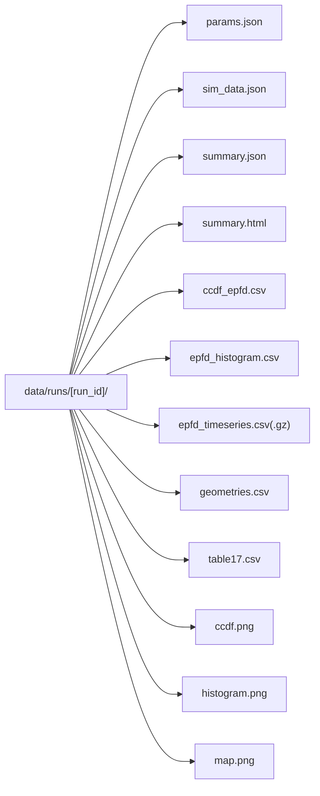

### 5.3 Worker process model (subprocess + log streaming)

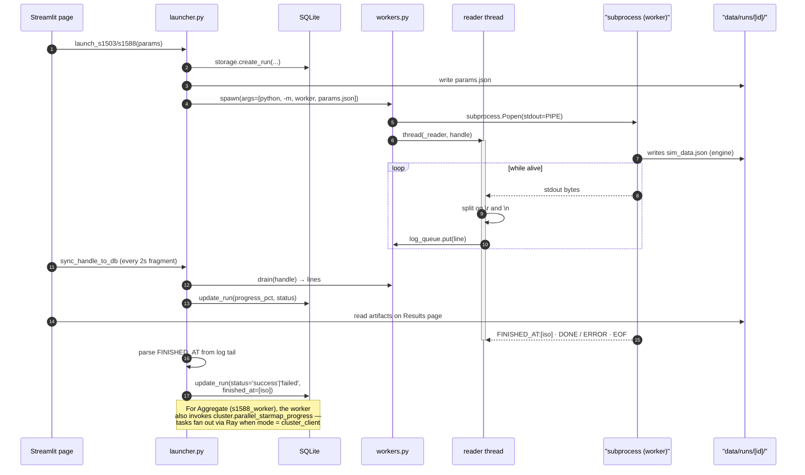

### 5.4 UI navigation flow

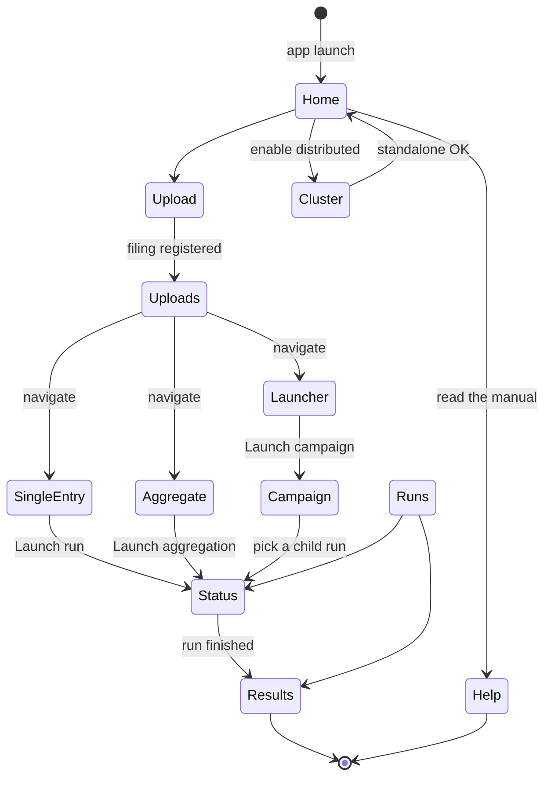

### 5.5 Filing upload (Upload page)

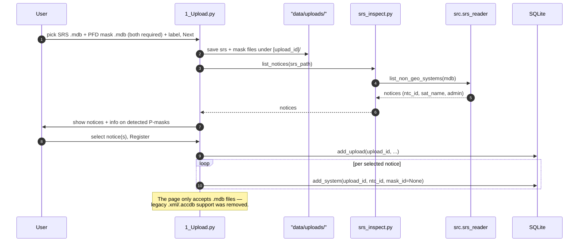

The Step-2 filing label is **suggested from the SRS network/satellite
name** (`notice.sat_name`, fallback `preview_srs.network_name`) plus the
persisted **filing-name prefix** and the upload timestamp — e.g.
`ANATEL — D-MEG1-1-2026-06-07T18-30-12` — and stays editable. The prefix
is set on the Uploads page (`storage.apply_filing_prefix` renames all
existing filings idempotently; `storage.set_upload_label` renames one).

### 5.6 Single-entry run — end-to-end

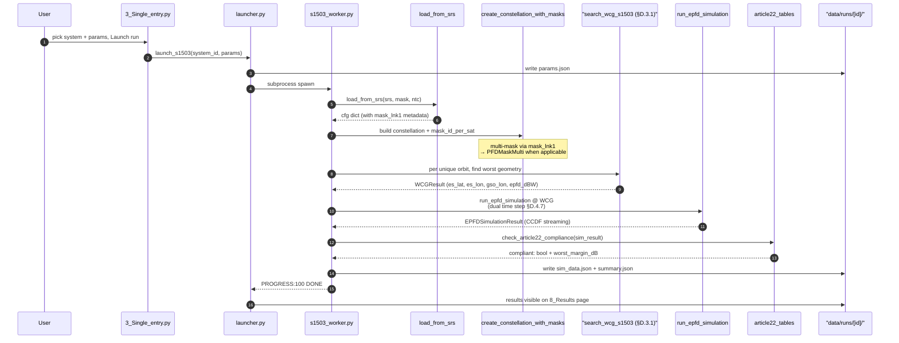

### 5.7 Aggregate — method dispatcher

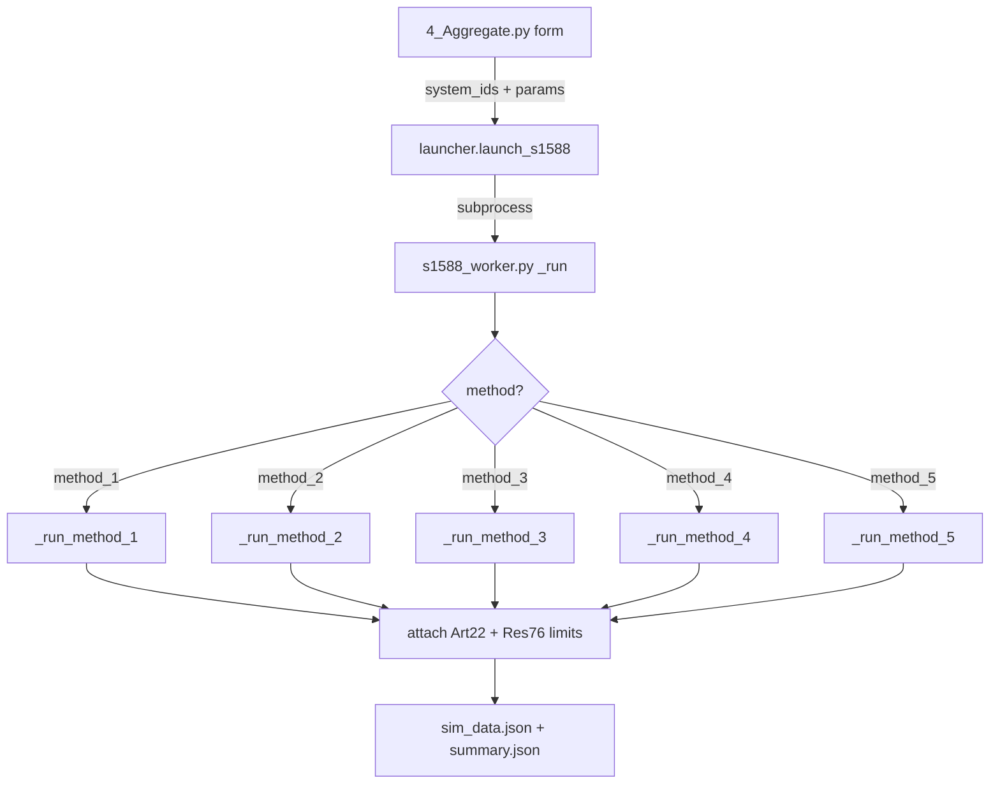

### 5.8 Aggregate · method_1 (Study 1)

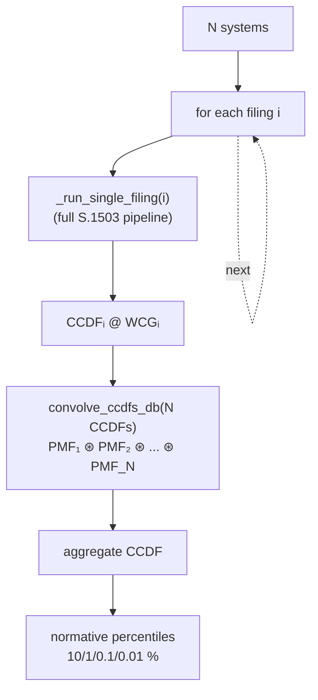

### 5.9 Aggregate · method_2 (Study 2 — grid + envelope)

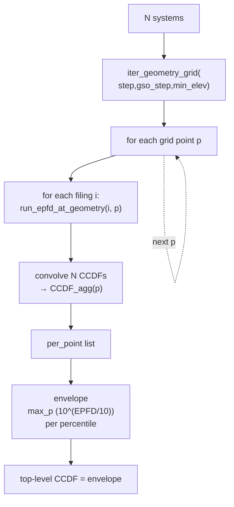

### 5.10 Aggregate · method_3 (Study 3 — joint, Method 2B)

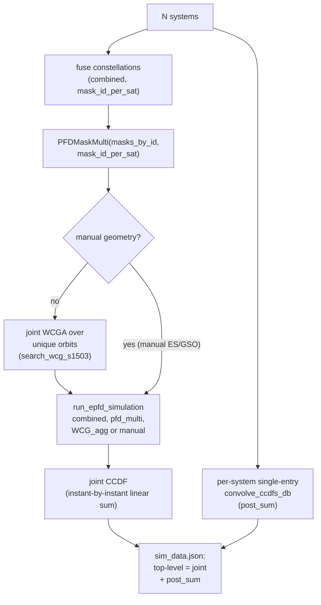

### 5.11 Aggregate · method_4 (per-WCG sweep)

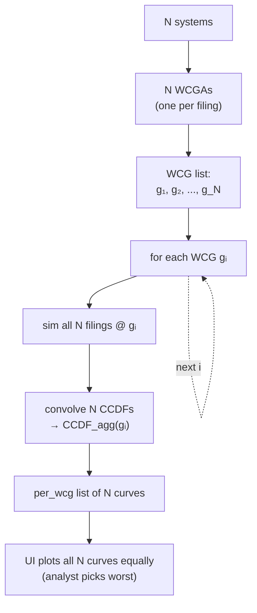

### 5.12 Aggregate · method_5 (Step-1 raw, no envelope)

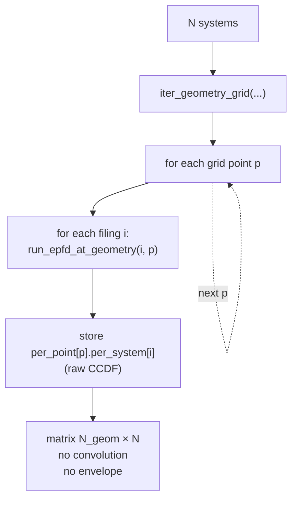

### 5.13 Results page rendering

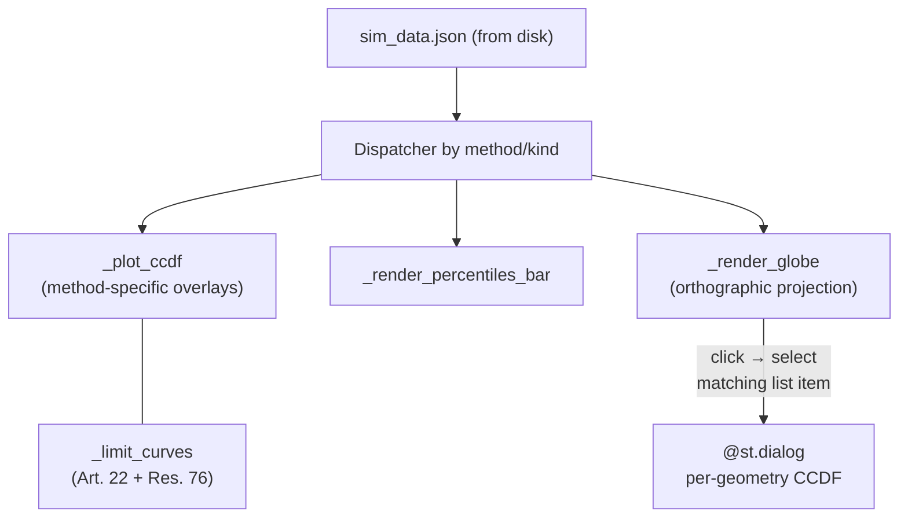

Click semantics: the globe uses `on_select="rerun"` +
`selection_mode="points"` + `clickmode="event+select"`. The first
clicked point is mapped to the *Geometry* picker via exact rounded
`(es_lat, es_lon)` match; pressing **Show CCDF** opens the modal
(`@st.dialog(width="large")`) with the selected geometry's CCDF +
Article 22 / Resolution 76 limit overlays.

### 5.14 Globe visualization per method

| Method | ES (★ star) | GSO (◆ diamond) | Grid points |
|---|---|---|---|
| single-entry | 1 WCG | 1 GSO | — |
| method_1 | N WCGs (one per system) | N GSOs | — |
| method_3 | 1 WCG_agg | 1 GSO_agg | — |
| method_4 | N WCGs | N GSOs | — |
| method_2 | — | GSO sweep (translucent) | ES grid (blue dots) |
| method_5 | — | GSO sweep | ES grid |

Clicking a geometry on the globe **selects the matching entry in the
*Geometry* picker** below the chart (single-select via
`clickmode="event+select"`, with unselected markers kept at full
opacity and the clicked one highlighted in amber). Pressing *Show
CCDF* opens a Streamlit `@st.dialog(width="large")` modal with that
point's CCDF + the Article 22 / Resolution 76 limit curves overlaid
(when `ccdf_bins_db` is stored at that level).

---

## 6. Functional layers

### 6.1 Persistence (`lib/storage.py`)

Backend: **SQLite** (stdlib). Tables:

| Table | Content |
|---|---|
| `uploads` | registered filing (label, paths, metadata JSON) |
| `systems` | tuple `(upload_id, ntc_id)` — one logical system |
| `runs` | execution (kind, method, status, progress, params JSON, result_path) |
| `campaigns` | grouping of runs |

Artifacts on disk in `data/runs/<run_id>/`:
- `params.json` — worker input
- `sim_data.json` — full result (CCDF, percentiles, art22, res76, `identification`,
  `table17`, `epfd_type`, `input_source`)
- `summary.json` — key metrics
- `summary.html` — S.1503-4 §D7.3 examination report (§6.10)
- `ccdf_epfd.csv`, `epfd_histogram.csv`, `epfd_timeseries.csv`(`.gz` over 50k pts),
  `geometries.csv`, `table17.csv` — CSV tables with `#` unit headers (A2.1 Table 1)
- `ccdf.png`, `histogram.png`, `map.png` — headless (matplotlib Agg) plots

The CSV/PNG set and `summary.html` are written best-effort by
`lib/result_artifacts.py` + `lib/report.py` (a plotting error never fails a
finished run). The ITU-style `run.xlsx` workbook (`lib/exports.run_to_xlsx`)
and a **Download-all `.zip`** of the run directory are built on demand from the
Results page — they are not persisted.

Foreign key: `systems.upload_id → uploads.id` (ON DELETE CASCADE). Cascade
delete + file removal.

### 6.2 Simulation execution (`lib/workers.py` + `lib/launcher.py` + `lib/job_runners/`)

**Worker process model:** every run is a Python subprocess that executes the
corresponding worker script. The UI reads stdout via a thread + `queue.Queue`.

- `workers.spawn(run_id, args=[...])` — `subprocess.Popen` + byte-level reader
  that splits lines on `\r` AND `\n` (compatible with the engine progress bars).
- `workers.drain(handle)` — pops pending lines; feeds the in-memory history.
- `launcher.launch_s1503(system_id, params)` — writes `params.json`, spawns.
- `launcher.launch_s1588(method, system_ids, params)` — same for aggregate.
- `launcher.sync_handle_to_db(run_id)` — propagates PROGRESS / DONE / ERROR
  to SQLite.

**Workers:**

- `s1503_worker.py` — calls `run_wcg_downlink(cfg)`; serializes the result and
  writes the per-run artifact/report stack (§6.10). When the engine raises
  `NoValidGeometry`, the worker catches it and writes a *completed*
  `compliance: "no_geometry"` `sim_data.json`/`summary.json` (carrying the
  exception `diagnostics`) instead of failing the run — the UI renders it as a
  legitimate no-geometry outcome, not an error. Emits `FINISHED_AT:<iso>` on
  stdout before exit so the launcher can stamp the run's `finished_at`
  precisely.
- `s1588_worker.py` — implements `method_1..method_5` (convolution / grid /
  joint), reusing `src/s1588_studies` and `src/epfd_calculator`. Wraps
  each per-task body (`_single_filing_task`, `_at_geometry_task`) so it
  can run either sequentially or via `cluster.parallel_starmap_progress`
  (Ray) — see section 4.5. A `NoValidGeometry` from any per-filing sim is caught
  and returned as an empty `no_geometry` sub-result so the aggregate keeps
  going. Same `FINISHED_AT` contract.

**Path resolver inside workers:** filing payloads carry both absolute
and `<upload_id>/<file>.MDB` relative paths. `_resolve_filing_path`
tries abs → CWD-relative (Ray `working_dir`) → `UPLOADS_DIR / rel`
(local rsync). Remote workers never depend on the driver's
home / username path.

### 6.3 Visualization (`lib/plots.py`)

Plotly factories:

- `ccdf_chart(series, limit_curves=..., height=, x_min=, x_max=)` — CCDFs
  overlaid + Article 22 + Resolution 76 curves. Log Y-axis with normative
  ticks (`100%, 10%, 1%, ..., 1e-7%`). Diagonal X-axis tick labels.
- `epfd_timeline_chart(t, epfd_db)` — EPFD↓ time series.
- `percentiles_chart(percentiles)` — bars for the normative percentiles.
- `globe_chart(es_points, gso_points, grid_points, grid_gso_lons, ...)` —
  orthographic globe with ES (star) + GSO (diamond) + optional grid.
- `earth_3d_chart(satellites_xyz=...)` — 3D Plotly view (Cesium replacement).

### 6.4 Theme / CSS (`lib/theme.py`)

Type scale via CSS variables, contrast on buttons / inputs, Material Symbols
icons injected via `:material/X:` (native support in Streamlit ≥ 1.36).
Multiselect chips, dropdown menus and form widgets re-styled for dark theme
consistency.

### 6.5 Export (`lib/exports.py`)

XLSX campaign report via `openpyxl` + `pandas`. Three sheets:
`campaign` (metadata), `runs` (status / method / metrics), `params`
(denormalized). `run_to_xlsx(sim_data)` additionally builds a **per-run**
ITU-BR-style workbook (`run_def` / `result_def` / `results` / `cdf` / `pdf`
sheets, S.1503-4 §D7.3) offered from the Results page — see §6.10.

### 6.6 Cross-page state (`lib/state.py`)

A small set of *current selections* persists to disk under
`streamlit_app/data/state_*.json` and is shared across pages so that
picks made on one screen propagate to the others:

| Selection key                   | Helpers                                            | Pages reading it                                      |
|---------------------------------|----------------------------------------------------|-------------------------------------------------------|
| `selection.system_id`           | `current_system_id()` / `set_current_system_id`    | Uploads (orbital), Single-entry, Mask Viewer          |
| `selection.system_ids`          | `current_system_ids()` / `set_current_system_ids`  | reserved for Aggregate / Launcher                     |
| `selection.mask_id`             | `current_mask_id()` / `set_current_mask_id`        | Mask Viewer                                           |
| `selection.run_id`              | `current_run_id()` / `set_current_run_id`          | Runs (inspect), Status, Results                       |

Selections survive reloads (JSON on disk via
`save_persisted`/`load_persisted`). Form parameters (`s1503.form`,
`s1588.form`) stay page-scoped — they are not cross-page because
numeric overrides do not transfer meaningfully between the
single-entry and aggregate flows.

### 6.7 Mask Viewer (`pages/B_Mask_Viewer.py`)

Standalone interactive page that mirrors the legacy
`visualization/mask_viewer.html` HTML viewer:

* Reads the PFD mask via `src.srs_reader.read_pfd_mask_xml_from_mdb` +
  `src.pfd_mask.load_pfd_mask_from_xml_content`, returns the same
  JSON-shaped dict the HTML viewer consumed (via `to_dict()`).
* Sliders use `st.select_slider` over the real degree values so the
  user picks `-55° … +55°` (STEAM-2 latitudes) rather than indices.
* Heatmap renders with Plotly `go.Heatmap`. The toggle between
  uniform-spaced cells and proportional degrees on the x-axis mirrors
  the HTML viewer's `setAxisMode`.
* Slice plot is a `go.Scatter` over the C-axis. A dashed amber vline
  on the heatmap marks the active B slice.
* PFD calculator implements the same bilinear (azimuth_elevation /
  alpha_deltaLongitude) and trilinear fallbacks as the JS code, mirror
  of the engine runtime.
* When no query / state is provided, the page shows a picker listing
  all PFD masks across systems; selection is persisted via
  `current_system_id` + `current_mask_id`.

### 6.8 Timezone display (`storage.fmt_local`)

All timestamps in the SQLite database are stored in **UTC** (`created_at`,
`updated_at`, `finished_at`). UI columns labelled **(BRT)** are
converted to `America/Sao_Paulo` for display only via
`storage.fmt_local(iso, tz_name="America/Sao_Paulo")`. Output format:
`YYYY-MM-DD HH:MM:SS` (no tz suffix — the column header makes it
explicit). Workers and the launcher continue to write UTC, so Ray
clusters spanning timezones stay consistent.

### 6.9 Constellation viewer (`pages/C_Constellation.py`)

Standalone page that renders the non-GSO constellation as a **3D globe
snapshot at `t=0`**, built live from a registered filing — no simulation
run and no pre-exported bundle required.

* `_build_constellation()` reads the SRS via `src.srs_reader.read_srs_mdb`
  → `srs_to_constellation_config` → `src.main.create_constellation_from_config`
  → `src.orbit_propagator.propagate_and_to_ecef_batch` at `t=0`, then scales
  the ECEF positions to a unit sphere (`ECEF / Re_km`).
* `_scenarios()` lists the Article 22 downlink scenarios for the filing's
  masks via `src.article22_tables.list_article22_downlink_runs_for_masks`
  (de-duplicated over ES antenna diameter).
* `_emitter_flags()` marks which satellites transmit in the selected band
  via `src.srs_reader.read_emitters_in_band` (`grp ⋈ mask_lnk1` at
  `frequency_run_ghz`).
* Rendering is inline **Plotly** (`lib/plots.earth_3d_chart` + per-satellite
  scatter traces) — no CesiumJS, CZML or Parquet.

Controls: scenario selector (*Completa — todas as frequências* or a specific
Article 22 scenario), a **Só emissores / Todos** filter, and a colour mode
(**Emissor** — transmit vs silent — or **Plano orbital** — one colour per
orbital plane). Metrics panel reports N_total, emitters-in-scenario, plane
count, altitude, inclination and eccentricity.

### 6.10 Result artifacts & §D7.3 report stack (`lib/result_artifacts.py` + `lib/report.py` + `exports.run_to_xlsx`)

Every finished single-entry run drops a normative artifact set next to
`sim_data.json`, driven from the engine's streaming accumulator and the
`ComplianceResult.table17` (one row per Article 22 specification point:
`Ji`, `Pi`, `Py`, pass):

* `result_artifacts.write_run_artifacts(result_path, sim_data, acc)` writes
  `ccdf_epfd.csv` (§D7.3.3), `epfd_histogram.csv` (PDF, §D7.1.1, 0.1 dB bins
  from `acc.duration_per_bin`), `epfd_timeseries.csv` (the accumulator's
  decimated trace — gzipped past 50k points; the statistics are still
  accumulated over every step, so decimation is presentation-only),
  `geometries.csv` (tested ES/GSO geometries — the single WCG for s1503, the
  `per_point` sweep for aggregates), `table17.csv`, plus `ccdf.png`,
  `histogram.png` and `map.png` (headless matplotlib Agg — no kaleido/browser).
  Each CSV carries `#` unit headers (A2.1 Table 1). Every writer fails soft.
* `report.write_summary_html(result_path, sim_data)` renders the §D7.3
  examination report as a self-contained `summary.html`: the §D7.3.1 Pass/Fail
  statement, the §D7.3.2 Table 17, the §D7.3.3 CDF table (with the embedded
  `ccdf.png`), and the §D7.2 background + run identification (`ntc_id`,
  `sat_name`, mask id/source, `epfd_type`, `input_source`).
* `exports.run_to_xlsx(sim_data)` builds an ITU-BR-style workbook
  (`run_def` / `result_def` / `results` / `cdf` / `pdf` sheets); the Results
  page offers it and a Download-all `.zip` of the whole run directory on
  demand.

### 6.11 Manual / parametric NGSO entry (`load_from_manual` + `constellation_templates` + `mdb_writer`)

The **Manual system** page (`pages/E_Manual_System.py`) defines an NGSO system
with no SRS filing:

* `src.constellation_templates` generates a plane list from a named pattern —
  `walker_delta`/`walker_star`, `equatorial_ring`, `train`, `molniya`,
  `tundra`, `igso`, `multi_shell` — plus `sun_synchronous_inclination_deg`
  and `repeat_ground_track_a_km` helpers. The user edits the generated planes
  (per-plane RAAN/ω/ν₀) and previews them on the 3D globe.
* `src.main.load_from_manual(manual)` turns that definition (same sections as
  `config.example.yaml`; a/e from apogee/perigee per §D6.3.7; per-plane
  RAAN/ω/ν₀ read from `_planes` rather than forced to 0) into a full engine
  config tagged `input_source='manual'`, deriving the run frequency from the
  attached PFD-mask XML (fmin + RefBW/2, §D2) when not given, and runs through
  the **same** `run_wcg_downlink` path as MDB filings.
* Alternatively the system is **registered as a filing**: `src.mdb_writer`
  shells out to a Java/Jackcess helper (`tools/jackcess/`) to write a real
  JET4 `<base>_SRS.mdb` + `<base>_Mask.mdb` pair cross-platform, or falls back
  to a YAML+mask-XML filing, then enters the normal Upload flow.

### 6.12 Parametric PFD-mask generator (`mask_generator` + `mask_converter`)

The **Mask generator** page (`pages/F_Mask_Generator.py`) builds a PFD mask
from beam parameters (`src.mask_generator`):

* `MaskGenParams` / `BeamSpec` carry the §C2.3.1 inputs (per-beam power in the
  reference bandwidth, `SimpleCircularBeamAntenna` gain, `n_co` simultaneous
  co-frequency beams, losses) and the §C1/§C2.2 constraints (operating
  latitude band → −1000 dBW, GSO-arc exclusion α₀).
* Each cell is the max-envelope of `pfd_i = P_i + G_i(θ) − 10·log10(4πd²)`
  (d in metres) summed over the `n_co` strongest beams. `generate_pfd_mask_azel`
  produces Option 2 (lat×az×el); `generate_pfd_mask_alpha_dlon` produces
  Option 1 (lat×α×ΔLong) **natively** (no conversion), reusing the
  `src.mask_converter` α/ΔLong geometry (§D6.4.4, including the signed-α
  southern-hemisphere fix §D6.4.4.3).
* GSO-arc mitigation has two modes: `beam_off` (in-zone boresight beams
  switched off, sidelobe leakage kept) and `alpha_cutoff` (direct |α| < α₀
  cutoff with a user-defined fill value).
* `write_pfd_mask_xml` serialises the §C4.2 (Table 5) XML, round-trippable
  through `PFDMaskXML` and usable directly as a Manual-System mask.

---

## 7. Python libraries — function ↔ package map

### 7.1 Numerical core

| Package | Min. version | Function / Component | Use |
|---|---|---|---|
| `numpy` | 1.24 | whole engine | arrays, linear algebra |
| `scipy` | 1.10 | propagator, convolution | interpolation, signal |
| `numba` | 0.59 | `epfd_calculator` | JIT (LLVM) — hot loop acceleration |
| `joblib` | 1.3 | EPFD pool | `multiprocessing` parallelism |
| `pyarrow` | 14 | streaming accumulator | Parquet I/O (opt.) |
| stdlib `multiprocessing` | — | EPFD worker | process spawning |

### 7.2 SRS / mask reading

| Package | Min. version | Function | Use |
|---|---|---|---|
| `access-parser` | 0.0.6 | `srs_reader._run_mdb_export` | reads `.mdb` (Access/JET) directly in pure Python — no OS binary, cross-platform |
| stdlib `xml.etree` | — | `pfd_mask.PFDMaskXML` | XML mask parser (legacy `.xml` masks; the Upload page now accepts `.mdb` only) |
| stdlib `zipfile` | — | `srs_reader.read_pfd_mask_xml_from_mdb` | unzips the OLE mask blob to recover the XML |

### 7.3 Streamlit UI

| Package | Min. version | Function / Component | Use |
|---|---|---|---|
| `streamlit` | 1.36 | whole UI | navigation, widgets, multi-page, fragments |
| `plotly` | 5.20 | `lib/plots.py` | CCDF / EPFD / 3D charts |
| `pandas` | 2.0 | `lib/exports.py`, tables | DataFrames, XLSX |
| `openpyxl` | 3.1 | `lib/exports.py` | XLSX writing (campaign reports) |
| `numpy` | 1.24 | plot helpers | normalization, log |
| `matplotlib` | 3.8 | optional, fallback | static rendering when Plotly unavailable |
| `pyyaml` | 6.0 | local configs | loading `config.yaml` (engine) |

### 7.4 Persistence

| Package | Min. version | Function | Use |
|---|---|---|---|
| stdlib `sqlite3` | — | `lib/storage.py` | local DB |
| stdlib `pathlib` | — | `lib/__init__.py` | paths |
| stdlib `json` | — | `lib/storage.py`, artifacts | serialization |
| stdlib `shutil` | — | cascade delete | removal of `data/runs/<id>/` |

### 7.5 Process execution

| Package | Min. version | Function | Use |
|---|---|---|---|
| stdlib `subprocess` | — | `lib/workers.py`, `lib/cluster.py` | spawn worker, capture stdout; spawn `ray start --head` / `ray stop` |
| stdlib `threading` | — | `lib/workers.py`, `lib/cluster.py` | non-blocking stdout reader; bounded `ray.init` via daemon thread |
| stdlib `queue` | — | `lib/workers.py` | log line buffer |

### 7.5b Distributed processing (optional)

| Package | Min. version | Function | Use |
|---|---|---|---|
| `ray[default]` | 2.10 | `lib/cluster.py` | task fan-out across local cores or remote workers; `runtime_env` for code + data shipping; Ray Client (`ray://...`) requires the `[default]` extra |

### 7.6 Testing / quality

| Package | Min. version | Function | Use |
|---|---|---|---|
| `pytest` | 8 | `tests/` | unit / integration |
| `ruff` | 0.5 (opt.) | linting | code-style enforcement (dev) |

### 7.7 Packaging / distribution

| Package | Min. version | Function | Use |
|---|---|---|---|
| `setuptools` | 68 | `pyproject.toml` build | `pip install -e .` |
| `wheel` | — | distribution | (optional) |
| `pip` | 24 | dependency resolution | installation |

### 7.8 **Explicitly excluded** packages

| Package | Exclusion reason |
|---|---|
| `fastapi` | Client-server + associated auth |
| `uvicorn` | External web server |
| `sqlalchemy`, `alembic` | Tied to the legacy Postgres |
| `asyncpg`, `psycopg2-binary` | Postgres |
| `minio` | External proprietary storage |
| `python-jose`, `bcrypt` | Authentication |
| `httpx` (external HTTP client use) | External APIs — outside the project scope by default |
| Julia + bridges (`epfd_julia`) | Other language |
| JavaScript SPA frameworks + bundlers | Other language / client-server |
| Cesium | Proprietary technology / JS |

### 7.9 Operating system dependencies

| Component | OS package | Justification |
|---|---|---|
| Ray daemon (optional) | `ray` CLI from `pip install ray[default]` | Spawned by `cluster.start_head` / `cluster.start_worker` as a subprocess; the CLI is resolved either from `PATH` or as a sibling of `sys.executable` |

> `.mdb` SRS reading no longer needs `mdb-tools`: it is parsed in pure Python via the `access-parser` package (cross-platform, no OS binary).

SHARC-Orbit targets **Linux, macOS and WSL2**. **Native Windows** also runs
the standalone Streamlit app (`.mdb` parsing is pure-Python; `multiprocessing`
falls back to `spawn`), with reduced features — see Section 10.

---

## 8. Data flow

### 8.1 Filing upload

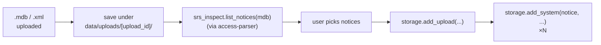

### 8.2 Single-entry (S.1503-4)

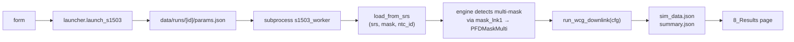

### 8.3 Aggregate

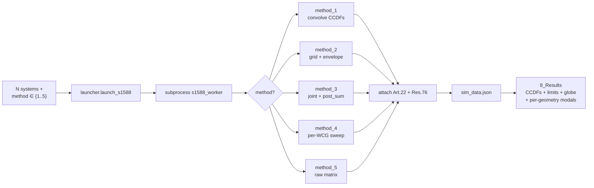

---

## 9. Project guarantees

| Guarantee | Implementation |
|---|---|
| Open source, Python, documented | `SIMULATOR-WG/SHARC-Orbit` repository (private→public); manuals in `docs/`; docstrings; in-app `pages/A_Help.py` |
| No other languages / proprietary tech / auth | 100 % Python stack; no client-server framework, no JS frameworks, no auth stack; local Streamlit without login |
| No external APIs | All input via local SRS; ITU integrations to be discussed case by case |
| Campaign spreadsheet | `lib/exports.py` produces XLSX campaign reports |
| Optional distributed processing | `lib/cluster.py` wraps Ray; standalone fallback path is identical; Ray is opt-in via the Cluster page |
| Public GitHub repository | `SIMULATOR-WG/SHARC-Orbit` |
| Private → public lifecycle | repository visibility control |
| Permanent URL | github.com/SIMULATOR-WG/SHARC-Orbit |

---

## 10. Points of attention

- **`numba` / `scipy` / `numpy` have C/Fortran backends**: they are Python
  packages of the scientific ecosystem (NumFOCUS). The project code is 100 %
  Python.
- **Streamlit runs HTTP on loopback (127.0.0.1)**: not a client-server with
  access control (no auth). Standard Python-local UI pattern.
- **`.mdb` parsing is pure Python** (`access-parser`) — no OS binary.
  **Linux / macOS / WSL2** is the primary target. **Native Windows** runs the
  standalone Streamlit app (pure-Python `.mdb`; engine no longer forces `fork`,
  so `multiprocessing` uses `spawn` — chunk workers re-apply engine globals via
  the Pool `initargs`). Reduced features on native Windows: Ray multi-node is
  WSL2/Linux-only, the `--kill-port` helper (`fuser`/`lsof`) is a no-op, and the
  legacy `src/launcher_ui.py` HTTP launcher (POSIX process groups) is unused.
- **Ray (optional)**: distributed dispatch is opt-in via
  `lib/cluster.py`. Default mode is `standalone` (no Ray runtime). When
  Ray is configured, all task code, the `streamlit_app/` package and
  the `uploads/` directory are shipped via `runtime_env`; thread
  libraries inside each task are pinned to 1 thread (`NUMBA_NUM_THREADS=1`,
  `OMP_NUM_THREADS=1`, …) to avoid oversubscription. The Cluster page
  is a 4-state machine and times out `ray.init` at 8 s so a dead head
  daemon cannot hang the UI.
- **`finished_at` semantics**: worker subprocesses emit `FINISHED_AT:<iso>`
  on stdout before exit. The launcher reads the last such line and
  stamps the DB column. The Runs page uses this for both the
  *finished_at* column and the `hh:mm:ss` *duration* column.
- **Per-node CPU cap**: head CPUs are capped in the Cluster page UI
  (`ray start --num-cpus=N`); workers are capped via the same flag in the
  attach command (CPU field on the attach hint). The cap genuinely bounds
  CPU use because the engine's internal `multiprocessing.Pool` is replaced
  by the Ray executor (1 thread/task) when the cluster is active — so
  `--num-cpus` controls concurrent tasks = cores. **Trap**: the head CPU
  field defaults to *all* host cores; lower it to leave OS headroom.
- **Run timing in artifacts**: `sim_data.json` / `summary.json` carry a
  `timing` block (`started_at`, `finished_at`, `duration_seconds`,
  `duration_hms`); duration uses a monotonic `perf_counter` (immune to
  wall-clock adjustment), so it can differ slightly from the DB
  `finished_at − started_at` (subprocess wall-clock).
- **PFD mask auto-resolution**: never "first declared". `load_from_srs`
  resolves the single-mask `mask_id` from `mask_lnk1` precedence
  (`emi_rcp=E` → `grp_id` → `seq_no`); an explicit choice (Article 22 leaf)
  wins; multi-mask filings dispatch per satellite via `PFDMaskMulti`.
- **PFD curve location**: the mask shape lives in the `masks` table (zipped
  XML) of a **companion MASK MDB** — not in the SRS (`mask_info` there is
  metadata only). Uploading the SRS without its MASK MDB makes the Mask
  Viewer / runs fail to load the curve; the error names the missing piece.

---

## 11. Maintenance and evolution

- **Source of truth:** `stage1` private repository.
- **Publication of the compliant subset:** `scripts/publish_to_anatel.sh` syncs
  `src/` + `streamlit_app/` + selected docs/tests into the public repository.
- **Regression testing:** `tests/` loads test filings and compares CCDF
  byte-by-byte across versions.

---

**Last update:** 2026-07-03 (Manual/parametric NGSO entry — `E_Manual_System.py`, `load_from_manual`, `constellation_templates`, Jackcess `mdb_writer`; parametric PFD-mask generator — `F_Mask_Generator.py`, `mask_generator` with native Option 1 + Option 2 + GSO-arc mitigation; per-run artifact + S.1503-4 §D7.3 report stack — `result_artifacts.py`, `report.py`/`summary.html`, `exports.run_to_xlsx`, Download-all zip; structured `NoValidGeometry`/`InvalidManualGeometry` outcomes with a `no_geometry` run result; southern-hemisphere signed-α fix §D6.4.4.3; previously: Constellation viewer page
(`pages/C_Constellation.py`) — 3D `t=0` globe of the non-GSO constellation
built live from the SRS `.mdb`, filtered by Article 22 scenario /
emitters-in-band (`grp ⋈ mask_lnk1`), coloured by emitter status or orbital
plane; previously: Article 22 normative scenario selector
(service → frequency → ES antenna/BW tree) in Single-entry / Aggregate /
Launcher via shared `lib/art22_ui.py`; PFD mask auto-resolution by
`mask_lnk1` precedence (explicit choice wins) in `load_from_srs`; normative
config + run timing persisted in `sim_data.json`/`summary.json` and shown on
Results; Runs reload restores the Article 22 scenario; Mask Viewer error
names a missing companion MASK MDB; cluster single-entry interior distribution
via injected WCGA/EPFD executors + LPT scheduling + SPREAD + ray.put
broadcast + native-driver connection; per-run hardware capture (hwinfo)
+ live Status utilisation; orbital-dynamics options (station keeping /
precession) in Single-entry / Aggregate / Launcher; Launcher mirrors
Aggregate + persisted form; external results `.mdb` CCDF overlay;
guided tour; filing-name prefix + network-name label suggestion;
delete-confirmation modals; per-worker CPU cap in cluster attach hint)
