# SHARC-Orbit — Tool architecture

Technical architecture document for the SHARC-Orbit tool (Streamlit UI) for
EPFD↓ simulation per ITU-R S.1503-4 and multi-system aggregation studies under
Resolution 76.

This document details modules, components, functionalities and the associated
Python libraries — supporting continuous technical evaluation of the solution.

---

## 1. Design principles

| Principle | Implementation |
|---|---|
| **Python-only** | No code in other languages in the application or the engine. One exception: the optional `tools/jackcess/MdbWriter.java` helper that writes real JET4 `.mdb` files, gated by `mdb_writer.is_available()` with a YAML+XML fallback when no JDK is present. No JS/TS. |
| **No client-server with auth** | Streamlit runs on loopback. No login. |
| **No mandatory external APIs** | No external API is required to run a simulation — every simulation input is a local SRS `.mdb`. The National occupancy page does not fetch catalogues. A licensed-station table is uploaded, and the ITU side is a complete SRS the user already has (BR IFIC ISO or `srsNNNN.zip`), not the public weekly `ificXXXX.mdb`. Indexed catalogues are cached under `data/br_occupancy/`. |
| **Open source** | Distributable via `pip install` or `git clone`. |
| **Reproducibility** | Every run writes `params.json` + deterministic artifacts to disk. |
| **Engine reuse** | The numerical engine in `src/` is imported unchanged. |
| **Local state** | SQLite (stdlib) + files. No Postgres, no MinIO. |

---

## 2. Overview

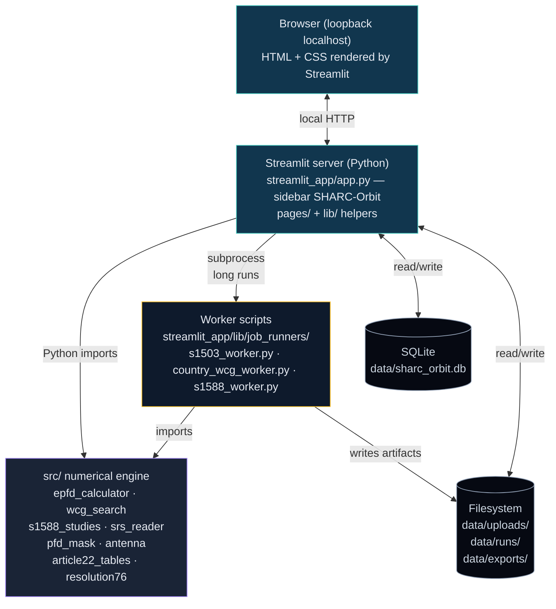
```mermaid
flowchart TB
    Browser["Browser (loopback localhost)<br>HTML + CSS rendered by Streamlit"]
    UI["Streamlit server (Python)<br>streamlit_app/app.py — sidebar SHARC-Orbit<br>pages/ + lib/ helpers"]
    Engine["src/ numerical engine<br>epfd_calculator · wcg_search<br>s1588_studies · srs_reader<br>pfd_mask · antenna<br>article22_tables · resolution76"]
    Workers["Worker scripts<br>streamlit_app/lib/job_runners/<br>s1503_worker.py · country_wcg_worker.py · s1588_worker.py"]
    DB[("SQLite<br>data/sharc_orbit.db")]
    FS[("Filesystem<br>data/uploads/<br>data/runs/<br>data/exports/")]

    Browser <-->|local HTTP| UI
    UI -->|Python imports| Engine
    UI -->|subprocess<br>long runs| Workers
    Workers -->|imports| Engine
    UI <-->|read/write| DB
    UI <-->|read/write| FS
    Workers -->|writes artifacts| FS

    classDef ui fill:#11364e,stroke:#4fd1c5,color:#e6eaf2
    classDef engine fill:#1a2436,stroke:#a78bfa,color:#e6eaf2
    classDef worker fill:#0e1a2c,stroke:#fbbf24,color:#e6eaf2
    classDef store fill:#060912,stroke:#94a3b8,color:#cbd5e0
    class Browser,UI ui
    class Engine engine
    class Workers worker
    class DB,FS store
```

The Streamlit UI is the **only presentation layer**. The engine is the **only
compute layer**. Each long simulation is launched via `subprocess` to isolate
memory/faults and enable progress streaming through the log.

---

## 3. Module organization

### 3.1 SHARC-Orbit repository root

```
SHARC-Orbit/
├── README.md
├── ARCHITECTURE.md           # this document — tool architecture
├── LICENSE.txt
├── requirements.txt          # the pinned dependency list — there is NO root pyproject.toml
├── config.example.yaml       # example engine config for the CLI entrypoints
├── .gitignore
├── src/                      # numerical engine (ITU-R S.1503-4 / Resolution 76)
├── streamlit_app/            # Python UI (Streamlit) — entrypoint; the test suite lives here
├── tools/jackcess/           # Java/Jackcess helper shelled out by src/mdb_writer.py
├── visualization/data/       # countries.geojson (country filter + territorial WCGA)
└── docs/                     # ITU recommendations, SRS schema notes, test fixtures
```

### 3.2 Numerical engine — `src/`

Inherited from the parent project and still the only compute layer. SHARC-Orbit
extends it — mask generation, manual/parametric systems and the Jackcess MDB
writer, §B3.3 operating parameters, the territorial WCGA and the windowed
track-duration EPFD path. Existing entry points stay backward-compatible: new
behaviour arrives as optional keyword arguments, never as a changed signature.

| Module | Responsibility |
|---|---|
| `src/epfd_calculator.py` | Temporal EPFD↓ simulation (S.1503-4 §D.5/D.7) with a streaming histogram — **and** the §D5.1.3/§D5.1.4.2 windowed track-duration path (`run_epfd_simulation_windowed`): one single-pass timeline over `[0, N_TotalSteps)`, per-window CCDFs, worst-window envelope, `window_diagnostics`, and the `or_rescues_capped` reading of the printed Step 20 |
| `src/epfd_stream_accumulator.py` | Streaming EPFD↓ accumulator behind the above — 0.1 dB histogram (§D7.1.1) weighted by step duration, diagnostic aggregates, decimated time trace. Picklable, so a multiprocessing / Ray worker returns kilobytes instead of megabytes |
| `src/wcg_search.py` | WCGA — Worst Case Geometry Algorithm (§D.3.1) |
| `src/country_constrained_wcg.py` | The same §D.3.1 WCGA with the ES domain restricted to selected country polygons, plus a per-orbit RAAN (Ω) sweep — automatically OFF for repeating ground tracks (§D4.6.1 `f_stn_keep` + `rpt_period`), ON otherwise. `resolve_country_raan_sweep`, `country_constrained_wcga` |
| `src/geometry.py` | Core WCG/EPFD geometry (§D.3.1.2 / §D.6.4) — α via the GSO-arc sweep, X angle, off-axis φ, elevation, angular velocity, ΔLong; numba batch kernels with a pure-NumPy fallback |
| `src/operating_params.py` | S.1503-4 §B3.3 non-GSO operating-parameter sets — parses `<non_gso_operating_parameters>` (MIN_DURATION, MAX_CO_FREQ, MIN_EXCLUDE, MIN_ELEV, MIN_ANGLE_AT_ES), one set per frequency range and resolved by frequency containment, read from the masks DB as zipped XML blobs (`f_mask='R'` via `mask_lnk3`) or from loose XML files. §B5.2 validation included. `load_from_paths`, `load_from_mask_mdb`, `validate_set`, `to_engine_config` |
| `src/s1588_studies/` | Aggregation studies (convolution, joint, grid) |
| `src/s1588_studies/convolution.py` | PMF convolution (CCDF↔PMF round-trip) |
| `src/s1588_studies/multi_system.py` | Joint simulation (Method 2B) |
| `src/s1588_studies/geometry.py` | Grid `(es_lat, es_lon, gso_lon)` (§D.6) |
| `src/s1588_studies/percentiles.py` | Extraction of 10/1/0.1/0.01 % percentiles |
| `src/s1588_studies/runner.py` | `run_epfd_at_geometry` — EPFD at a fixed `GeometryPoint` instead of a `WCGResult` (Studies 2/3) |
| `src/s1588_studies/single_pass.py` | Loop-inverted tiled grid engine — propagate once per time step, evaluate every point of the tile; memory bounded by `tile_size` |
| `src/s1588_studies/vectorized_kernel.py` | Tier-2 `[M_points × N_sats]` vectorized kernel — α via an njit sweep; S.1428 only (no BO.1443 planar) |
| `src/s1588_studies/countries.py` | Point-in-polygon country filter over the grid (`visualization/data/countries.geojson`); also feeds the territorial WCGA pickers |
| `src/srs_reader.py` | SRS `.mdb` reader (notices, masks, `mask_lnk1`) |
| `src/pfd_mask.py` | `PFDMask`, `PFDMaskXML`, `PFDMaskMulti` (multi-mask per satellite) |
| `src/antenna.py` | `ITURS1428Antenna`, `ITUBO1443Antenna`, factory `create_gso_es_antenna` |
| `src/orbit_propagator.py` | Keplerian propagation (optional J2) |
| `src/article22_tables.py` | RR Article 22 tables (single-entry limits) |
| `src/resolution76_tables.py` | Resolution 76 tables (aggregate limits) |
| `src/main.py` | Orchestrator `run_wcg_downlink(config)` — main entrypoint; config loaders `load_from_srs` (filings) / `load_from_manual` (parametric NGSO, R3/R4); raises `NoValidGeometry` when the WCG search finds no store-criteria geometry (never returns an all-`None` tuple) |
| `src/coordinates.py` | LLA/ECEF/ECI conversions |
| `src/time_step.py` | Normative resolution §D.4.2/§D.4.7 (dual time step) + the §D5.1.3 window parameters (`compute_track_duration_windows` → `TrackDurationWindows`) |
| `src/constants.py` | S.1503-4 Table 2 / §A2.2 constants + WGS-84 extras |
| `src/s1503_figure13_wcg_lon.py` | §D.3 / Figure 13 post-WCGA longitudinal adjustment — moves the ES/GSO pair to where the dominant satellite really crosses the target latitude under the full §D6.3 model, preserving the WCGA's relative geometry (toggle `s1503_figure13`, default on; skipped for a defined geometry) |
| `src/export_visualization.py` · `src/orbit_tracks_parquet.py` | CZML export for the Cesium viewer and segmented ECEF orbit tracks in Parquet |
| `src/data/` | The normative limit points behind the two table modules — `article22_limits.json`, `resolution76_limits.json` |
| `src/__init__.py` | **Pins `NUMBA_THREADING_LAYER=workqueue` before any numba import** — required because the engine forks a `multiprocessing.Pool`. Do not remove |
| `src/launcher_ui.py` | Legacy standalone HTTP launcher — unused by Streamlit, kept only for the CLI |
| `src/exceptions.py` | Domain exceptions — `NoValidGeometry` (WCG search completed but no geometry met the store criteria; carries actionable `diagnostics`) and `InvalidManualGeometry` (out-of-range manual ES/GSO coordinates) |
| `src/mask_generator.py` | Parametric PFD-mask generator (Part C) — `BeamSpec`/`MaskGenParams`, `generate_pfd_mask_azel` (Option 2), `generate_pfd_mask_alpha_dlon` (native Option 1), `write_pfd_mask_xml` (§C4.2 Table 5) |
| `src/mask_converter.py` | Az/el ↔ α/ΔLong mask geometry (§D6.4.4) — batch helpers reused by the generator; carries the signed-α southern-hemisphere fix (§D6.4.4.3) |
| `src/constellation_templates.py` | Constellation-pattern generators (Walker delta/star, equatorial ring, train, Molniya, tundra, IGSO, multi-shell) + sun-synchronous / repeat-ground-track helpers for manual entry |
| `src/mdb_writer.py` | Cross-platform JET4 MDB writer — a manual system → real `<base>_SRS.mdb` + `<base>_Mask.mdb` pair via a Java/Jackcess shell-out (`tools/jackcess/`); `availability()`/`is_available()` gate on a JRE with the `jdk.compiler` module |

### 3.3 Streamlit UI — `streamlit_app/`

```
streamlit_app/
├── app.py                    # entrypoint (sidebar label "SHARC-Orbit")
├── pages/
│   ├── 0_Cluster.py          # Ray runtime config + node control
│   ├── 1_Upload.py
│   ├── 2_Uploads.py
│   ├── 3_Single_entry.py
│   ├── 4_Aggregate.py
│   ├── 5_Launcher.py
│   ├── 6_Runs.py
│   ├── 7_Status.py
│   ├── 8_Results.py
│   ├── 9_Campaign.py
│   ├── A_Help.py             # in-app manual (workflow + glossary + troubleshooting)
│   ├── B_Mask_Viewer.py      # Interactive PFD mask visualiser (heatmap + slice + point calculator)
│   ├── C_Constellation.py    # 3D constellation globe (t=0 snapshot, per Article 22 scenario)
│   ├── E_Manual_System.py    # Manual/parametric NGSO entry — constellation-template wizard + 3D preview + register-as-filing
│   ├── F_Mask_Generator.py   # Parametric PFD-mask generator (Part C) — beam params → PFD mask + C4.2 XML export
│   ├── G_Country_Single_entry.py # redirect stub — the territorial WCGA moved into Single-entry; not in st.navigation, kept for stale bookmarks and persisted state
│   └── H_National_Occupancy.py   # National band occupancy — licensed catalogue + ITU SNS/IFIC filings
├── lib/
│   ├── __init__.py           # global paths (DATA_ROOT, RUNS_DIR, ...)
│   ├── engine.py             # lazy wrappers over src/
│   ├── storage.py            # SQLite + filesystem
│   ├── state.py              # session_state + disk persistence
│   ├── plots.py              # Plotly factories (CCDF, EPFD, percentiles, 3D, globe)
│   ├── theme.py              # CSS overrides + pills
│   ├── filings.py            # SRS preview
│   ├── srs_inspect.py        # notice/mask listing (lru_cache)
│   ├── exports.py            # XLSX — campaign report + per-run ITU-style workbook (run_to_xlsx)
│   ├── workers.py            # subprocess + log streaming
│   ├── launcher.py           # bridge worker ↔ DB ↔ filesystem
│   ├── cluster.py            # Ray runtime + LPT dispatch + SPREAD + ray.put broadcast + node control
│   ├── wcga_cluster.py       # Ray executor injected into the WCGA latitude sweep
│   ├── epfd_cluster.py       # Ray executor injected into the EPFD↓ time-chunk sweep
│   ├── plan.py               # per-filing cost estimate for LPT scheduling
│   ├── hwinfo.py             # per-run hardware capture (CPU/mem, per cluster node)
│   ├── mdb_results.py        # parse external results .mdb → CCDF curves (overlay)
│   ├── tour.py               # stateful guided tour across the workflow pages
│   ├── widgets.py            # select_described + confirm_delete_button (modal)
│   ├── manual.py             # per-page contextual help snippets
│   ├── estimator.py          # runtime + workload estimator (auto-calibrated)
│   ├── result_artifacts.py   # per-run CSV/PNG artifacts (CCDF, histogram, timeseries, geometries, table17, maps)
│   ├── report.py             # S.1503-4 §D7.3 summary.html (statement + Table 17 + CDF)
│   ├── art22_ui.py           # shared Article 22 downlink scenario tree (service → frequency run → ES antenna / ref-BW leaf)
│   ├── band_chart.py         # ITU-style frequency-occupancy strips (pure HTML/CSS through st.markdown)
│   ├── freq_bands.py         # letter-band edges derived from the frequencies themselves (satellite practice, not IEEE 521) + Article 22 presets
│   ├── occupancy.py          # national licensed-station + ITU SNS/IFIC catalogue index; cache under data/br_occupancy/
│   └── job_runners/
│       ├── __init__.py       # worker contract — params JSON as argv[1], PROGRESS:<float> on stdout, artifacts under params['result_path']
│       ├── s1503_worker.py   # single-system worker
│       ├── country_wcg_worker.py # territorial single-entry worker — same pipeline, WCGA ES domain ⊂ country polygons, auto per-orbit RAAN sweep
│       └── s1588_worker.py   # multi-system worker (method_1..4)
├── __init__.py               # package marker — what makes `python -m streamlit_app.lib.job_runners.*` work
├── pyproject.toml            # packaging stub (sharc-orbit-streamlit) — NOT the install path; its deps omit ray and access-parser
├── static/topojson/          # vendored world_110m.json — keeps the Plotly globe fully offline
├── tests/                    # pytest — 42 engine + UI suites, not just smoke
├── data/                     # SQLite + uploads + runs + occupancy cache + cluster.json (gitignored)
├── README.md
└── .streamlit/config.toml    # theme, server settings
```

### 3.4 Pages (UI components)

| Page | Functionality |
|---|---|
| Home | Landing, engine status pill |
| Cluster | Ray runtime config (4-state machine) + head/worker control + bind-IP picker (VPN / LAN / auto) |
| Upload | Register SRS `.mdb` + notice/mask detection (mdb-only) |
| Uploads | List filings + systems; **per-system orbital parameters** (planes, alt, e, i, RAAN, period) + **operating frequency bands** (masks + groups); *View mask* buttons → Mask Viewer; bulk delete / re-scan |
| Mask Viewer | Interactive PFD mask visualiser — metadata header, real-degree A/B sliders, 2D heatmap (uniform vs proportional), slice line plot, point-wise PFD calculator |
| Single-entry | S.1503-4 form (WCGA + EPFD↓); retractable WCG search / Defined geometry / Time step / **Orbital dynamics** (station keeping `Wdelta`, artificial precession, precession-from-MDB) sections. Geometry source is WCGA, a defined ES/GSO point, or an ES×GSO grid. Adds the **territorial WCGA** (country multiselect + per-orbit RAAN sweep auto/on/off → `country_wcg_worker`) and the **§B3.3 operating parameters** panel that selects §D5.1.4.1 vs §D5.1.4.2 per band |
| Aggregate | Multi-system form (4 methods) + per-method panel; same WCG / Time step / **Orbital dynamics** sections (per filing) |
| Launcher | Multi-method campaign — mirrors all Aggregate options; persisted form |
| Runs | Row-per-run table; per-row Results/Status; **delete actions behind a confirmation modal**; `finished_at (BRT)` + `duration` |
| Status | Progress + log streaming + cancel; **live host CPU%/mem% + per-worker utilisation** (while running) |
| Results | CCDF + percentiles + Art.22 / Res.76 limits + 3D globe; **upload external results `.mdb` to overlay reference CCDF curves** |
| Campaign | Aggregated dashboard + XLSX export |
| Help | In-app manual + **guided tour launcher** (`lib/tour.py`) |
| Constellation | 3D globe of the non-GSO constellation — `t=0` ECEF snapshot rendered inline via Plotly; filter by Article 22 scenario (**emitters-in-band** vs all) with per-satellite emission flags from `grp ⋈ mask_lnk1`; colour by **emitter status** or **orbital plane**; per-scenario metrics (N_total, emitters, planes, altitude, inclination, e). Built live from the SRS `.mdb` — **no run required** |
| Manual system | Define an NGSO system with no SRS filing — pick a constellation template (Walker, ring, train, Molniya, tundra, IGSO, multi-shell), edit the generated plane list (RAAN/ω/per-sat phases), preview on the 3D globe, attach a standalone PFD-mask XML, and either launch an EPFD↓ run directly or **register it as a filing** (real JET4 `_SRS.mdb`/`_Mask.mdb` pair via Jackcess, or a YAML+XML fallback) |
| National occupancy | Frequency-occupancy survey for one country — a national licensed catalogue (uploaded, or fetched where an administration publishes one) plus any number of registered ITU filing catalogues (complete `SRS.mdb` from a BR IFIC ISO, or an uploaded `.mdb`). A licensed-station table is uploaded; no administration is built in. The public weekly `ificXXXX.mdb` is not a source. Filters by source, country, orbit and letter band; renders shared-axis occupancy strips with a common-overlap row |
| Mask generator | Build a PFD mask from beam parameters (`pfd_i = P_i + G_i(θ) − 10log10(4πd²)` per cell, §C2.3.1, summed over the N_co strongest beams) in Option 1 (α×ΔLong) or Option 2 (az×el), with GSO-arc mitigation (beam-off / α-cutoff) and an operating-latitude band; preview + export round-trippable §C4.2 XML usable directly as a Manual-System mask |

Each workflow page also gets a collapsed `Help on this page` expander
fed by `lib/manual.py` snippets — keeps quick context one click away
from the title.

---

## 4. Simulation methods

The tool exposes two top-level simulation modes:

- **Single-entry** (one system) — ITU-R S.1503-4 reference flow
- **Aggregate** (≥ 2 systems) — four alternative aggregation methods (methods
  under study, **not necessarily tied to a single ITU-R recommendation**)

Single-entry is one *mode* but three *dispatches*, chosen by the geometry
source picked on the page: `launcher.launch_s1503` (WCGA, optionally
territorial via `launcher.launch_country_wcg` and a dedicated worker) and
`launcher.launch_s1588(method="method_2", kind="single")` for the ES×GSO grid
study.

### 4.1 Single-entry — ITU-R S.1503-4

**Goal:** characterize the EPFD↓ from one NGSO system as seen by the geostationary
ES at the worst-case geometry (WCG), and check compliance with RR Article 22
single-entry limits.

**Inputs:** one *system* (filing × notice) with its constellation, PFD mask(s)
distributed across satellites via `mask_lnk1` (transparently handled by the
engine), GSO ES antenna parameters, and simulation parameters that are **all
optional**: `num_time_steps`, `time_step_s` (the §D4.7 *coarse* stride, not the
sampling period), `fine_time_step_s`, `min_elevation_deg`, `dual_time_step_mode`
and `itu_software` (§D4.1 reading A/B). Left empty — the default — Δt and NSTEPS
are dimensioned by the engine per §D4; see *Time base* below.

**Operating parameters (§B3.3).** α₀ (MIN_EXCLUDE), ε₀ (MIN_ELEV), MAX_CO_FREQ,
MIN_DURATION and MIN_ANGLE_AT_ES come from the `<non_gso_operating_parameters>`
XML set — stored in the masks database as zipped `f_mask='R'` blobs linked
through `mask_lnk3`, or supplied as a standalone XML with the filing, where the
uploaded XML wins over the same band read from the `.mdb`. Per the Attachment to
Part B, the XML **supersedes** the SRS `sat_oper` / `grp` columns for the band
examined. The set is selected by frequency containment against the run
frequency; a set that cannot be resolved is recorded under
`_operating_params_error` instead of silently downgrading the examination.

**Engine flow** (`src/main.py:run_wcg_downlink`):

1. Load SRS via `load_from_srs(...)` → Python `cfg` dict.
2. Build the constellation via `create_constellation_for_config(cfg)` (which
   wraps `create_constellation_with_masks`): `mask_lnk1` is resolved at the
   **pinned simulation frequency**, not the possibly-clamped
   `ngso.frequency_ghz`. With `simulation.restrict_emitters_to_sim_band` (ON by
   default in the Single-entry form, OFF at the engine API) only satellites
   whose SRS `grp` row with `emi_rcp='E'` covers that frequency are kept, and
   `n_satellites` in the artifact is that filtered count. When `grp` data exists
   and no transmitting group covers the frequency the loader raises
   `ValueError` rather than fabricating co-frequency interference.
3. Multi-mask detection: if `len(unique_mask_ids) > 1` → wrap in
   `PFDMaskMulti(masks_by_id, mask_id_per_sat)`; otherwise load a single PFD
   mask.
4. **WCGA** (S.1503-4 §D.3.1). An outer loop runs over unique orbit keys —
   `(a, e, i)`, extended with the PFD mask **content hash** in multi-mask mode
   so identically shaped curves under different `mask_id`s are evaluated once.
   For each key `search_wcg_s1503(...)` does the latitude sweep plus a (θ, φ)
   sub-grid with binary searches on the boundaries α = α₀ and ε = ε₀ (mask
   θ-symmetry auto-detected by `detect_wcg_theta_symmetry` unless overridden).
   Candidates are ranked by **margin** — EPFD − EPFDThreshold[lat], which is
   latitude-dependent under RR Notes 22.5C.4 / 22.5C.8 and otherwise equivalent
   to ranking on absolute EPFD — with an angular-velocity tie-break inside the
   0.1 dB bin. The winner triggers a ΔM realignment of the constellation, then
   the §D3 / Figure 13 ES-GSO longitude adjustment (`src/s1503_figure13_wcg_lon.py`).
5. **Time base (§D4).** Each sub-constellation (grouped by `(a, e, i)`) is
   dimensioned with its own geometry by `compute_time_step_and_count_multi`, and
   the §D4.1 rule combines them: Δt = min over sets, NSTEPS = ⌊max Trun / min Δt⌋.
   The fine step comes from §D4.2 (`compute_downlink_fine_step_s1503`, θ3dB with
   Nhit = 16); the run length from §D4.6.1 (repeating ground track) or §D4.6.2,
   extended to the Nmin of Table 13. §D4.1's 10⁸ recalculation of N'hit / N'coarse
   is applied, with the `itu_software` switch selecting reading A or B. Note that
   §D4.6.1 is chosen by the SRS `f_stn_keep` flag, **not** by geometric track
   closure.
6. **EPFD↓ simulation at the WCG.** `run_epfd_simulation` over the dimensioned
   NSTEPS (a user-supplied `num_time_steps` is honoured but recorded as a
   truncation or extension of the prescribed run). The dual time step (§D4.7) is
   **on by default** — `dual_time_step_mode='s1503'`, which the form's "on" maps
   to — and Ncoarse is computed from ⌊Nhit·φcoarse/θ3dB⌋, not entered by the
   user. It is switched off automatically when the track-duration variant runs.
7. CCDF built by the streaming accumulator (0.1 dB bins weighted by the real
   duration of each interval). Memory cost < 1 MB regardless of N **on the
   standard §D5.1.4.1 path** — see §4.1.1 for the windowed path's very different
   memory profile.
8. **Compliance (§D7.1.3).** The per-row verdict is the Step 4-5 *probability*
   test: pass iff Py ≤ Pi, where Py is the simulated percentage of time the epfd
   exceeds Ji. The Pi = 0 row — the Recommendation's 100 %-of-the-time limit —
   passes only if J_max < J_100 strictly. **The dB margin is reported but is not
   the criterion**: at the Pi = 0 and Pi = 100 rows a positive margin and a FAIL
   can coexist. One row per Article 22 specification point is written to the
   artifact as `table17` (§D7.3.2, see §6.10). The applicable table
   (22-1A … 22-1E) is auto-selected by frequency, service and antenna.

**WCG-empty outcome (contract):** if the WCGA store criteria (minimum
elevation ε₀, GSO-arc elevation εGSO, exclusion angle α₀, PFD mask) are never
satisfied, `run_wcg_downlink` **raises `NoValidGeometry`** (carrying a
`diagnostics` dict of the gating knobs) rather than returning an all-`None`
tuple — a legitimate result, not a crash. The worker catches it and writes a
completed `compliance: "no_geometry"` artifact (§6.2). Out-of-range manual
ES/GSO coordinates raise `InvalidManualGeometry` instead.

**Output (artifact `sim_data.json`):**

```
{
  "kind": "s1503",             // "single" for the ES×GSO grid study
                               //   (study_mode=single_grid);
                               // "country_constrained_s1503" for a territorial run
  "compliance": "pass" | "fail" | "unknown" | "no_geometry",
  "epfd_type", "input_source", "multi_config", "units",   // run identity
  "wcg": {es_lat_deg, es_lon_deg, gso_lon_deg, theta_deg, phi_deg, alpha_deg,
          offaxis_deg, epfd_dBW, elevation_deg},
  "wcg_source", "country_wcg_alignment", "country_constrained_wcg",
                               //   territorial runs only
  "ccdf_bins_db":   [...],     // descending EPFD↓ (dBW/m²/40 kHz)
  "ccdf_pct":       [...],     // ascending % of time exceeded
  "histogram":      {...},     // the 0.1 dB PDF behind the CCDF (§D7.1.1)
  "max_epfd_dbw_m2_40khz": -161.5,
  "percentiles": {"10.0%": ..., "1.0%": ..., "0.1%": ..., "0.01%": ...},
  "n_satellites": N,           // after the emitter band filter, when enabled
  "table17": [...],            // §D7.3.2 — the normative per-point verdict (§6.10)
  "compliance_detail": {worst_margin_dB, worst_limit_dBW, worst_percentage},
  "article22":   {limits[[epfd_db, pct], ...], rr_reference, ...},
  "resolution76":{limits[[epfd_db, pct], ...], rr_reference, ...},
  "num_time_steps", "time_step_s", "dual_time_step" { mode, fine_step_s,
      coarse_step_s, ncoarse, num_time_steps, n_fine_steps_executed,
      n_coarse_steps_executed, n_exec_steps },
  "track_duration", "per_window", "worst_window_index",   // §D5.1.4.2 provenance
  "wcg_explanation", "frequency_request_ignored",         // diagnostics
  "hardware": {captured_by:{hostname, cpu_model, cpu_count_logical,
               mem_total_bytes, ...}, cluster_mode, distributed,
               nodes:[{hostname, cpu, mem_total_bytes}], n_nodes},
  "timing": {...}
}
```

**Non-normative switches, recorded as provenance.** Several knobs deliberately
depart from the Recommendation. Each is written into the artifact and into the
§D7.3 report header, so a run produced under an override can never be read as
conformant: `track_duration_mode` (`force` / `off`, overriding the data-driven
§D5.1.4 selection), `emulate_s1503_2` / `strict_exclusion_zone`,
`disable_gso_min_elevation`, `strict_max_co_freq_total`,
`step20_or_rescues_capped`, and an explicit `num_time_steps`.

The Single-entry method **does not** spawn additional simulations: the
`PHASE 3B — Static ES` legacy stage is **disabled** by default
(`simulation.run_static_es = False` set by the worker).

#### 4.1.1 Track-duration variant (§D5.1.3 / §D5.1.4.2)

**The selection between §D5.1.4.1 and §D5.1.4.2 is data-driven, never a user
choice.** A notice takes the variant when MIN_DURATION is non-zero at any
latitude; the *window length*, however, is MIN_DURATION at the ES latitude
actually examined — so a notice can select the variant globally and still
degenerate at one latitude (N_SW ≤ 1), in which case the run falls back to
§D5.1.4.1 and says so in `track_duration_degenerate`.

Window arithmetic (`src/time_step.py:compute_track_duration_windows` →
`TrackDurationWindows`):

```
N_SW         = ⌊MIN_DURATION / T_fine⌋        sliding-window length, in steps
N_MSL        = ⌈MST / T_fine⌉                  minimum sliding-length offset
N_TW         = ⌈N_SW / N_MSL⌉                  number of window SETS
N_Repeat     = ⌈N_step / N_SW⌉
N_TotalSteps = N_Repeat·N_SW + (N_TW − 1)·N_MSL
```

`N_TotalSteps` is **one** timeline, not N_TW timelines — the run duration plus
the time needed to complete all the windows. The single-pass dispatch
(`single_pass=True`, the default) walks it once with a halo between chunks; the
older per-set dispatch survives only as an A/B reference.

Each window set keeps its own accumulator, and the headline CCDF is the
**worst-per-level envelope** across the N_TW sets — not a single accumulator.
Each worker also holds a dense `N_SW × N_sat` ring buffer, whose size is modelled
in advance and capped by `simulation.track_duration_max_ring_mb` (default 8 GB);
exceeding it raises a `ValueError` naming the knob instead of running the host
out of memory.

Two properties of this path are easy to get wrong and are therefore recorded
explicitly in the artifact:

- The per-step **selection inputs** of §D5.1.4.1 do not apply here; those that
  were supplied but ignored are listed in `selection_inputs_ignored`.
- **An empty tracked set is the anti-conservative failure mode.** When no
  satellite holds α₀/ε₀ for a whole window the aggregate keeps only the Step-20
  gain branch and the run reads as a clean PASS, so the per-family counters and
  the empty-window fraction are surfaced on Results and in `summary.html`.

`or_rescues_capped` selects the reading of the printed Step 20. The default
(`True`) follows the Recommendation as printed: the Note removes from the gain
branch only satellites already on the MAX_CO_FREQ list, so a satellite that met
α₀/ε₀ but lost the ranking still contributes through the gain branch. The
narrow reading survives as a study switch.

#### 4.1.2 Territorial WCGA (country-constrained ES domain)

`src/country_constrained_wcg.py` restricts the WCGA's earth-station domain to
selected country polygons (`visualization/data/countries.geojson`) through the
`country_constrained_wcga(...)` context manager. This narrows *where the ES may
sit*; it does **not** replace the WCGA with an ES×GSO grid.

`resolve_country_raan_sweep` decides the RAAN (Ω) sweep with a policy of
`on` / `off` / `auto`. Under `auto` the decision is **per orbit** and follows
§D4.6.1: a shell with a repeating ground track (`f_stn_keep` set and
`rpt_period ≥ 1 h`) keeps its filed RAAN, because sweeping Ω would destroy the
Earth-fixed track the administration filed; every other shell sweeps. A
mixed-shell filing is therefore handled orbit by orbit, and the post-search ΔΩ
alignment is applied only to the sweep-ON satellites.

The run goes through its own worker (`lib/job_runners/country_wcg_worker.py`),
which wraps the same pipeline and writes `country_constrained_wcg.json` beside
the usual artifacts, plus `kind: "country_constrained_s1503"`, `wcg_source` and
`country_wcg_alignment` inside `sim_data.json` / `summary.json`.

### 4.2 Aggregate — Methods 1 to 4 (under study)

The Aggregate page accepts ≥ 2 systems (each a `(upload_id, ntc_id)` tuple)
and exposes four aggregation alternatives. All four run through the
`s1588_worker.py` subprocess; their output artifacts share the same envelope
JSON schema (`ccdf_bins_db`, `ccdf_pct`, `max_epfd_dbw_m2_40khz`, `percentiles`)
plus method-specific keys.

The four methods are **not all normative** — they exist to support comparison
of aggregation policies during the Resolution 76 studies.

---

#### Method 1 — convolution at each system's WCG

**Concept (Study 1, conservative):**

1. For each filing `i`, run the full single-entry pipeline → CCDFᵢ at its
   own WCGᵢ (each system at its individual worst-case geometry).
2. Convolve the N CCDFs via PMF transform:
   `PMF_total = PMF₁ ⊛ PMF₂ ⊛ ... ⊛ PMF_N` (linear power scale).
3. Convert back to CCDF → top-level aggregate CCDF.

**Assumption:** statistical independence between systems. Ignores temporal
correlation (peaks may coincide in reality).

**Conservatism:** each CCDFᵢ uses its own worst geometry; aggregating combines
worst-case statistics from N different geometries → typically larger than the
common-geometry methods.

**Artifact extra keys:** `per_system[i]` (each filing's CCDF + WCG).

---

#### Method 2 — convolution on common ES × GSO grid (Study 2)

**Concept:**

1. Build a grid of (`es_lat`, `es_lon`, `gso_lon`) triplets via
   `iter_geometry_grid(grid_step_deg, gso_pointing_step_deg,
   min_elevation_deg)` (S.1503-4 §D.6). Typical step: 10°.
2. For each grid point `p`:
   - Run `run_epfd_at_geometry(constellation_i, p)` for each filing `i`
     (single PFD mask handled transparently by engine multi-mask path).
   - Convolve the N per-system CCDFs at `p` → `CCDF_agg(p)`.
3. **Envelope** across all grid points (linear power scale):
   `EPFD_envelope(pct) = 10·log₁₀(max_p [10^(EPFD_agg(p, pct)/10)])`.
4. Top-level CCDF = envelope. `per_point[]` carries each grid point's
   aggregate CCDF.

**Notes:**

- Same geometry for all systems before convolution.
- Still assumes statistical independence between systems (convolution).
- Top-level curve is the **upper envelope** — pointwise-max across
  the grid in linear power.
- Computational cost: N_geom × N S.1503 simulations + N_geom convolutions.

**Artifact extra keys:** `grid_step_deg`, `gso_pointing_step_deg`,
`n_grid_points`, `per_point[]`.

---

#### Method 3 — joint simulation (Study 3 — coherent megaconstellation)

**Concept:**

1. Build a *megaconstellation* by fusing the N filings: their satellites are
   concatenated, each with its own `mask_id` (`PFDMaskMulti(masks_by_id,
   mask_id_per_sat)`). Same `t₀`, same `Δt`, same simulation window.
2. **Joint WCGA** on the megaconstellation: iterate the unique
   `(a, e, i, mask_id)` orbit keys → `search_wcg_s1503(oe_ref, mask_for_ref,
   ...)` for each → pick the maximum aggregate `epfd_dBW`.
   Optional override: user can pass a manual `(es_lat, es_lon, gso_lon)`.
3. **Joint EPFD↓ simulation** at the joint WCG/manual geometry:
   `run_epfd_simulation(constellation=combined, pfd_mask=pfd_multi, ...)`.
   The aggregate EPFD is computed instant-by-instant: per timestep, all
   contributors (across all N systems) sum in linear power scale.
4. CCDF from the streaming accumulator → top-level aggregate CCDF.

**Why joint and not convolution:** preserves temporal correlation between
constellations. If peaks across systems align in time, the joint sum reflects
the real combined EPFD (the convolution methods cannot, because they assume
independence).

**post_sum complement:** in parallel, the worker also runs the per-system
single-entry pipeline and convolves the N CCDFs (same as Method 1) into a
`post_sum` payload. Comparing `joint` vs `post_sum` quantifies the contribution
of temporal correlation that convolution discards.

**Artifact extra keys:** `geometry` (joint WCG), `post_sum`
{`ccdf_bins_db`, `ccdf_pct`, `max_epfd_dbw`, `percentiles`}, `per_system[]`.

---

#### Method 4 — per-WCG convolution sweep (didactic / inhomogeneity audit)

**Concept:**

1. For each filing `i`, compute its WCG `gᵢ` via the standard single-entry
   pipeline (N WCGs in total).
2. For each WCG `gᵢ`, simulate **all** N filings at that geometry:
   `run_epfd_at_geometry(constellation_j, gᵢ)` for j = 1..N. Convolve the N
   per-system CCDFs → 1 aggregate CCDF `CCDF_agg(gᵢ)`.
3. Output: N aggregate CCDFs, one per WCG (`per_wcg[]`).
4. Top-level CCDF: by convention, the worst per-WCG (max `max_epfd_dbw`).
   The UI plots **all N** per-WCG curves equally so the analyst decides
   visually which is worst.

**Use case:** measure how aggregate EPFD varies across the "natural" worst
geometries of each filing — exposes inhomogeneity between systems.

**Cost:** N WCGAs + N × N EPFD simulations + N convolutions.

**Artifact extra keys:** `per_wcg[]` (each entry: `wcg_index`, `es_lat_deg`,
`es_lon_deg`, `gso_lon_deg`, `ccdf_bins_db`, `ccdf_pct`, `percentiles`,
`max_epfd_dbw`).

---

> **Retired: Method 5 (Step-1 raw, no envelope).** Folded into Method 2, whose
> artifacts now keep the full curve set (`per_point[].per_system[]` raw CCDFs
> alongside the per-point convolutions and the envelope). `method_5` survives
> only as a dormant back-compat dispatch in `s1588_worker.py` so historical
> runs still reload; it is not selectable in the UI.

---

### 4.3 Visual summary — aggregate method matrix

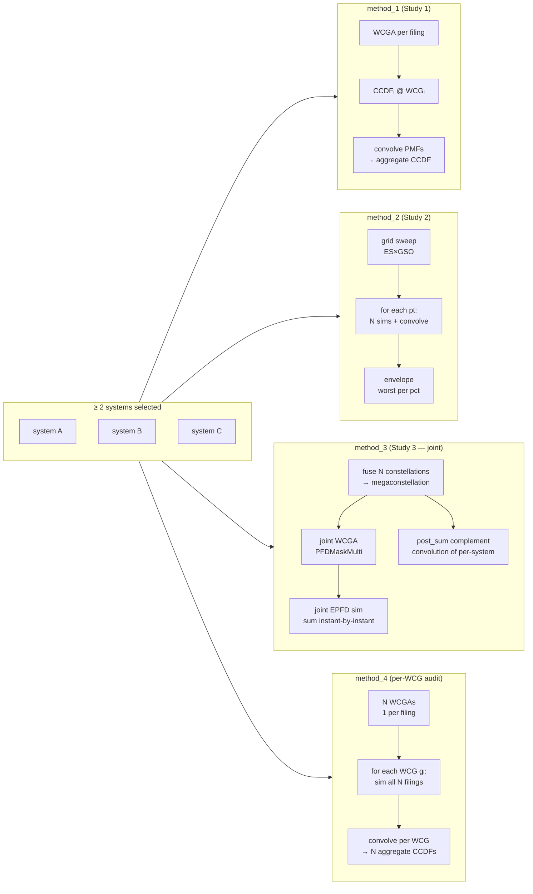
```mermaid
graph LR
    subgraph Inputs["≥ 2 systems selected"]
        S1[system A]
        S2[system B]
        S3[system C]
    end

    subgraph M1["method_1 (Study 1)"]
        direction TB
        M1a[WCGA per filing]
        M1b["CCDFᵢ @ WCGᵢ"]
        M1c["convolve PMFs<br>→ aggregate CCDF"]
        M1a --> M1b --> M1c
    end

    subgraph M2["method_2 (Study 2)"]
        direction TB
        M2a[grid sweep<br>ES×GSO]
        M2b["for each pt:<br>N sims + convolve"]
        M2c[envelope<br>worst per pct]
        M2a --> M2b --> M2c
    end

    subgraph M3["method_3 (Study 3 — joint)"]
        direction TB
        M3a[fuse N constellations<br>→ megaconstellation]
        M3b[joint WCGA<br>PFDMaskMulti]
        M3c[joint EPFD sim<br>sum instant-by-instant]
        M3d[post_sum complement<br>convolution of per-system]
        M3a --> M3b --> M3c
        M3a --> M3d
    end

    subgraph M4["method_4 (per-WCG audit)"]
        direction TB
        M4a[N WCGAs<br>1 per filing]
        M4b["for each WCG gᵢ:<br>sim all N filings"]
        M4c[convolve per WCG<br>→ N aggregate CCDFs]
        M4a --> M4b --> M4c
    end

    Inputs --> M1
    Inputs --> M2
    Inputs --> M3
    Inputs --> M4
```

### 4.4 Common technical notes (all aggregate methods)

- **PMF convolution**: implemented in `src/s1588_studies/convolution.py`. The
  function `convolve_ccdfs_db(ccdfs)` converts dB-CCDF → linear PMF →
  `np.convolve` chained → linear PMF total → CCDF in dB. The convolution
  operator is mathematically correct because EPFD across independent systems
  sums in linear power.
- **Limits attachment**: every aggregate artifact is augmented with Article 22
  + Resolution 76 limit curves from the first filing's config (Resolution 76
  assumes common ES diameter + reference BW across systems).
- **Compliance**: the Results page renders the limit curves on the CCDF chart
  but does **not** automatically grade aggregate compliance — the analyst
  reads it from the plot.
- **3D Globe visualization**: every method emits the geometry points used
  (ES + GSO + grid when applicable), rendered on an orthographic globe
  (`lib/plots.globe_chart`). Clicking a geometry **selects the matching
  item in the *Geometry* picker below** (match by rounded `(es_lat,
  es_lon)`); pressing **Show CCDF** opens a `@st.dialog` modal with that
  point's CCDF overlaid with Article 22 / Resolution 76 limit curves.
  The selected point is highlighted in amber; the click model is
  single-select (`clickmode="event+select"` + `dragmode=False`).

---

### 4.5 Distributed processing (Ray)

Two granularities of fan-out, both through `lib/cluster.py`:

1. **Across sub-simulations (aggregate)** — methods 1–5 dispatch
   per-filing / per-geometry tasks (section 4.5.5).
2. **Inside a single simulation (single-entry & per-filing)** — the
   WCGA latitude sweep and the EPFD↓ time-chunk sweep are themselves
   distributable via **injected executors** (section 4.5.7), so even one
   heavy filing (e.g. a 24 h run) fans out across the cluster.

Standalone (no Ray) is **not** a degenerate path: the engine already
saturates local cores — WCGA via `multiprocessing.Pool` (one latitude
per core, `_resolve_wcga_parallel_jobs` prefers processes over Numba
threads) and the EPFD sim via its own time-chunk Pool. Ray adds
**cross-machine** scale on top.

The page `pages/0_Cluster.py` is a **state machine** that exposes only the
action relevant for the current state:

| State | Trigger | UI actions |
|---|---|---|
| `STANDALONE` | `cluster.json` mode = `standalone` (default) | Form → *Start Ray head on this host* |
| `RAY CLUSTER ACTIVE` | head reachable + ≥ 1 node alive | Node table, head endpoint, *Stop cluster*, *Refresh status* |
| `RAY CLUSTER UNREACHABLE` | mode = cluster_client but `ray.init` times out (8 s) | *Re-check*, *Restart head*, *Return to standalone* |
| `RAY NOT INSTALLED` | `ray` import fails | *Reset to standalone* |

#### 4.5.1 Modes

| Mode | Use | Effect |
|---|---|---|
| `standalone` | one machine (default) | `parallel_starmap_progress` collapses to a plain Python loop — engine already saturates local cores |
| `cluster_client` | two or more machines | driver attaches to the head. **When the head runs on this host, `ensure_init` connects as a native driver via the GCS address (`<ip>:6379`) — not the fragile `ray://:10001` client channel** (which drops under heavy data load); it falls back to `ray://` only if the driver connect fails |

Mode `local` (in-process Ray) is implemented in the library but **hidden
from the UI** because on a single host it just adds oversubscription
without benefit.

**Why the native-driver preference:** the Ray Client channel (`ray://`)
tunnels every object/task through one gRPC stream that saturates and
drops (`Put failed`, "Failed to reconnect the data channel") on large
payloads — and on failure the run silently falls back to local-only. A
native driver talks to the local raylet directly. See section 4.5.8.

#### 4.5.2 `runtime_env` shipping

`cluster.uploads_runtime_env()` builds the runtime_env passed to
`ray.init`:

```python
{
    "py_modules": [REPO_ROOT/"src", REPO_ROOT/"streamlit_app"],
    "working_dir": REPO_ROOT/"streamlit_app/data/uploads",
    "excludes": ["**/__pycache__/**", "data/uploads/**",
                 "data/runs/**", "data/exports/**", ...],
    "env_vars": {
        "NUMBA_NUM_THREADS": "1",
        "OMP_NUM_THREADS": "1",
        "MKL_NUM_THREADS": "1",
        "OPENBLAS_NUM_THREADS": "1",
        "NUMEXPR_NUM_THREADS": "1",
    },
}
```

- `py_modules` — `src/` (engine) + `streamlit_app/` (helpers + workers)
  are zipped, content-hashed and shipped to every Ray worker. No need
  for a SHARC-Orbit checkout on the worker host.
- `working_dir` — `streamlit_app/data/uploads/` is uploaded as a
  separate package, extracted to the Ray worker's CWD. SRS/mask MDBs
  available at `Path(<relpath>)` inside each task.
- Default working_dir cap raised from 100 MiB to 2 GiB via
  `RAY_RUNTIME_ENV_WORKING_DIR_UPLOAD_SIZE_LIMIT_BYTES`.
- `env_vars` — pins **every thread library** inside each Ray task to
  1 thread, so Ray's `num_cpus` cap = total active CPU threads (no
  Numba/OMP oversubscription).

#### 4.5.3 Path resolver (3-level fallback)

Filing payloads carry **both** absolute and relative paths. The
function `_resolve_filing_path` in `s1588_worker.py` tries, in order:

1. `filing[abs_key]` (absolute) — works on single-machine runs.
2. `Path(filing[rel_key])` resolved against the task's **CWD** — Ray
   extracts `working_dir` there.
3. `UPLOADS_DIR / filing[rel_key]` — local uploads dir (manual rsync
   deployment).

So worker hosts may use a different username/home path than the
driver — paths never need to match.

#### 4.5.4 Dispatch helper

```python
cluster.parallel_starmap_progress(
    fn=..., items=[(...)],         # tuples of args
    num_cpus=1.0, runtime_env=...,
    costs=[...],                   # optional LPT weights (per item)
    on_done=lambda i, n: _emit_progress(...),
)
```

- Calls `ensure_init(runtime_env=...)` (idempotent; bounded by an 8 s
  timeout so a dead head never hangs the UI).
- If Ray is active: wraps `fn` in `ray.remote`, submits with
  `.options(num_cpus=..., scheduling_strategy="SPREAD")`, drains via
  `ray.wait` (stream completion).
- If Ray is inactive: plain `for it in items: fn(*it)`.
- Results preserve input ordering. `on_done(i_done, n_total)` fires
  after each task so the worker can emit `PROGRESS:%` lines.

Three scheduling refinements (all transparent to callers):

- **LPT (`costs=`)** — when costs are supplied (`lib/plan.filing_costs`
  estimates per-filing cost ∝ `N_sat × N_steps`), tasks are *submitted*
  heaviest-first to minimise makespan under heterogeneous weights. A
  wrong estimate only changes order, never correctness.
- **`SPREAD`** — forces tasks across nodes. Without it, `ray.put`-broadcast
  args (below) live on the driver's node and Ray's data-locality
  preference would pin every task there, starving remote workers.
- **`ray.put` broadcast** — `broadcast_shared_in_tuples` detects objects
  repeated across the item tuples (constellation, PFD mask, antenna, WCG)
  and `ray.put`s each **once**, replacing occurrences with an
  `ObjectRef`; the remote wrapper restores them via
  `resolve_refs_in_tuple`. Cuts channel traffic from once-per-task to
  once-per-shared-object — the fix for `Put failed` at scale.

#### 4.5.5 Task fan-out per method

| Method | Tasks dispatched |
|---|---|
| method_1 | `N` filings (per-filing single-entry sim) |
| method_2 | `n_grid_points × N` (geometry × filing) |
| method_3 | joint sim sequential; post_sum `N` tasks parallel |
| method_4 | `N` WCGAs + `N × N` (WCG × filing) sims |

#### 4.5.6 Multi-machine flow

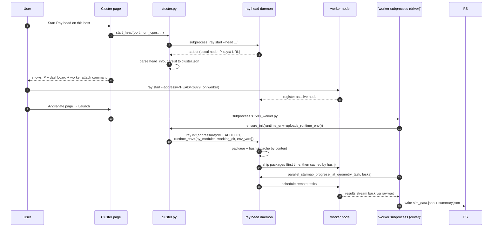
```mermaid
sequenceDiagram
    autonumber
    participant U as User
    participant CP as Cluster page
    participant CL as cluster.py
    participant HD as ray head daemon
    participant W as worker node
    participant DR as "worker subprocess (driver)"

    U->>CP: Start Ray head on this host
    CP->>CL: start_head(port, num_cpus, ...)
    CL->>HD: subprocess `ray start --head ...`
    HD-->>CL: stdout (Local node IP, ray:// URL)
    CL->>CL: parse head_info, persist to cluster.json
    CP-->>U: shows IP + dashboard + worker attach command
    U->>W: ray start --address=<HEAD>:6379 (on worker)
    W-->>HD: register as alive node
    U->>CP: Aggregate page → Launch
    CP->>DR: subprocess s1588_worker.py
    DR->>CL: ensure_init(runtime_env=uploads_runtime_env())
    CL->>HD: ray.init(address=ray://HEAD:10001,<br>runtime_env={py_modules, working_dir, env_vars})
    HD->>HD: package + hash + cache by content
    HD->>W: ship packages (first time, then cached by hash)
    DR->>HD: parallel_starmap_progress(_at_geometry_task, tasks)
    HD->>W: schedule remote tasks
    W-->>DR: results stream back via ray.wait
    DR->>FS: write sim_data.json + summary.json
```

#### 4.5.7 Executor injection — distributing inside one simulation

A single heavy filing's WCGA and EPFD↓ phases are distributable without
the engine importing the app (dependency inversion):

- The engine exposes `wcg_search.set_wcga_executor(fn)` and
  `epfd_calculator.set_epfd_executor(fn)`. When set, the per-latitude /
  per-time-chunk dispatch uses `fn` instead of the built-in
  `multiprocessing.Pool`; same work units (`_wcga_pool_worker`,
  `_simulate_chunk`) and same merge (`_WCGState.merge`,
  `EPFDStreamAccumulator.merge`) → **parity-preserving**.
- `lib/wcga_cluster.py` / `lib/epfd_cluster.py` build Ray-backed
  executors (via `parallel_starmap_progress`, so they inherit LPT /
  SPREAD / broadcast) and inject them. `s1503_worker.py` arms them
  around `run_wcg_downlink` when Ray is active; fresh Ray workers
  re-apply the run's global state (GMST0 / GSO mode / α-method /
  Numba=1) that the local Pool would otherwise inherit via `fork`.
- No nesting: only the standalone single-entry driver arms the
  executors; aggregate filing-tasks (already distributed) never set
  the global, so their inner WCGA/EPFD use the local Pool.

Parity validated: in-process executor is bit-identical (incl. reversed
order); cross-node EPFD CCDF is bit-identical; cross-node WCGA matches
to ~1e-5° on the continuous GSO longitude (FP noise across
heterogeneous CPUs — well within engineering tolerance).

#### 4.5.8 Per-run hardware capture (`lib/hwinfo.py`)

Every run records the hardware it executed on into `sim_data.json` /
`summary.json` under a `hardware` block: `captured_by` (driver host
CPU model / cores / memory via psutil), `cluster_mode`, and — when
distributed — `nodes[]` (per **alive** worker: CPU count + memory;
**dead/disconnected nodes are filtered out**). The Status page also
shows **live** host CPU%/mem% (every 2 s) and per-node utilisation
(throttled ~10 s probe; an inline psutil probe shipped by value so it
runs on any node without `runtime_env`).

### 4.6 Article 22 normative scenario selection

EPFD↓ compliance is judged against an **Article 22** limit curve whose
shape depends on **service** (FSS/BSS), **frequency**, **ES antenna
diameter** and **reference bandwidth**. A filing's PFD band may intersect
several normative tables (22-1A…22-1E), so the applicable scenario is not
unique. The UI exposes the choice as a tree, built from
`list_article22_downlink_possibilities_for_masks`.

- **Shared helper** — `lib/art22_ui.py`:
  - `system_bands(srs, ntc)` — a filing's **downlink (PFD) bands**, grouping
    masks that share a `(freq_min, freq_max)`;
  - `merge_intervals` / `intersect_sets` — interval algebra over bands;
  - `art22_tree_for_bands(intervals)` — calls the engine
    `list_article22_downlink_possibilities_for_masks` to expand the tree
    **EPFD↓ → service → frequency run → option** (ES antenna · ref BW ·
    pattern · limit curve), one leaf per normative combination.
- **Where it appears**:
  - **Single-entry** — tree over the system's own PFD bands; the chosen
    leaf also **pins the PFD `mask_id`** (the band to simulate).
  - **Aggregate / Launcher** — tree over the **common** downlink band
    (intersection across selected systems); the leaf is one shared limit
    config for the whole aggregate / every campaign method, and does **not**
    pin a mask (each filing keeps its own).
- **What a leaf overrides**: `service`, `es_antenna_diameter_m`,
  `reference_bandwidth_khz`, `simulation_frequency_ghz` (and `mask_id` for
  single-entry). These flow to the worker, which sets them on the cfg before
  `apply_article22_limits_to_config` resolves the exact table row. The
  Service / ES-antenna form widgets mirror the leaf so the run is visible
  before launch. Time steps, WCGA settings, geometry and orbital dynamics are
  untouched. The pinned **frequency run is not inert**, though: it drives
  mask / `grp` resolution (so ε₀ can come from a different `grp.elev_min`) and
  the Table 8 εGSO defaults, and `load_from_srs` resolves the §B3.3
  operating-parameter set by frequency containment — a resolved set supersedes
  ε₀ (`min_elevation_deg`), α₀ (`alpha0_deg`), MAX_CO_FREQ, MIN_ANGLE_AT_ES and
  MIN_DURATION, the last of which selects §D5.1.4.1 vs §D5.1.4.2. Changing the
  leaf can therefore change ε₀, α₀ and the satellite-selection algorithm itself.
  Left on **Auto**, the engine auto-resolves per filing as before.
- **PFD mask resolution precedence** (engine, `load_from_srs`): when no
  `mask_id` is explicitly chosen, the single-mask case resolves it from
  **`mask_lnk1` precedence** (`emi_rcp=E` → lowest `grp_id` → lowest
  `seq_no`; wildcard `orb -1` first), falling back to the first declared PFD
  only when the filing has no `mask_lnk1` assignment. An explicit choice
  (Article 22 leaf, or a system registered with a specific mask) always
  wins. Multi-mask filings (distinct masks per orbit/satellite via
  `mask_lnk1`) use `PFDMaskMulti` — each satellite contributes with its own
  mask in both WCGA and the EPFD↓ accumulation.
  When a frequency run is pinned — which an Article 22 leaf always does —
  resolution is **frequency-first**: the precedence candidates are filtered to
  masks whose declared band contains that frequency (a displaced precedence
  winner is logged), falling back to any declared PFD mask that covers it. If
  some mask declares a band and none covers the pinned frequency,
  `load_from_srs` raises `ValueError` and the run fails: examining another band
  would silently change the Article 22 table and the reference ES antenna. Only
  when no mask declares a band at all does the precedence pick stand.
- **Persistence + reload**: the resolved normative config (`service`,
  `frequency_run_*`, `rr_reference`, ref BW, ES diameter, pattern, limit
  curve) is written into `sim_data.json` / `summary.json` under
  `article22`, and shown textually on the Results page next to the curve.
  The Runs **reload** restores the scenario (`reference_bandwidth_khz`,
  `simulation_frequency_ghz`, `mask_id`) so a run reproduces exactly.

This section visualises the **architecture of each component** and the
**end-to-end flow** of Single-entry and Aggregate runs.

### 5.1 Module dependency graph

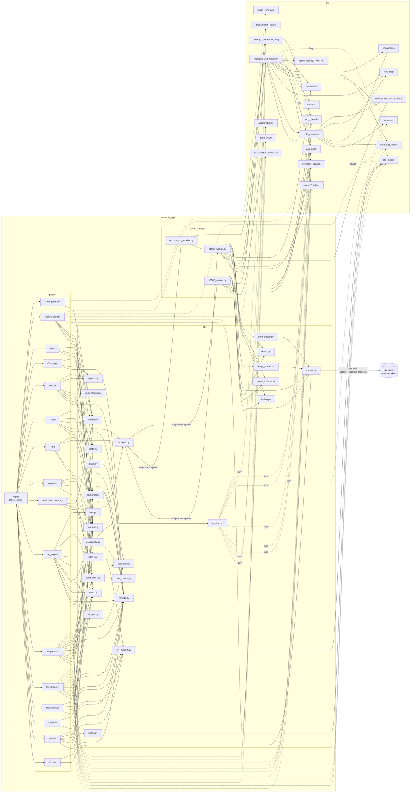
```mermaid
flowchart LR
    subgraph "streamlit_app/"
        APP["app.py<br>(st.navigation)"]
        subgraph "pages/"
            P_CL[Cluster]
            P_UP[Upload]
            P_UPS[Uploads]
            P_SE[Single-entry]
            P_AGG[Aggregate]
            P_LAU[Launcher]
            P_RUN[Runs]
            P_ST[Status]
            P_RES[Results]
            P_CAM[Campaign]
            P_HP[Help]
            P_MV[Mask viewer]
            P_CON[Constellation]
            P_MS[Manual system]
            P_MG[Mask generator]
            P_NO[National occupancy]
        end
        subgraph "lib/"
            ENG[engine.py]
            STG[storage.py]
            LAU[launcher.py]
            WRK[workers.py]
            PLT[plots.py]
            STA[state.py]
            FIL[filings.py]
            SRSI[srs_inspect.py]
            EXP[exports.py]
            THM[theme.py]
            CLU[cluster.py]
            WID[widgets.py]
            MAN[manual.py]
            EST[estimator.py]
            TOUR[tour.py]
            HWI[hwinfo.py]
            MDBR[mdb_results.py]
            RART[result_artifacts.py]
            REP[report.py]
            WCLU[wcga_cluster.py]
            ECLU[epfd_cluster.py]
            PLAN[plan.py]
            A22U[art22_ui.py]
            BCH[band_chart.py]
            FBND[freq_bands.py]
            OCC[occupancy.py]
        end
        subgraph "lib/job_runners/"
            W503[s1503_worker.py]
            WCWG[country_wcg_worker.py]
            W588[s1588_worker.py]
        end
    end

    subgraph "src/"
        E_MAIN[main.run_wcg_downlink]
        E_WCG[wcg_search]
        E_CCWG[country_constrained_wcg]
        E_EPFD[epfd_calculator]
        E_ACC[epfd_stream_accumulator]
        E_OPS[operating_params]
        E_TS[time_step]
        E_GEO[geometry]
        E_PROP[orbit_propagator]
        E_COORD[coordinates]
        E_F13[s1503_figure13_wcg_lon]
        E_S1588[s1588_studies]
        E_SRS[srs_reader]
        E_MASK[pfd_mask]
        E_MGEN[mask_generator]
        E_CT[constellation_templates]
        E_MDBW[mdb_writer]
        E_ANT[antenna]
        E_A22[article22_tables]
        E_R76[resolution76_tables]
        E_EXC[exceptions]
    end

    RAY[(Ray cluster<br>head + workers)]

    APP --> P_CL & P_UP & P_UPS & P_MV & P_CON & P_SE & P_AGG & P_NO & P_LAU & P_RUN & P_ST & P_RES & P_CAM & P_HP & P_MS & P_MG
    P_CL --> CLU & STG
    P_UP --> FIL & SRSI & STG & MAN & TOUR
    P_UPS --> STG & SRSI & MAN
    P_MV --> SRSI & STG & MAN & STA
    P_CON --> STG & SRSI & PLT & THM & STA
    P_SE --> LAU & STG & STA & WID & MAN & EST & A22U & BCH & TOUR
    P_AGG --> LAU & STG & STA & WID & MAN & EST & A22U & BCH & TOUR
    P_NO --> OCC & BCH & THM & MAN & STA
    P_LAU --> LAU & STG & MAN & A22U
    P_RUN --> LAU & STG & WRK & MAN
    P_ST --> LAU & STG & WRK & THM & MAN & HWI
    P_RES --> STG & PLT & THM & MAN & MDBR & EXP & TOUR
    P_CAM --> STG & EXP & MAN
    P_MS --> LAU & PLT & THM & STA
    P_MG --> THM
    P_HP --> MAN & THM & TOUR

    LAU --> WRK & STG
    WRK -->|subprocess spawn| W503 & WCWG & W588
    W503 --> E_MAIN & E_OPS & E_A22 & E_R76 & E_ACC & E_EXC & CLU & WCLU & ECLU & HWI & RART & REP
    WCWG --> W503 & E_CCWG
    W588 --> E_S1588 & E_EPFD & E_WCG & E_MASK & E_R76 & CLU & RART & REP
    CLU -. "ray.init / parallel_starmap_progress" .-> RAY
    WCLU --> CLU
    ECLU --> CLU
    PLAN --> EST

    E_MAIN --> E_WCG & E_EPFD & E_TS & E_GEO & E_PROP & E_COORD & E_MASK & E_ANT & E_A22 & E_F13 & E_EXC
    E_MAIN -.lazy.-> E_OPS & E_SRS
    E_EPFD --> E_GEO & E_PROP & E_COORD & E_TS & E_ACC
    E_CCWG --> E_WCG
    E_OPS -.reads.-> E_SRS
    ENG -.lazy.-> E_MAIN & E_S1588 & E_EPFD & E_WCG & E_ANT & E_MASK & E_SRS & E_A22 & E_R76
    FIL --> E_SRS
    SRSI --> E_SRS
    A22U --> SRSI
    BCH --> FBND
    OCC --> FBND & ENG
    P_MS -.-> E_CT & E_MDBW & E_MAIN & E_PROP & E_MASK
    P_MG -.-> E_MGEN
    P_SE -.-> E_A22 & E_OPS & E_CCWG & E_S1588
    P_UP -.-> E_OPS
    P_CON -.-> E_SRS & E_MAIN & E_PROP & E_A22 & E_GEO & E_WCG & E_MASK
```

Two conventions in the graph are worth stating, because they are easy to read
the wrong way:

- **Pages may import `src/` directly** (dotted edges above). `lib/engine.py`
  puts `REPO_ROOT` on `sys.path` as an import side effect; other modules import
  it for that, not only for its wrappers.
- `lib/manual.py` is a data module, not a page dependency in reverse. Every
  workflow page pulls its own snippet through `help_expander`; the Help page is
  not special.


### 5.2 Persistence layer (`lib/storage.py`)

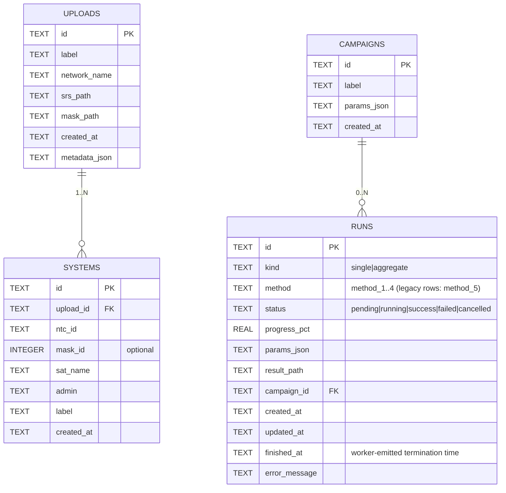
```mermaid
erDiagram
    UPLOADS ||--o{ SYSTEMS : "1..N"
    UPLOADS {
        TEXT id PK
        TEXT label
        TEXT network_name
        TEXT srs_path
        TEXT mask_path
        TEXT created_at
        TEXT metadata_json
    }
    SYSTEMS {
        TEXT id PK
        TEXT upload_id FK
        TEXT ntc_id
        INTEGER mask_id "optional"
        TEXT sat_name
        TEXT admin
        TEXT label
        TEXT created_at
    }
    CAMPAIGNS ||--o{ RUNS : "0..N"
    CAMPAIGNS {
        TEXT id PK
        TEXT label
        TEXT params_json
        TEXT created_at
    }
    RUNS {
        TEXT id PK
        TEXT kind "single|aggregate"
        TEXT method "method_1..4 (legacy rows: method_5)"
        TEXT status "pending|running|success|failed|cancelled"
        REAL progress_pct
        TEXT params_json
        TEXT result_path
        TEXT campaign_id FK
        TEXT created_at
        TEXT updated_at
        TEXT finished_at "worker-emitted termination time"
        TEXT error_message
    }
```

Artifacts on disk (per run) in `data/runs/<run_id>/`:

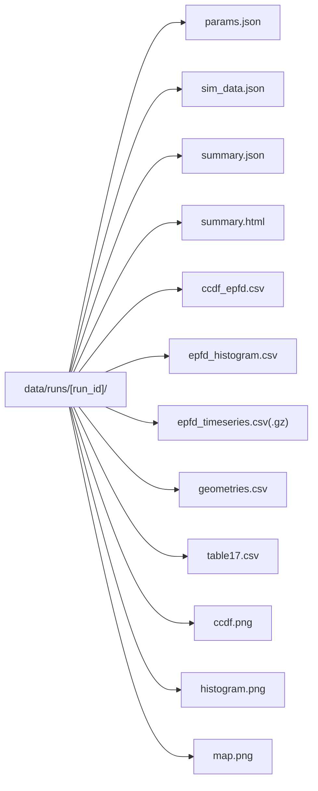
```mermaid
graph LR
    R["data/runs/[run_id]/"]
    P[params.json]
    S[sim_data.json]
    U[summary.json]
    H[summary.html]
    C1[ccdf_epfd.csv]
    C2[epfd_histogram.csv]
    C3["epfd_timeseries.csv(.gz)"]
    C4[geometries.csv]
    C5[table17.csv]
    I1[ccdf.png]
    I2[histogram.png]
    I3[map.png]
    R --> P & S & U & H & C1 & C2 & C3 & C4 & C5 & I1 & I2 & I3
```

### 5.3 Worker process model (subprocess + log streaming)

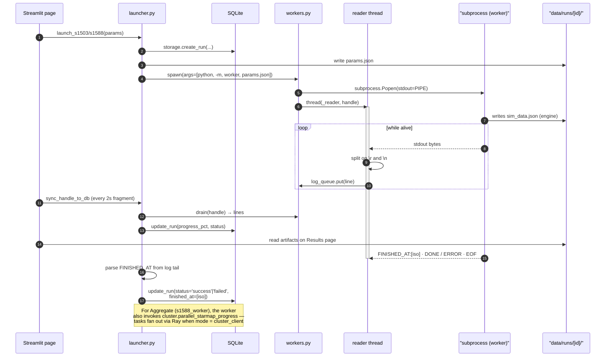
```mermaid
sequenceDiagram
    autonumber
    participant UI as Streamlit page
    participant L as launcher.py
    participant DB as SQLite
    participant W as workers.py
    participant T as reader thread
    participant P as "subprocess (worker)"
    participant FS as "data/runs/[id]/"

    UI->>L: launch_s1503/s1588(params)
    L->>DB: storage.create_run(...)
    L->>FS: write params.json
    L->>W: spawn(args=[python, -m, worker, params.json])
    W->>P: subprocess.Popen(stdout=PIPE)
    W->>T: thread(_reader, handle)
    activate T
    P->>FS: writes sim_data.json (engine)
    loop while alive
        P-->>T: stdout bytes
        T->>T: split on \r and \n
        T->>W: log_queue.put(line)
    end
    UI->>L: sync_handle_to_db (every 2s fragment)
    L->>W: drain(handle) → lines
    L->>DB: update_run(progress_pct, status)
    UI->>FS: read artifacts on Results page
    P-->>T: FINISHED_AT:[iso] · DONE / ERROR · EOF
    deactivate T
    L->>L: parse FINISHED_AT from log tail
    L->>DB: update_run(status='success'|'failed',<br>finished_at=[iso])
    Note over L,DB: For Aggregate (s1588_worker), the worker<br>also invokes cluster.parallel_starmap_progress —<br>tasks fan out via Ray when mode = cluster_client
```

### 5.4 UI navigation flow

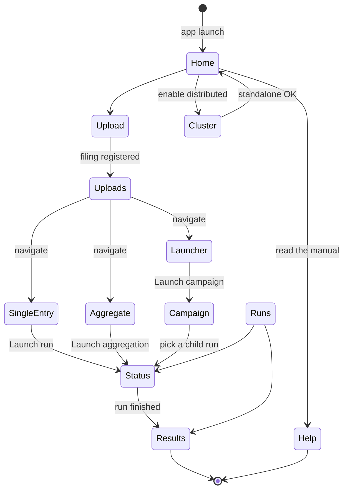
```mermaid
stateDiagram-v2
    [*] --> Home: app launch
    Home --> Upload
    Home --> Cluster: enable distributed
    Home --> Help: read the manual
    Cluster --> Home: standalone OK
    Upload --> Uploads: filing registered
    Uploads --> SingleEntry: navigate
    Uploads --> Aggregate: navigate
    Uploads --> Launcher: navigate
    SingleEntry --> Status: Launch run
    Aggregate --> Status: Launch aggregation
    Launcher --> Campaign: Launch campaign
    Status --> Results: run finished
    Campaign --> Status: pick a child run
    Results --> [*]
    Runs --> Status
    Runs --> Results
    Help --> [*]
```

### 5.5 Filing upload (Upload page)

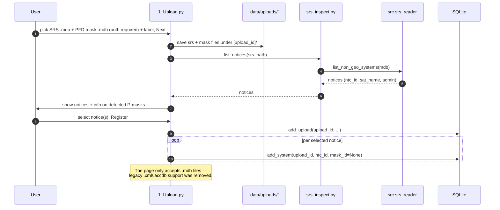
```mermaid
sequenceDiagram
    autonumber
    participant U as User
    participant UI as 1_Upload.py
    participant FS as "data/uploads/"
    participant SI as srs_inspect.py
    participant SR as src.srs_reader
    participant DB as SQLite

    U->>UI: pick SRS .mdb + PFD mask .mdb (both required) + label, Next
    UI->>FS: save srs + mask files under [upload_id]/
    UI->>SI: list_notices(srs_path)
    SI->>SR: list_non_geo_systems(mdb)
    SR-->>SI: notices (ntc_id, sat_name, admin)
    SI-->>UI: notices
    UI->>U: show notices + info on detected P-masks
    U->>UI: select notice(s), Register
    UI->>DB: add_upload(upload_id, ...)
    loop per selected notice
        UI->>DB: add_system(upload_id, ntc_id, mask_id=None)
    end
    Note over UI: The page only accepts .mdb files —<br>legacy .xml/.accdb support was removed.
```

The Step-2 filing label is **suggested from the SRS network/satellite
name** (`notice.sat_name`, fallback `preview_srs.network_name`) plus the
persisted **filing-name prefix** and the upload timestamp — e.g.
`ANATEL — D-MEG1-1-2026-06-07T18-30-12` — and stays editable. The prefix
is set on the Uploads page (`storage.apply_filing_prefix` renames all
existing filings idempotently; `storage.set_upload_label` renames one).

### 5.6 Single-entry run — end-to-end

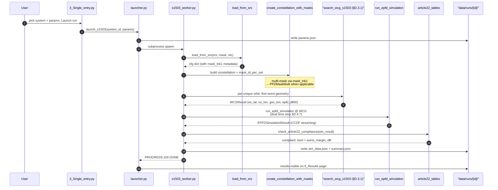
```mermaid
sequenceDiagram
    autonumber
    participant U as User
    participant SE as 3_Single_entry.py
    participant LA as launcher.py
    participant W as s1503_worker.py
    participant LS as load_from_srs
    participant CC as create_constellation_with_masks
    participant WCG as "search_wcg_s1503 (§D.3.1)"
    participant EPFD as run_epfd_simulation
    participant A22 as article22_tables
    participant FS as "data/runs/[id]/"

    U->>SE: pick system + params, Launch run
    SE->>LA: launch_s1503(system_id, params)
    LA->>FS: write params.json
    LA->>W: subprocess spawn
    W->>LS: load_from_srs(srs, mask, ntc)
    LS-->>W: cfg dict (with mask_lnk1 metadata)
    W->>CC: build constellation + mask_id_per_sat
    Note over CC: multi-mask via mask_lnk1<br>→ PFDMaskMulti when applicable
    W->>WCG: per unique orbit, find worst geometry
    WCG-->>W: WCGResult (es_lat, es_lon, gso_lon, epfd_dBW)
    W->>EPFD: run_epfd_simulation @ WCG<br>(dual time step §D.4.7)
    EPFD-->>W: EPFDSimulationResult (CCDF streaming)
    W->>A22: check_article22_compliance(sim_result)
    A22-->>W: compliant: bool + worst_margin_dB
    W->>FS: write sim_data.json + summary.json
    W-->>LA: PROGRESS:100 DONE
    LA->>FS: results visible on 8_Results page
```

### 5.7 Aggregate — method dispatcher

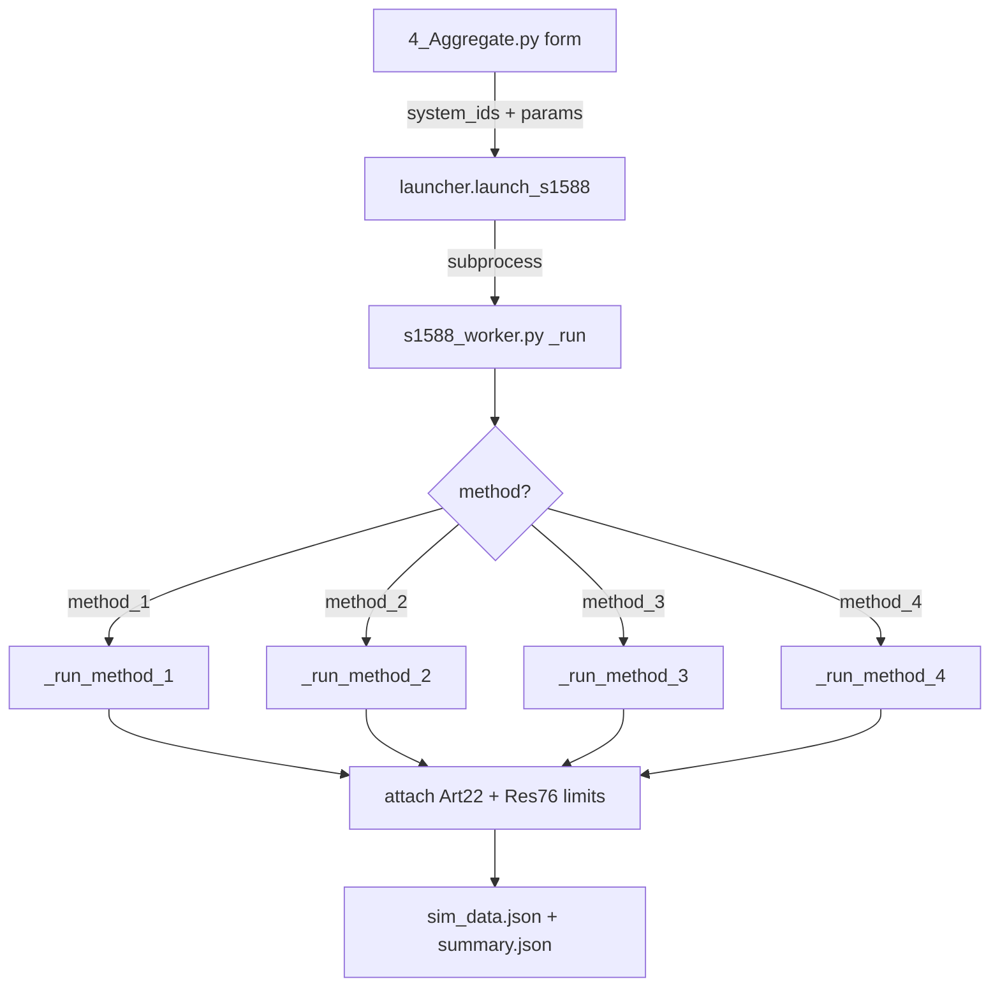
```mermaid
flowchart TD
    P[4_Aggregate.py form]
    LA[launcher.launch_s1588]
    W[s1588_worker.py _run]
    M{method?}

    P -->|"system_ids + params"| LA
    LA -->|"subprocess"| W
    W --> M
    M -->|method_1| F1[_run_method_1]
    M -->|method_2| F2[_run_method_2]
    M -->|method_3| F3[_run_method_3]
    M -->|method_4| F4[_run_method_4]
    F1 & F2 & F3 & F4 --> ATT[attach Art22 + Res76 limits]
    ATT --> OUT[sim_data.json + summary.json]
```

### 5.8 Aggregate · method_1 (Study 1)

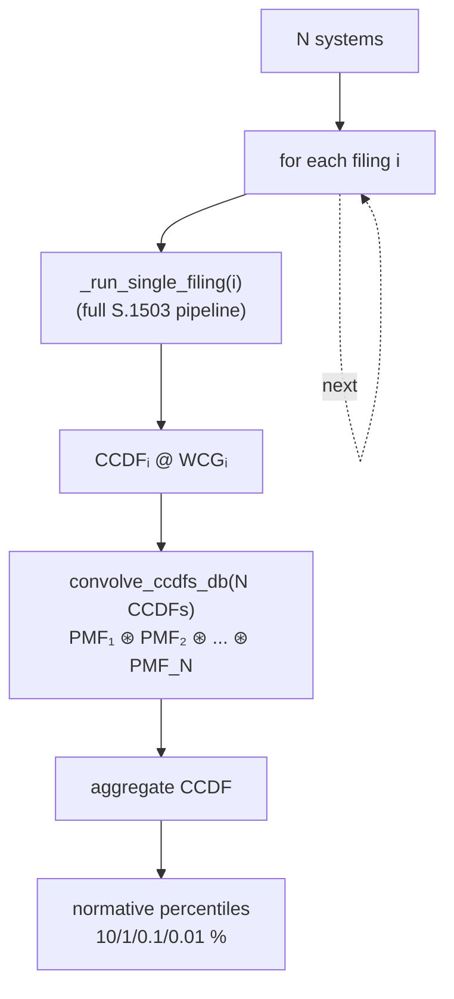
```mermaid
flowchart TD
    Start[N systems]
    Loop[for each filing i]
    SE["_run_single_filing(i)<br>(full S.1503 pipeline)"]
    CCDFi["CCDFᵢ @ WCGᵢ"]
    CONV["convolve_ccdfs_db(N CCDFs)<br>PMF₁ ⊛ PMF₂ ⊛ ... ⊛ PMF_N"]
    AGG["aggregate CCDF"]
    PCT["normative percentiles<br>10/1/0.1/0.01 %"]
    Start --> Loop
    Loop --> SE --> CCDFi
    Loop -. next .-> Loop
    CCDFi --> CONV
    CONV --> AGG --> PCT
```

### 5.9 Aggregate · method_2 (Study 2 — grid + envelope)

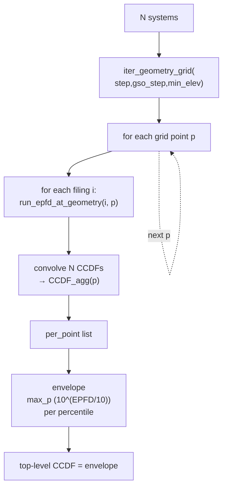
```mermaid
flowchart TD
    Start[N systems]
    Grid["iter_geometry_grid(<br>step,gso_step,min_elev)"]
    PointLoop["for each grid point p"]
    SimLoop["for each filing i:<br>run_epfd_at_geometry(i, p)"]
    CCDFp["convolve N CCDFs<br>→ CCDF_agg(p)"]
    All[per_point list]
    Env["envelope<br>max_p &lpar;10^(EPFD/10)&rpar;<br>per percentile"]
    Top["top-level CCDF = envelope"]

    Start --> Grid --> PointLoop
    PointLoop --> SimLoop --> CCDFp --> All
    PointLoop -. next p .-> PointLoop
    All --> Env --> Top
```

### 5.10 Aggregate · method_3 (Study 3 — joint, Method 2B)

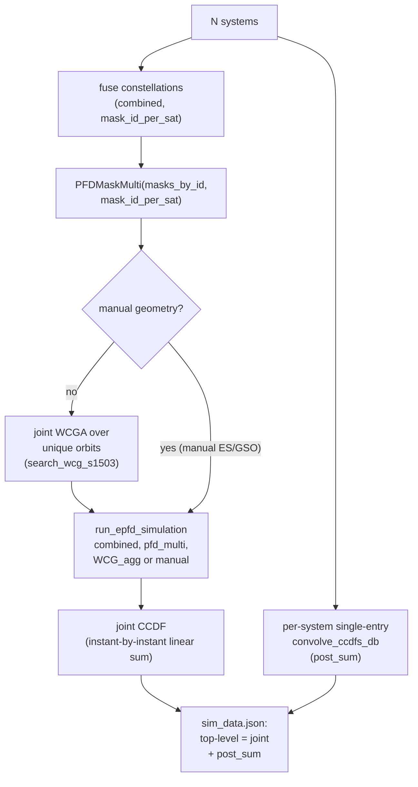
```mermaid
flowchart TD
    Start[N systems]
    Fuse["fuse constellations<br>(combined, mask_id_per_sat)"]
    Multi["PFDMaskMulti(masks_by_id,<br>mask_id_per_sat)"]
    WCGA["joint WCGA over<br>unique orbits<br>(search_wcg_s1503)"]
    Geo{manual geometry?}
    Sim["run_epfd_simulation<br>combined, pfd_multi,<br>WCG_agg or manual"]
    Joint["joint CCDF<br>(instant-by-instant linear sum)"]
    PostSum["per-system single-entry<br>convolve_ccdfs_db<br>(post_sum)"]
    Out["sim_data.json:<br>top-level = joint<br>+ post_sum"]

    Start --> Fuse --> Multi
    Multi --> Geo
    Geo -->|no| WCGA --> Sim
    Geo -->|"yes (manual ES/GSO)"| Sim
    Sim --> Joint --> Out
    Start --> PostSum --> Out
```

### 5.11 Aggregate · method_4 (per-WCG sweep)

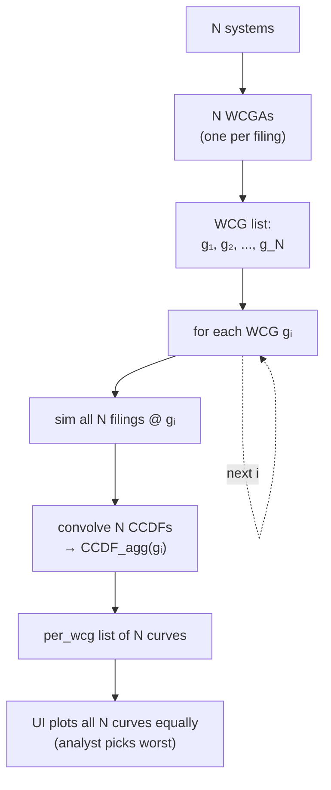
```mermaid
flowchart TD
    Start[N systems]
    WCGAs["N WCGAs<br>(one per filing)"]
    WCGList["WCG list:<br>g₁, g₂, ..., g_N"]
    OuterLoop[for each WCG gᵢ]
    InnerLoop["sim all N filings @ gᵢ"]
    Conv["convolve N CCDFs<br>→ CCDF_agg(gᵢ)"]
    PerWCG[per_wcg list of N curves]
    Out["UI plots all N curves equally<br>(analyst picks worst)"]

    Start --> WCGAs --> WCGList --> OuterLoop
    OuterLoop --> InnerLoop --> Conv --> PerWCG
    OuterLoop -. next i .-> OuterLoop
    PerWCG --> Out
```

### 5.12 Results page rendering

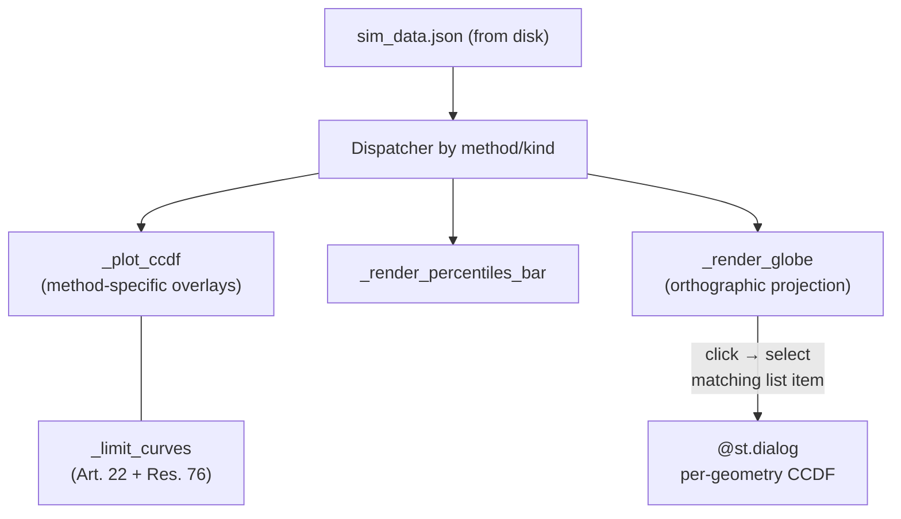
```mermaid
flowchart TB
    Art["sim_data.json (from disk)"]
    Disp[Dispatcher by method/kind]
    CCDF["_plot_ccdf<br>(method-specific overlays)"]
    Lim["_limit_curves<br>(Art. 22 + Res. 76)"]
    Pct["_render_percentiles_bar"]
    Globe["_render_globe<br>(orthographic projection)"]
    Modal["@st.dialog<br>per-geometry CCDF"]

    Art --> Disp
    Disp --> CCDF
    Disp --> Pct
    Disp --> Globe
    CCDF --- Lim
    Globe -->|click → select<br>matching list item| Modal
```

Click semantics: the globe uses `on_select="rerun"` +
`selection_mode="points"` + `clickmode="event+select"`. The first
clicked point is mapped to the *Geometry* picker via exact rounded
`(es_lat, es_lon)` match; pressing **Show CCDF** opens the modal
(`@st.dialog(width="large")`) with the selected geometry's CCDF +
Article 22 / Resolution 76 limit overlays.

### 5.13 Globe visualization per method

| Method | ES (★ star) | GSO (◆ diamond) | Grid points |
|---|---|---|---|
| single-entry | 1 WCG | 1 GSO | — |
| method_1 | N WCGs (one per system) | N GSOs | — |
| method_3 | 1 WCG_agg | 1 GSO_agg | — |
| method_4 | N WCGs | N GSOs | — |
| method_2 | — | GSO sweep (translucent) | ES grid (blue dots) |

Clicking a geometry on the globe **selects the matching entry in the
*Geometry* picker** below the chart (single-select via
`clickmode="event+select"`, with unselected markers kept at full
opacity and the clicked one highlighted in amber). Pressing *Show
CCDF* opens a Streamlit `@st.dialog(width="large")` modal with that
point's CCDF + the Article 22 / Resolution 76 limit curves overlaid
(when `ccdf_bins_db` is stored at that level).

---

## 6. Functional layers

### 6.1 Persistence (`lib/storage.py`)

Backend: **SQLite** (stdlib). Tables:

| Table | Content |
|---|---|
| `uploads` | registered filing (label, paths, metadata JSON) |
| `systems` | tuple `(upload_id, ntc_id, mask_id)` — one logical system; the mask id is part of the identity, so one filing can register several systems that differ only by mask |
| `runs` | execution (kind, method, status, progress, params JSON, result_path) |
| `campaigns` | grouping of runs |

Artifacts on disk in `data/runs/<run_id>/`:
- `params.json` — worker input
- `sim_data.json` — full result (CCDF, percentiles, art22, res76, `identification`,
  `table17`, `epfd_type`, `input_source`)
- `summary.json` — key metrics
- `summary.html` — S.1503-4 §D7.3 examination report (§6.10)
- `ccdf_epfd.csv`, `epfd_histogram.csv`, `epfd_timeseries.csv`(`.gz` over 50k pts),
  `geometries.csv`, `table17.csv`, `timebase.csv` (the §D4 time-step audit trail:
  N and Δt fine/coarse actually used, per system or joint) — CSV tables with `#`
  unit headers (A2.1 Table 1)
- `ccdf_per_system.csv`, `epfd_timeseries_per_system.csv` — **method_3 only**:
  each system's own CCDF and trace evaluated at the SAME joint WCG geometry as
  the aggregate headline. A decomposition of the aggregate, **not** each
  system's independent WCG (which is what `post_sum` does)
- `ccdf.png`, `histogram.png`, `map.png` — headless (matplotlib Agg) plots

The CSV/PNG set and `summary.html` are written best-effort by
`lib/result_artifacts.py` + `lib/report.py` (a plotting error never fails a
finished run). The ITU-style `run.xlsx` workbook (`lib/exports.run_to_xlsx`)
and a **Download-all `.zip`** of the run directory are built on demand from the
Results page — they are not persisted.

Foreign key: `systems.upload_id → uploads.id` (ON DELETE CASCADE). Cascade
delete + file removal.

### 6.2 Simulation execution (`lib/workers.py` + `lib/launcher.py` + `lib/job_runners/`)

**Worker process model:** every run is a Python subprocess that executes the
corresponding worker script. The UI reads stdout via a thread + `queue.Queue`.

- `workers.spawn(run_id, args=[...])` — `subprocess.Popen` + byte-level reader
  that splits lines on `\r` AND `\n` (compatible with the engine progress bars).
- `workers.drain(handle)` — pops pending lines; feeds the in-memory history.
- `launcher.launch_s1503(system_id, params)` — writes `params.json`, spawns.
- `launcher.launch_country_wcg(system_id, params)` — territorial single-entry;
  spawns `country_wcg_worker`, stored with `method="country_constrained"` and
  displayed as *territorial*.
- `launcher.launch_s1503_manual(manual_cfg, params)` — parametric NGSO with no
  filing row behind it.
- `launcher.launch_s1588(method, system_ids, params)` — same for aggregate.
  `kind` defaults to `"aggregate"`, but Single-entry's ES×GSO grid path calls it
  with `kind="single"`, `method="method_2"` and `params['study_mode']="single_grid"`.
- `launcher.sync_handle_to_db(run_id)` — propagates PROGRESS / DONE / ERROR
  to SQLite.

**Workers:**

- `s1503_worker.py` — calls `run_wcg_downlink(cfg)`; serializes the result and
  writes the per-run artifact/report stack (§6.10). When the engine raises
  `NoValidGeometry`, the worker catches it and writes a *completed*
  `compliance: "no_geometry"` `sim_data.json`/`summary.json` (carrying the
  exception `diagnostics`) instead of failing the run — the UI renders it as a
  legitimate no-geometry outcome, not an error. Emits `FINISHED_AT:<iso>` on
  stdout before exit so the launcher can stamp the run's `finished_at`
  precisely.
- `country_wcg_worker.py` — the same WCGA + EPFD↓ pipeline as `s1503_worker`,
  with the WCGA's ES domain restricted to `params['country_codes']` and an auto
  per-orbit RAAN sweep (§6.14). Writes `country_constrained_wcg.json` beside the
  usual artifacts.
- `s1588_worker.py` — implements `method_1..method_4` (convolution / grid /
  joint; plus a dormant `method_5` back-compat dispatch for pre-merge runs),
  reusing `src/s1588_studies` and `src/epfd_calculator`. Wraps
  each per-task body (`_single_filing_task`, `_at_geometry_task`) so it
  can run either sequentially or via `cluster.parallel_starmap_progress`
  (Ray) — see section 4.5. A `NoValidGeometry` from any per-filing sim is caught
  and returned as an empty `no_geometry` sub-result so the aggregate keeps
  going. Same `FINISHED_AT` contract.

**Path resolver inside workers:** filing payloads carry both absolute
and `<upload_id>/<file>.MDB` relative paths. `_resolve_filing_path`
tries abs → CWD-relative (Ray `working_dir`) → `UPLOADS_DIR / rel`
(local rsync). Remote workers never depend on the driver's
home / username path.

### 6.3 Visualization (`lib/plots.py`)

Plotly factories:

- `ccdf_chart(series, limit_curves=..., height=, x_min=, x_max=)` — CCDFs
  overlaid + Article 22 + Resolution 76 curves. Log Y-axis with normative
  ticks (`100%, 10%, 1%, ..., 1e-7%`). Diagonal X-axis tick labels.
- `epfd_timeline_chart(t, epfd_db)` — EPFD↓ time series.
- `percentiles_chart(percentiles)` — bars for the normative percentiles.
- `globe_chart(es_points, gso_points, grid_points, grid_gso_lons, ...)` —
  orthographic globe with ES (star) + GSO (diamond) + optional grid.
- `earth_3d_chart(satellites_xyz=...)` — 3D Plotly view (Cesium replacement).

### 6.4 Theme / CSS (`lib/theme.py`)

Type scale via CSS variables, contrast on buttons / inputs, Material Symbols
icons injected via `:material/X:` (native support in Streamlit ≥ 1.36).
Multiselect chips, dropdown menus and form widgets re-styled for dark theme
consistency.

### 6.5 Export (`lib/exports.py`)

XLSX campaign report via `openpyxl` + `pandas`. Three sheets:
`campaign` (metadata), `runs` (status / method / metrics), `params`
(denormalized). `run_to_xlsx(sim_data)` additionally builds a **per-run**
ITU-BR-style workbook (`run_def` / `result_def` / `results` / `cdf` / `pdf`
sheets, S.1503-4 §D7.3) offered from the Results page — see §6.10.

### 6.6 Cross-page state (`lib/state.py`)

A small set of *current selections* persists to disk under
`streamlit_app/data/state_*.json` and is shared across pages so that
picks made on one screen propagate to the others:

| Selection key                   | Helpers                                            | Pages reading it                                      |
|---------------------------------|----------------------------------------------------|-------------------------------------------------------|
| `selection.system_id`           | `current_system_id()` / `set_current_system_id`    | Uploads (orbital), Single-entry, Mask Viewer          |
| `selection.system_ids`          | `current_system_ids()` / `set_current_system_ids`  | reserved for Aggregate / Launcher                     |
| `selection.mask_id`             | `current_mask_id()` / `set_current_mask_id`        | Mask Viewer                                           |
| `selection.run_id`              | `current_run_id()` / `set_current_run_id`          | Runs (inspect), Status, Results                       |

Selections survive reloads (JSON on disk via
`save_persisted`/`load_persisted`). Form parameters (`s1503.form`,
`s1588.form`) stay page-scoped — they are not cross-page because
numeric overrides do not transfer meaningfully between the
single-entry and aggregate flows.

### 6.7 Mask Viewer (`pages/B_Mask_Viewer.py`)

Standalone interactive page — originally ported from a since-removed
`visualization/mask_viewer.html`, and now the only viewer:

* Reads the PFD mask via `src.srs_reader.read_pfd_mask_xml_from_mdb` +
  `src.pfd_mask.load_pfd_mask_from_xml_content`, returns the same
  JSON-shaped dict the HTML viewer consumed (via `to_dict()`).
* Sliders use `st.select_slider` over the real degree values so the
  user picks `-55° … +55°` (STEAM-2 latitudes) rather than indices.
* Heatmap renders with Plotly `go.Heatmap`. The toggle between
  uniform-spaced cells and proportional degrees on the x-axis mirrors
  the HTML viewer's `setAxisMode`.
* Slice plot is a `go.Scatter` over the C-axis. A dashed amber vline
  on the heatmap marks the active B slice.
* PFD calculator implements the same bilinear (azimuth_elevation /
  alpha_deltaLongitude) and trilinear fallbacks as the JS code, mirror
  of the engine runtime.
* When no query / state is provided, the page shows a picker listing
  all PFD masks across systems; selection is persisted via
  `current_system_id` + `current_mask_id`.

### 6.8 Timezone display (`storage.fmt_local`)

All timestamps in the SQLite database are stored in **UTC** (`created_at`,
`updated_at`, `finished_at`). UI columns labelled **(BRT)** are
converted to `America/Sao_Paulo` for display only via
`storage.fmt_local(iso, tz_name="America/Sao_Paulo")`. Output format:
`YYYY-MM-DD HH:MM:SS` (no tz suffix — the column header makes it
explicit). Workers and the launcher continue to write UTC, so Ray
clusters spanning timezones stay consistent.

### 6.9 Constellation viewer (`pages/C_Constellation.py`)

Standalone page that renders the non-GSO constellation as a **3D globe
snapshot at `t=0`**, built live from a registered filing — no simulation
run and no pre-exported bundle required.

* `_build_constellation()` reads the SRS via `src.srs_reader.read_srs_mdb`
  → `srs_to_constellation_config` → `src.main.create_constellation_from_config`
  → `src.orbit_propagator.propagate_and_to_ecef_batch` at `t=0`, then scales
  the ECEF positions to a unit sphere (`ECEF / Re_km`).
* `_scenarios()` lists the Article 22 downlink scenarios for the filing's
  masks via `src.article22_tables.list_article22_downlink_runs_for_masks`
  (de-duplicated over ES antenna diameter).
* `_emitter_flags()` marks which satellites transmit in the selected band
  via `src.srs_reader.read_emitters_in_band` (`grp ⋈ mask_lnk1` at
  `frequency_run_ghz`).
* Rendering is inline **Plotly** (`lib/plots.earth_3d_chart` + per-satellite
  scatter traces) — no CesiumJS, CZML or Parquet.

Controls: scenario selector (*Completa — todas as frequências* or a specific
Article 22 scenario), a **Só emissores / Todos** filter, and a colour mode
(**Emissor** — transmit vs silent — or **Plano orbital** — one colour per
orbital plane). Metrics panel reports N_total, emitters-in-scenario, plane
count, altitude, inclination and eccentricity.

### 6.10 Result artifacts & §D7.3 report stack (`lib/result_artifacts.py` + `lib/report.py` + `exports.run_to_xlsx`)

Every finished single-entry run drops a normative artifact set next to
`sim_data.json`, driven from the engine's streaming accumulator and the
`ComplianceResult.table17` (one row per Article 22 specification point:
`Ji`, `Pi`, `Py`, pass):

* `result_artifacts.write_run_artifacts(result_path, sim_data, acc)` writes
  `ccdf_epfd.csv` (§D7.3.3), `epfd_histogram.csv` (PDF, §D7.1.1, 0.1 dB bins
  from `acc.duration_per_bin`), `epfd_timeseries.csv` (the accumulator's
  decimated trace — gzipped past 50k points; the statistics are still
  accumulated over every step, so decimation is presentation-only),
  `geometries.csv` (tested ES/GSO geometries — the single WCG for s1503, the
  `per_point` sweep for aggregates), `table17.csv`, plus `ccdf.png`,
  `histogram.png` and `map.png` (headless matplotlib Agg — no kaleido/browser).
  Each CSV carries `#` unit headers (A2.1 Table 1). Every writer fails soft.
* `report.write_summary_html(result_path, sim_data)` renders the §D7.3
  examination report as a self-contained `summary.html`: the §D7.3.1 Pass/Fail
  statement, the §D7.3.2 Table 17, the §D7.3.3 CDF table (with the embedded
  `ccdf.png`), and the §D7.2 background + run identification (`ntc_id`,
  `sat_name`, mask id/source, `epfd_type`, `input_source`).
* `exports.run_to_xlsx(sim_data)` builds an ITU-BR-style workbook
  (`run_def` / `result_def` / `results` / `cdf` / `pdf` sheets); the Results
  page offers it and a Download-all `.zip` of the whole run directory on
  demand.

### 6.11 Manual / parametric NGSO entry (`load_from_manual` + `constellation_templates` + `mdb_writer`)

The **Manual system** page (`pages/E_Manual_System.py`) defines an NGSO system
with no SRS filing:

* `src.constellation_templates` generates a plane list from a named pattern —
  `walker_delta`/`walker_star`, `equatorial_ring`, `train`, `molniya`,
  `tundra`, `igso`, `multi_shell` — plus `sun_synchronous_inclination_deg`
  and `repeat_ground_track_a_km` helpers. The user edits the generated planes
  (per-plane RAAN/ω/ν₀) and previews them on the 3D globe.
* `src.main.load_from_manual(manual)` turns that definition (same sections as
  `config.example.yaml`; a/e from apogee/perigee per §D6.3.7; per-plane
  RAAN/ω/ν₀ read from `_planes` rather than forced to 0) into a full engine
  config tagged `input_source='manual'`, deriving the run frequency from the
  attached PFD-mask XML (fmin + RefBW/2, §D2) when not given, and runs through
  the **same** `run_wcg_downlink` path as MDB filings.
* Alternatively the system is **registered as a filing**: `src.mdb_writer`
  shells out to a Java/Jackcess helper (`tools/jackcess/`) to write a real
  JET4 `<base>_SRS.mdb` + `<base>_Mask.mdb` pair cross-platform, or falls back
  to a YAML+mask-XML filing, then enters the normal Upload flow.

### 6.12 Parametric PFD-mask generator (`mask_generator` + `mask_converter`)

The **Mask generator** page (`pages/F_Mask_Generator.py`) builds a PFD mask
from beam parameters (`src.mask_generator`):

* `MaskGenParams` / `BeamSpec` carry the §C2.3.1 inputs (per-beam power in the
  reference bandwidth, `SimpleCircularBeamAntenna` gain, `n_co` simultaneous
  co-frequency beams, losses) and the §C1/§C2.2 constraints (operating
  latitude band → −1000 dBW, GSO-arc exclusion α₀).
* Each cell is the max-envelope of `pfd_i = P_i + G_i(θ) − 10·log10(4πd²)`
  (d in metres) summed over the `n_co` strongest beams. `generate_pfd_mask_azel`
  produces Option 2 (lat×az×el); `generate_pfd_mask_alpha_dlon` produces
  Option 1 (lat×α×ΔLong) **natively** (no conversion), reusing the
  `src.mask_converter` α/ΔLong geometry (§D6.4.4, including the signed-α
  southern-hemisphere fix §D6.4.4.3).
* GSO-arc mitigation has two modes: `beam_off` (in-zone boresight beams
  switched off, sidelobe leakage kept) and `alpha_cutoff` (direct |α| < α₀
  cutoff with a user-defined fill value).
* `write_pfd_mask_xml` serialises the §C4.2 (Table 5) XML, round-trippable
  through `PFDMaskXML` and usable directly as a Manual-System mask.

### 6.13 National band occupancy (`lib/occupancy.py` + `lib/freq_bands.py` + `lib/band_chart.py`)

Frequency-occupancy survey for **any** administration. The country is a *filter
over a country-agnostic index*, not a property of the index — the page started
Brazil-only, and the generalisation moved the whole selection to query time
(`lib/br_occupancy.py` → `lib/occupancy.py`, `pages/H_Brazil_Occupancy.py` →
`pages/H_National_Occupancy.py`).

**Three optional input kinds**, any combination of which may be loaded:

1. a **national licensed-station table** — one CSV, one row per station per
   sub-band, read by meaning rather than by one administration's column
   spellings (`parse_anatel_subfaixas_csv`, `register_national_csv`). Nothing
   is fetched: the administration uploads the table. The required fields are
   documented in the page help;
2. the complete **`SRS.mdb`** from a BR IFIC ISO (`extract_srs_from_iso` →
   `ingest_local_iso`), or any additional filing `.mdb` uploaded for study.

The public weekly **`ificXXXX.mdb`** is not ingested: it only carries that
week's publications and does not hold the assignments the survey needs.

**Every notice is indexed, not only the ones in one country.** Each row carries
its country evidence — notifying administration, service area (`srv_area`, with
its `f_excl_api` exclusions), and earth-station countries — so
`country_codes(rule="serves"|"notified")` can answer at query time. The
exclusions are deliberately *not* subtracted at system level: `f_excl_api` sits
on `srv_area(grp_id, ctry)`, i.e. per frequency group, so a filing whose Ku group
serves a country and whose Ka group excludes it does occupy spectrum there.

**Catalogue registry.** Every indexed catalogue is its own entry under
`data/br_occupancy/sources/` with a label, a system count and an enable flag, so
a new filing can be compared against what is already indexed instead of
overwriting it. The on-disk cache keeps its original `br_occupancy` name on
purpose: renaming it would orphan the catalogues an installation has already
built.

**Direction is relative to the notified station.** `grp.emi_rcp` is written from
the point of view of the station the notice is *for*, so the same letter means
opposite directions on the two kinds of notice: a satellite that receives is fed
by an uplink, an earth station that receives is fed by a downlink. Reading every
group with the space-station convention put every earth-station band in the
wrong direction — and roughly half of the SRS notices are earth stations.

`lib/freq_bands.py` derives the letter band (C, Ku, Ka …) from the frequencies
themselves, using satellite practice rather than IEEE 521 (C from 3.4 GHz, Ku/Ka
split at 17.7 GHz), which is what lets one filter serve both a licensed
catalogue with its own band label and SNS notices that carry none.
`lib/band_chart.py` renders the occupancy strips as plain HTML/CSS through
`st.markdown` — the same shared-axis chart Aggregate uses, with a
common-overlap row.

### 6.14 Territorial (country-constrained) WCGA (`src/country_constrained_wcg.py` + `lib/job_runners/country_wcg_worker.py`)

Picking countries under **Single-entry → Geometry → S.1503-4 WCGA** routes the
launch to `launcher.launch_country_wcg` instead of `launch_s1503`. The worker
runs the **same** §D.3.1 WCGA + EPFD↓ pipeline, with two changes:

1. only ES locations inside the selected country polygons
   (`visualization/data/countries.geojson`, via `s1588_studies/countries.py`)
   are stored as candidates;
2. an optional RAAN (Ω) sweep, defaulting to **auto, decided per orbit**: a
   shell with a repeating ground track (`f_stn_keep` set and `rpt_period ≥ 1 h`)
   keeps its filed RAAN, because sweeping Ω would destroy the Earth-fixed track
   the administration filed; every other shell sweeps. A mixed-shell filing is
   handled orbit by orbit, and the post-search ΔΩ taken from the winner is
   applied only to the sweep-ON satellites, so the relative RAAN among the free
   shells is preserved.

This narrows *where the ES may sit*. It does **not** replace the WCGA with an
ES×GSO grid — that is a different mode (`study_mode="single_grid"`).

Artifacts: `country_constrained_wcg.json` (countries, sweep decision per orbit,
selected geometry) beside the usual stack, plus
`kind: "country_constrained_s1503"`, `wcg_source` and `country_wcg_alignment`
inside `sim_data.json` / `summary.json`. `pages/G_Country_Single_entry.py` is a
redirect stub kept for bookmarks from when this was its own page.

### 6.15 §B3.3 operating parameters and the windowed EPFD↓ path (`src/operating_params.py`)

The non-GSO operating regime lives in an **XML file per frequency range**, not in
the SRS `sat_oper` table — which is why a parser was needed before MIN_DURATION
could reach the engine at all. In the examination database the sets are zipped
XML blobs in the mask `.mdb` with `f_mask='R'`, linked through `mask_lnk3`, and
resolved by frequency containment against the run frequency. Per the Attachment
to Part B, a resolved set **supersedes** the SRS tables for that band.

- `load_from_paths` / `load_from_mask_mdb` build an `OperatingParameterRegistry`;
  an XML uploaded with the filing wins over the same band read from the `.mdb`.
- `validate_set` runs **at upload time**, so a §B5.2 range violation or a
  duplicate band fails before a run is ever launched, not in the middle of one.
- Paths live in `uploads.metadata_json` under `op_param_paths` — the table
  predates the feature and no column was added — and are read back through
  `storage.op_param_paths_of`, which drops paths no longer on disk.
- Each parameter has its own lookup rule: interpolate in latitude for
  MIN_EXCLUDE, nearest latitude for MIN_DURATION and MAX_CO_FREQ, nearest
  latitude plus azimuth interpolation for MIN_ELEV.

MIN_DURATION is what selects the engine path: non-zero at the examined ES
latitude → `run_epfd_simulation_windowed` (§4.1.1), zero → the standard
§D5.1.4.1 `run_epfd_simulation`. The choice is data-driven and is reported, with
its Step 19/20 diagnostics and any deviation, on Results and in `summary.html`.


---

## 7. Python libraries — function ↔ package map

`requirements.txt` pins **exact** versions (`==`). The numbers below are those
pins — the tested configuration, not floors. The project currently runs on
numpy 2.x and pandas 3.x; the `>=` floors in the legacy
`streamlit_app/pyproject.toml` are not the supported configuration.

### 7.1 Numerical core

| Package | Pinned version | Function / Component | Use |
|---|---|---|---|
| `numpy` | 2.4.6 | whole engine | arrays, linear algebra |
| `scipy` | 1.17.1 | `mask_converter` (griddata), `pfd_mask` (interp1d) | mask-grid interpolation |
| `numba` | 0.65.1 | `geometry`, `wcg_search`, `s1588_studies/vectorized_kernel` | JIT (LLVM) hot-loop kernels. `epfd_calculator` calls them and only sets the per-worker thread budget (`set_numba_num_threads`) |
| `joblib` | 1.5.3 | — | pinned, but not imported: the EPFD pool is stdlib `multiprocessing.Pool` |
| `pyarrow` | 24.0.0 | `src/orbit_tracks_parquet.py` | Parquet track segments for the standalone CZML export (`src/export_visualization.py`) — not reached by the Streamlit app |
| stdlib `multiprocessing` | — | EPFD worker pool | process spawning |

### 7.2 SRS / mask reading

| Package | Pinned version | Function | Use |
|---|---|---|---|
| `access-parser` | 0.0.6 | `srs_reader._run_mdb_export` | reads `.mdb` (Access/JET) directly in pure Python — no OS binary, cross-platform |
| stdlib `xml.etree` | — | `pfd_mask.PFDMaskXML`, `operating_params.parse_operating_params_xml` | PFD-mask XML and the §B3.3 `<non_gso_operating_parameters>` sets. The Upload page accepts `.mdb` plus operating-parameter `.xml` |
| stdlib `zipfile` | — | `srs_reader.read_pfd_mask_xml_from_mdb`, `operating_params.load_from_mask_mdb` | unzips the OLE blob to recover the XML (masks, and the `f_mask='R'` operating-parameter sets) |

### 7.3 Streamlit UI

| Package | Pinned version | Function / Component | Use |
|---|---|---|---|
| `streamlit` | 1.58.0 | whole UI | navigation, widgets, multi-page, fragments |
| `plotly` | 6.8.0 | `lib/plots.py` | CCDF / EPFD / 3D charts; plotly.js is inlined from the installed wheel, never the CDN |
| `pandas` | 3.0.3 | `lib/exports.py`, tables | DataFrames, XLSX |
| `openpyxl` | 3.1.5 | `lib/exports.py` | XLSX writing (per-run + campaign workbooks) |
| `numpy` | 2.4.6 | plot helpers | normalization, log |
| `matplotlib` | 3.10.9 | `lib/result_artifacts.py` | **required, not a fallback** — the headless (Agg) per-run PNGs |
| `pyyaml` | 6.0.3 | local configs, YAML filings | `config.yaml` and the YAML SRS-equivalent |

### 7.4 Persistence

| Package | Pinned version | Function | Use |
|---|---|---|---|
| stdlib `sqlite3` | — | `lib/storage.py` | local DB |
| stdlib `pathlib` | — | `lib/__init__.py` | paths |
| stdlib `json` | — | `lib/storage.py`, artifacts | serialization |
| stdlib `shutil` | — | cascade delete | removal of `data/runs/<id>/` |

### 7.5 Process execution

| Package | Pinned version | Function | Use |
|---|---|---|---|
| stdlib `subprocess` | — | `lib/workers.py`, `lib/cluster.py` | spawn worker, capture stdout; spawn `ray start --head` / `ray stop` |
| stdlib `threading` | — | `lib/workers.py`, `lib/cluster.py` | non-blocking stdout reader; bounded `ray.init` via daemon thread |
| stdlib `queue` | — | `lib/workers.py` | log line buffer |

### 7.5b Distributed processing (optional)

| Package | Pinned version | Function | Use |
|---|---|---|---|
| `ray[default]` | 2.55.1 | `lib/cluster.py` | task fan-out across local cores or remote workers; `runtime_env` for code + data shipping; Ray Client (`ray://...`) requires the `[default]` extra |

### 7.6 Testing / quality

| Package | Pinned version | Function | Use |
|---|---|---|---|
| `pytest` | — (dev only, not in `requirements.txt`) | `streamlit_app/tests/` — 42 modules | unit / integration / normative conformance |
| `ruff` | — (dev only, optional) | linting | code-style enforcement |

### 7.7 Packaging / distribution

There is **no root `pyproject.toml`** and the project is not `pip install -e .`.
Installation is `uv venv --python 3.12.3` plus
`uv pip install -r requirements.txt`; `streamlit_app/pyproject.toml` is a stub
whose dependency list omits `ray` and `access-parser`, so `uv sync` must not be
used. Distribution is by `git clone` (or a GitHub ZIP), not by a wheel.

| Tool | Function | Use |
|---|---|---|
| `uv` | interpreter + venv + installer | pins the exact CPython patch (3.12.3) the Ray cluster requires |
| `pip` | fallback resolver | only inside the venv, e.g. to build the offline wheelhouse |

### 7.8 **Explicitly excluded** packages

| Package | Exclusion reason |
|---|---|
| `fastapi` | Client-server + associated auth |
| `uvicorn` | External web server |
| `sqlalchemy`, `alembic` | Tied to the legacy Postgres |
| `asyncpg`, `psycopg2-binary` | Postgres |
| `minio` | External proprietary storage |
| `python-jose`, `bcrypt` | Authentication |
| `httpx` (external HTTP client use) | External APIs — outside the project scope by default |
| Julia + bridges (`epfd_julia`) | Other language |
| JavaScript SPA frameworks + bundlers | Other language / client-server |
| Cesium | Proprietary technology / JS |

### 7.9 Operating system dependencies

| Component | OS package | Justification |
|---|---|---|
| Ray daemon (optional) | `ray` CLI from `pip install ray[default]` | Spawned by `cluster.start_head` / `cluster.start_worker` as a subprocess; the CLI is resolved either from `PATH` or as a sibling of `sys.executable` |
| JET4 `.mdb` **writing** (optional) | a full **JDK** with the `jdk.compiler` module, plus the vendored jars in `tools/jackcess/` | Only **Manual system → Register as filing** needs it (`src/mdb_writer.py` shells out to `java`). A JRE is not enough. Without it the button falls back to a YAML + mask-XML filing and everything else works unchanged |

> `.mdb` SRS reading no longer needs `mdb-tools`: it is parsed in pure Python via the `access-parser` package (cross-platform, no OS binary).

SHARC-Orbit targets **Linux, macOS and WSL2**. **Native Windows** also runs
the standalone Streamlit app (`.mdb` parsing is pure-Python; `multiprocessing`
falls back to `spawn`), with reduced features — see Section 10.

---

## 8. Data flow

### 8.1 Filing upload

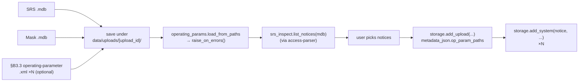
```mermaid
flowchart LR
    SRS["SRS .mdb"]
    MSK["Mask .mdb"]
    OPX["§B3.3 operating-parameter<br>.xml ×N (optional)"]
    SAVE["save under<br>data/uploads/[upload_id]/"]
    VAL["operating_params.load_from_paths<br>→ raise_on_errors()"]
    LIST["srs_inspect.list_notices(mdb)<br>(via access-parser)"]
    PICK[user picks notices]
    AU["storage.add_upload(...)<br>metadata_json.op_param_paths"]
    AS["storage.add_system(notice, ...)<br>×N"]
    SRS --> SAVE
    MSK --> SAVE
    OPX --> SAVE --> VAL --> LIST --> PICK --> AU --> AS
```

The §B3.3 XML paths ride on the upload's `metadata_json` — the `uploads` table
predates the feature and no column was added — and reach every worker as
`params['op_param_paths']`. Validation runs **here**, at upload, so a §B5.2 range
error fails before a run is launched rather than in the middle of one.

### 8.2 Single-entry (S.1503-4)

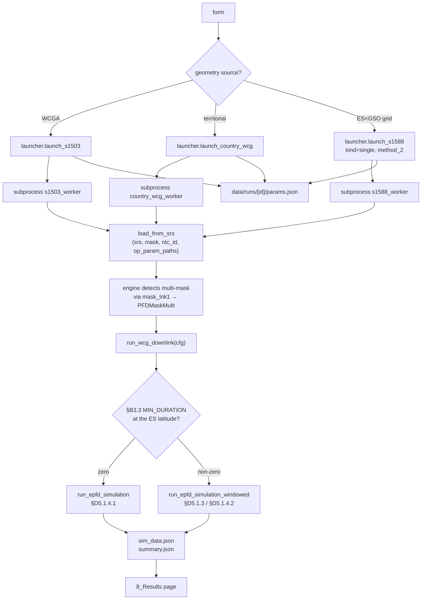
```mermaid
flowchart TB
    A[form]
    Q{geometry source?}
    B1[launcher.launch_s1503]
    B2[launcher.launch_country_wcg]
    B3["launcher.launch_s1588<br>kind=single, method_2"]
    D1[subprocess s1503_worker]
    D2[subprocess country_wcg_worker]
    D3[subprocess s1588_worker]
    C["data/runs/[id]/params.json"]
    E["load_from_srs<br>(srs, mask, ntc_id, op_param_paths)"]
    F["engine detects multi-mask<br>via mask_lnk1 → PFDMaskMulti"]
    G["run_wcg_downlink(cfg)"]
    W{"§B3.3 MIN_DURATION<br>at the ES latitude?"}
    G1["run_epfd_simulation<br>§D5.1.4.1"]
    G2["run_epfd_simulation_windowed<br>§D5.1.3 / §D5.1.4.2"]
    H["sim_data.json<br>summary.json"]
    I[8_Results page]
    A --> Q
    Q -->|WCGA| B1 --> D1
    Q -->|territorial| B2 --> D2
    Q -->|ES×GSO grid| B3 --> D3
    B1 --> C
    B2 --> C
    B3 --> C
    D1 --> E
    D2 --> E
    D3 --> E
    E --> F --> G --> W
    W -->|zero| G1 --> H
    W -->|non-zero| G2 --> H
    H --> I
```

### 8.3 Aggregate

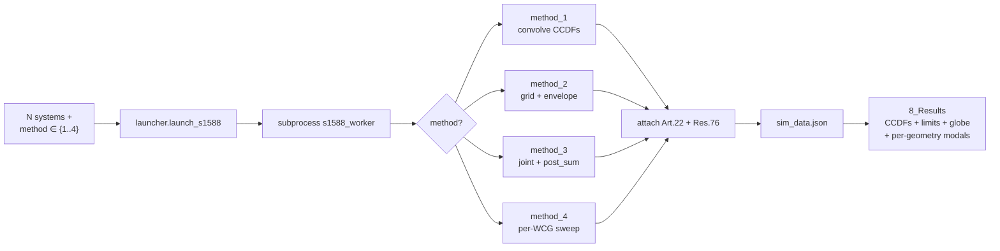
```mermaid
flowchart LR
    A["N systems +<br>method ∈ {1..4}"]
    B[launcher.launch_s1588]
    C[subprocess s1588_worker]
    D{method?}
    M1[method_1<br>convolve CCDFs]
    M2[method_2<br>grid + envelope]
    M3[method_3<br>joint + post_sum]
    M4[method_4<br>per-WCG sweep]
    E[attach Art.22 + Res.76]
    F[sim_data.json]
    G["8_Results<br>CCDFs + limits + globe<br>+ per-geometry modals"]
    A --> B --> C --> D
    D --> M1 & M2 & M3 & M4
    M1 & M2 & M3 & M4 --> E --> F --> G
```

---

## 9. Project guarantees

| Guarantee | Implementation |
|---|---|
| Open source, Python, documented | `SIMULATOR-WG/SHARC-Orbit` repository (private→public); manuals in `docs/`; docstrings; in-app `pages/A_Help.py` |
| No other languages / proprietary tech / auth | 100 % Python stack; no client-server framework, no JS frameworks, no auth stack; local Streamlit without login |
| No external APIs | No machine API is called and no credential is held; the engine's input is still local SRS/mask files. National occupancy adds **user-triggered** catalogue downloads over stdlib `urllib.request` from published ITU (WIC / BR IFIC) and administration URLs — nothing is fetched automatically, and every catalogue can instead be supplied as a local upload |
| Campaign spreadsheet | `lib/exports.py` produces XLSX campaign reports |
| Optional distributed processing | `lib/cluster.py` wraps Ray; standalone fallback path is identical; Ray is opt-in via the Cluster page |
| Public GitHub repository | `SIMULATOR-WG/SHARC-Orbit` |
| Private → public lifecycle | repository visibility control |
| Permanent URL | github.com/SIMULATOR-WG/SHARC-Orbit |

---

## 10. Points of attention

- **`numba` / `scipy` / `numpy` have C/Fortran backends**: they are Python
  packages of the scientific ecosystem (NumFOCUS). The project code is 100 %
  Python.
- **Streamlit runs HTTP on loopback (127.0.0.1)**: not a client-server with
  access control (no auth). Standard Python-local UI pattern.
- **`.mdb` parsing is pure Python** (`access-parser`) — no OS binary.
  **Linux / macOS / WSL2** is the primary target. **Native Windows** runs the
  standalone Streamlit app (pure-Python `.mdb`; engine no longer forces `fork`,
  so `multiprocessing` uses `spawn` — chunk workers re-apply engine globals via
  the Pool `initargs`). Reduced features on native Windows: Ray multi-node is
  WSL2/Linux-only, the `--kill-port` helper (`fuser`/`lsof`) is a no-op, the
  legacy `src/launcher_ui.py` HTTP launcher (POSIX process groups) is unused,
  National occupancy's ISO path needs `xorriso` on `PATH` (uploading an
  already-extracted `.mdb` does not), and Manual system → *Register as filing*
  needs a full JDK with `jdk.compiler` or it falls back to a YAML + mask-XML
  filing.
- **Ray (optional)**: distributed dispatch is opt-in via
  `lib/cluster.py`. Default mode is `standalone` (no Ray runtime). When
  Ray is configured, all task code, the `streamlit_app/` package and
  the `uploads/` directory are shipped via `runtime_env`; thread
  libraries inside each task are pinned to 1 thread (`NUMBA_NUM_THREADS=1`,
  `OMP_NUM_THREADS=1`, …) to avoid oversubscription. The Cluster page
  is a 4-state machine and times out `ray.init` at 8 s so a dead head
  daemon cannot hang the UI.
- **`finished_at` semantics**: worker subprocesses emit `FINISHED_AT:<iso>`
  on stdout before exit. The launcher reads the last such line and
  stamps the DB column. The Runs page uses this for both the
  *finished_at* column and the `hh:mm:ss` *duration* column.
- **Per-node CPU cap**: head CPUs are capped in the Cluster page UI
  (`ray start --num-cpus=N`); workers are capped via the same flag in the
  attach command (CPU field on the attach hint). The cap genuinely bounds
  CPU use because the engine's internal `multiprocessing.Pool` is replaced
  by the Ray executor (1 thread/task) when the cluster is active — so
  `--num-cpus` controls concurrent tasks = cores. **Trap**: the head CPU
  field defaults to *all* host cores; lower it to leave OS headroom.
- **Run timing in artifacts**: `sim_data.json` / `summary.json` carry a
  `timing` block (`started_at`, `finished_at`, `duration_seconds`,
  `duration_hms`); duration uses a monotonic `perf_counter` (immune to
  wall-clock adjustment), so it can differ slightly from the DB
  `finished_at − started_at` (subprocess wall-clock).
- **PFD mask auto-resolution**: never "first declared". `load_from_srs`
  resolves the single-mask `mask_id` from `mask_lnk1` precedence
  (`emi_rcp=E` → `grp_id` → `seq_no`); an explicit choice (Article 22 leaf)
  wins; multi-mask filings dispatch per satellite via `PFDMaskMulti`.
- **PFD curve location**: the mask shape lives in the `masks` table (zipped
  XML) of a **companion MASK MDB** — not in the SRS (`mask_info` there is
  metadata only). Uploading the SRS without its MASK MDB makes the Mask
  Viewer / runs fail to load the curve; the error names the missing piece.
- **§B3.3 windowed selection (track duration)**: when an operating-parameter set
  supplies MIN_DURATION, EPFD↓ runs the windowed single-pass engine over ONE
  `[0, N_TotalSteps)` timeline (§D5.1.3) instead of `nsteps × tstep` — so
  `result.n_timeline_steps`, not the headline accumulator, is the run. Three
  consequences: (a) `or_rescues_capped` picks the reading of the printed Step 20
  — the default `True` blocks the *tracked* set, `False` the *eligible* set, and
  the two give different CCDFs from identical inputs; the value is recorded on
  the result and in `sim_data['track_duration']`; (b) selection inputs the
  windowed path cannot honour are listed in `selection_inputs_ignored` rather
  than silently dropped; (c) an **empty tracked set is the anti-conservative
  failure mode** — with no satellite holding α₀/ε₀ for a whole window the run
  reads as a clean PASS, which is why the empty-window fraction is surfaced.

---

## 11. Maintenance and evolution

- **Source of truth:** `origin` → `SIMULATOR-WG/SHARC-Orbit` — the working
  repository *is* the public one; there is no separate publication step.
- **Regression testing:** `streamlit_app/tests/` — 42 pytest modules covering
  engine conformance (§D4 time step, §D5.1.4 track duration, multi-config,
  per-satellite mask routing, per-system decomposition, CCDF envelope and
  convolution) and UI/lib wiring (occupancy catalogues, the national catalogue
  format, band chart, result artifacts, hwinfo, MDB writer). Several UI suites
  are driven through Streamlit's own `AppTest`.

---

**Last update:** 2026-09-17 (**§B3.3 operating parameters + windowed track-duration EPFD↓** — `src/operating_params.py` parses and validates the `<non_gso_operating_parameters>` sets from the mask MDB `f_mask='R'`/`mask_lnk3` blobs or uploaded XML, validated at upload time; `epfd_calculator.run_epfd_simulation_windowed` runs §D5.1.3/§D5.1.4.2 on ONE single-pass `N_TotalSteps` timeline with per-window CCDFs, a worst-per-level envelope, Step 19/20 diagnostics and the `or_rescues_capped` Step-20 reading; §D7.1.3 Step 4-5 decides on the probability, not the margin. **Territorial WCGA** — `src/country_constrained_wcg.py` + `lib/job_runners/country_wcg_worker.py` + `launcher.launch_country_wcg`, with the per-orbit auto RAAN sweep keyed on §D4.6.1 `f_stn_keep`; `G_Country_Single_entry.py` folded into Single-entry as a redirect. **National band occupancy** — generalised from Brazil-only to any administration: `lib/occupancy.py` (← `lib/br_occupancy.py`), `pages/H_National_Occupancy.py` (← `pages/H_Brazil_Occupancy.py`), `lib/freq_bands.py`, `lib/band_chart.py`, a registry of independently indexed filing catalogues, country as a query-time filter, and ITU WIC / BR IFIC / national-catalogue ingestion. Previously, 2026-07-03: Manual/parametric NGSO entry — `E_Manual_System.py`, `load_from_manual`, `constellation_templates`, Jackcess `mdb_writer`; parametric PFD-mask generator — `F_Mask_Generator.py`, `mask_generator` with native Option 1 + Option 2 + GSO-arc mitigation; per-run artifact + S.1503-4 §D7.3 report stack — `result_artifacts.py`, `report.py`/`summary.html`, `exports.run_to_xlsx`, Download-all zip; structured `NoValidGeometry`/`InvalidManualGeometry` outcomes with a `no_geometry` run result; southern-hemisphere signed-α fix §D6.4.4.3; previously: Constellation viewer page
(`pages/C_Constellation.py`) — 3D `t=0` globe of the non-GSO constellation
built live from the SRS `.mdb`, filtered by Article 22 scenario /
emitters-in-band (`grp ⋈ mask_lnk1`), coloured by emitter status or orbital
plane; previously: Article 22 normative scenario selector
(service → frequency → ES antenna/BW tree) in Single-entry / Aggregate /
Launcher via shared `lib/art22_ui.py`; PFD mask auto-resolution by
`mask_lnk1` precedence (explicit choice wins) in `load_from_srs`; normative
config + run timing persisted in `sim_data.json`/`summary.json` and shown on
Results; Runs reload restores the Article 22 scenario; Mask Viewer error
names a missing companion MASK MDB; cluster single-entry interior distribution
via injected WCGA/EPFD executors + LPT scheduling + SPREAD + ray.put
broadcast + native-driver connection; per-run hardware capture (hwinfo)
+ live Status utilisation; orbital-dynamics options (station keeping /
precession) in Single-entry / Aggregate / Launcher; Launcher mirrors
Aggregate + persisted form; external results `.mdb` CCDF overlay;
guided tour; filing-name prefix + network-name label suggestion;
delete-confirmation modals; per-worker CPU cap in cluster attach hint)
